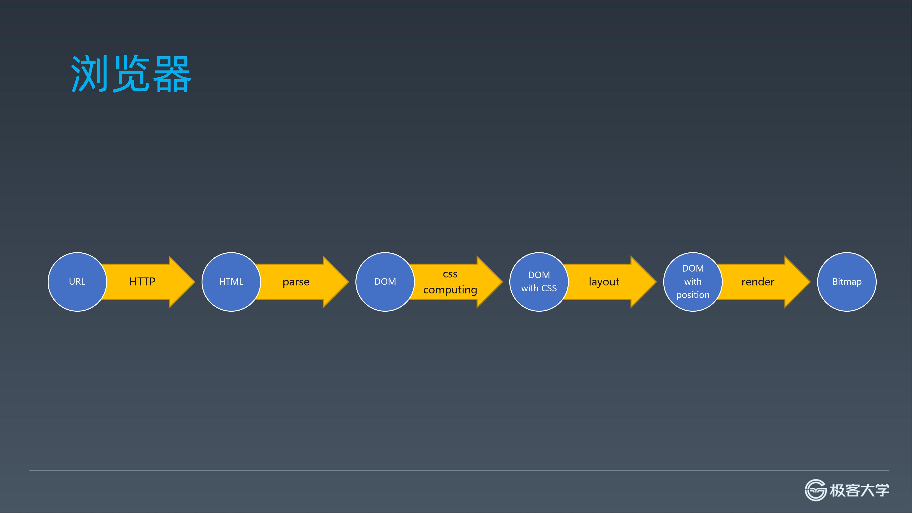
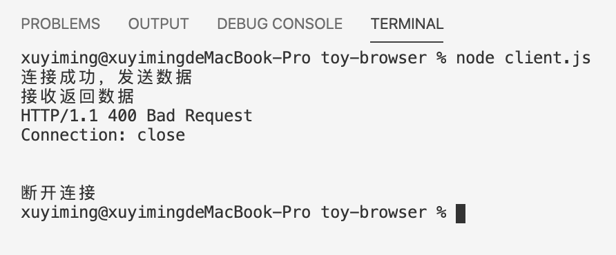
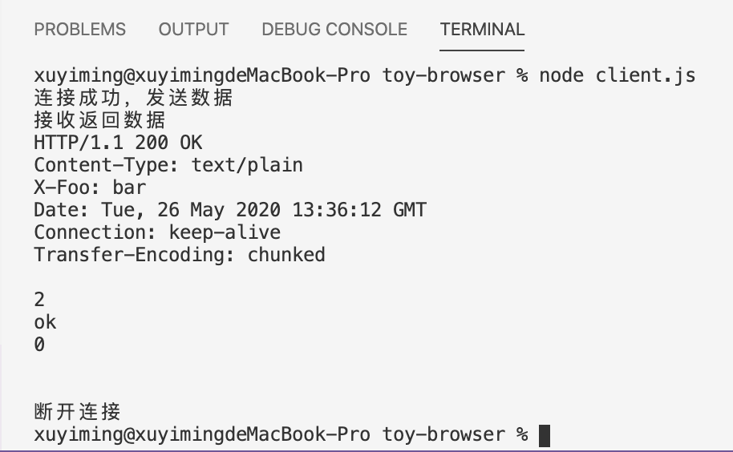
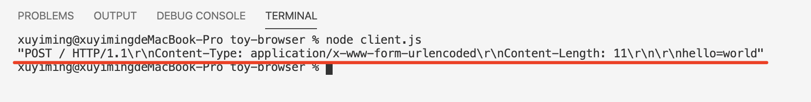
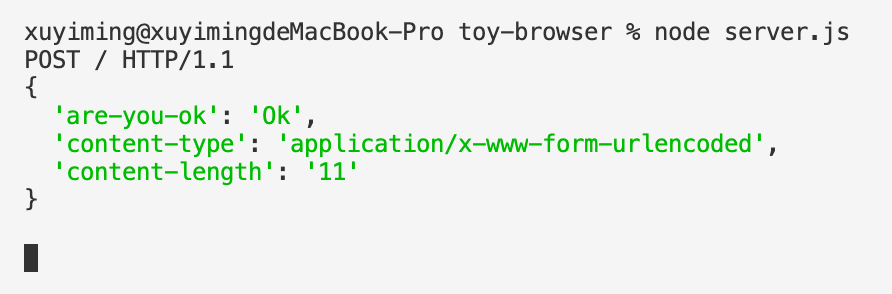
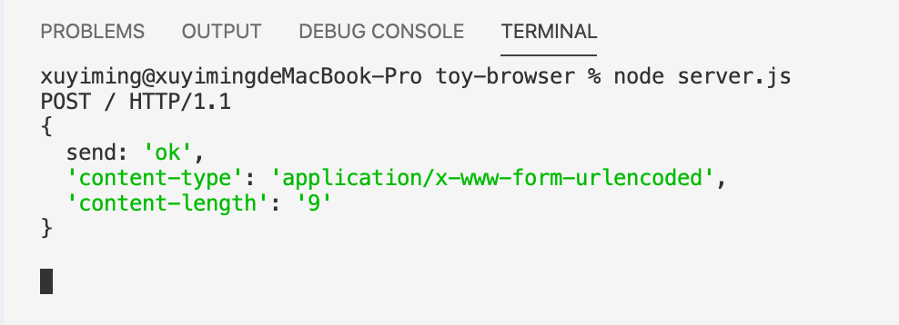

## 前言

本系列记录了一个玩具浏览器的实现过程。该玩具浏览器包含：

- 构建 HTTP 请求，发送并解析响应
- 解析 HTML
- DOM 节点与计算 CSS 解析
- 布局：Flex
- 渲染：从文本到图片

浏览器自接收 URL 到屏幕上渲染位图，全流程大致如下图所示



> 注：[本系列](/tag/实现一个玩具浏览器/) 及 [项目](https://github.com/xuyimingwork/toy-browser) 源自：[极客时间-前端进阶训练营-浏览器工作原理](https://u.geekbang.org/subject/fe/1000447)

## 先做个服务器

为方便后续，先编写一个 HTTP 服务器：

```js
// server.js
const http = require('http');

const server = http.createServer((req, res) => {
  console.log(`${req.method} ${req.url} HTTP/${req.httpVersion}`);
  res.setHeader('Content-Type', 'text/html');
  res.setHeader('X-Foo', 'bar');
  res.writeHead(200, { 'Content-Type': 'text/plain' });
  res.end('ok');
});

server.listen(8088)
```

这个服务器接到请求后首先会打印请求的基本情况，然后对响应设置了三个 HTTP 头，状态码 200，还有内容 OK。该服务器监听 8088 端口。

通过 `node server.js` 启动服务器，浏览器访问 `localhost:8088` 即可看见返回的 OK 字样。

## 建立与服务端的连接

接下来就是构建客户端。作为 HTTP 客户端，需要做两个事情：
- 发送 HTTP 请求
- 解析 HTTP 响应

为了从更底层了解 HTTP，通过 node 的 `net` 模块进行请求的发送，另外创建 `Request` 与 `Response` 类负责相应的工作。

```js
// client.js
const net = require('net');

class Request {

}

class Response {

}
```

我们通过 net 的 `createConnection` 进行创建连接发送请求与接收响应。先在 `Request` 外测试一下：

```js
// client.js
const client = net.createConnection({ 
  host: '127.0.0.1',
  port: 8088 }, () => {
  console.log('连接成功，发送数据');
  client.write('world!\r\n');
});

client.on('data', (data) => {
  console.log('接收返回数据');
  console.log(data.toString());
  client.end();
});

client.on('end', () => {
  console.log('断开连接');
});
```

上面代码中客户端建立了与主机 `127.0.0.1` 端口 `8088` 的 TCP 连接，并发送了字符串 `world!\r\n`，然后监听 `data` 事件，将收到的服务端数据 `toString` 后直接打印。

此时执行 `node client.js`，结果如下：



这个结果是符合预期的，因为我们的服务端是个 HTTP 服务器，建立连接后服务端预期接收的是 HTTP 请求，但是收到了 `world!\r\n`，显然是错的，于是返回 `400 Bad Request` 并断开连接。然后客户端这边触发了 `end` 事件。

## 假装发送一个 HTTP 请求

依据 [HTTP 请求的格式](https://tools.ietf.org/html/rfc2616#section-5)，我们写一个假的请求如下：

```js
const client = net.createConnection({ 
  host: '127.0.0.1',
  port: 8088 }, () => {
  console.log('连接成功，发送数据');
  client.write('GET / HTTP/1.1\r\n');
  client.write('Host: 127.0.0.1\r\n');
  client.write('\r\n');
});

client.on('data', (data) => {
  console.log('接收返回数据');
  console.log(data.toString());
  client.end();
});

client.on('end', () => {
  console.log('断开连接');
});
```

重新执行，得到了我们想要的结果：



> 试验：这里还可以将两处 `127.0.0.1` 替换为 `www.baidu.com`，然后将 port 由 `8088` 换成 `80`，是可以拿到百度的首页内容的。在查看百度返回的数据的时候你会发现 `接收返回数据` 这个字眼出现了多次，因为产生了多次 `data` 事件。后面的代码会针对这个问题进行处理。

> 补充：这里如果没有 `client.write('Host: 127.0.0.1\r\n');`，也是可以接收到服务端返回的数据的，但是 `Host` 请求头是 HTTP 1.1 规定的唯一一个必须携带的请求头，所以依据规范，这里把它带上了。另外，如果有传请求体，则需要带上 `Content-Length` 头部。

> 补充：如果有请求体而没有 `Content-Length`，除了一些特定情况，则大概率会得到一个 400 的响应。摘录 HTTP 1.1 标准中的一段：
> 
> [For compatibility with HTTP/1.0 applications, HTTP/1.1 requests containing a message-body MUST include a valid Content-Length header field unless the server is known to be HTTP/1.1 compliant. If a request contains a message-body and a Content-Length is not given, the server SHOULD respond with 400 (bad request) if it cannot determine the length of the message, or with 411 (length required) if it wishes to insist on receiving a valid Content-Length.](https://www.w3.org/Protocols/rfc2616/rfc2616-sec4.html#sec4.4)

可以看到建立 TCP 连接后，只需要给 client 写入文本，就可以产生发送 HTTP 请求的效果。

## Request 的设计与初测试

接着设计 `Request` 类。从上面可以看到构建一个 HTTP 请求大概需要如下参数；

- method
- host
- port
- path
- headers
- body

在 `Request` 的构造函数里接收这些参数，并进行一些初始化操作。提供一个 `send` 方法用于建立连接并发送请求，提供一个 `toString` 方法将参数转换为需要发送的请求。

首先是构造函数：
```js
class Request {
  constructor({
    method = 'GET',
    host = '',
    port = 80,
    path = '/',
    headers = {},
    body = {}
  } = {}) {
    this.method = method
    this.host = host
    this.port = port
    this.path = path
    this.headers = headers
    this.body = body

    if (!this.headers['Content-Type']) {
      this.headers['Content-Type'] = 'application/x-www-form-urlencoded'
    }

    if (this.headers['Content-Type'] === 'application/json') {
      this.bodyText = JSON.stringify(this.body) 
    } else if (this.headers['Content-Type'] === 'application/x-www-form-urlencoded') {
      this.bodyText = Object.keys(this.body).map(key => `${key}=${encodeURIComponent(this.body[key])}`).join('&')
    }

    this.headers['Content-Length'] = this.bodyText.length
  }
}
```

构造函数中主要是
- 搜集参数，若没有则提供默认值
- 检测 headers 中是否存在 `Content-Type`，没有则默认为 `application/x-www-form-urlencoded`
- 依据不同的 `Content-Type` 处理 `body` 并将处理后的文本结果赋值给 `bodyText`
- 计算生成 `Content-Length`

然后是 `toString` 构造 HTTP 请求文本。

```js
class Request {
  // ...

  toString() {
    return `${this.method} ${this.path} HTTP/1.1\r
${Object.keys(this.headers).map(key => `${key}: ${this.headers[key]}`).join('\r\n')}\r
\r
${this.bodyText}`
  }
}
```

这里就是用模板字符串和参数构建出 HTTP 请求，注意 `\r`。

在写 `send` 方法前，先检测下 `toString` 是否正确。

```js
const request = new Request({
  method: 'POST',
  host: '127.0.0.1',
  port: 8088,
  body: {
    hello: 'world'
  }
})

console.log(JSON.stringify(request.toString()))
```

这里加 `JSON.stringify` 的目的是能看到打印出来的 `\r\n`，结果如图：



符合预期。在 `server.js` 的首个 `console.log` 后新增一句 `console.log(req.headers);`，执行 `node server.js` 重启服务端，在客户端的 `Request` 中添加 headers，放到刚才的 `client` 中发送一下：

```js
const client = net.createConnection({ 
  host: '127.0.0.1',
  port: 8088 }, () => {
  console.log('连接成功，发送数据');

  const request = new Request({
    method: 'POST',
    host: '127.0.0.1',
    port: 8088,
    headers: {
      'Are-You-Ok': 'Ok'
    },
    body: {
      hello: 'world'
    }
  })
  client.write(request.toString());
});
```

客户端收到了服务端的正常返回并且服务端也收到了 `are-you-ok` 的头部



## 我要发送啦

最后，完成 `send` 方法。

```js
class Request {
  // ...

  send(connection) {
    return new Promise((resolve, reject) => {
      // 发送请求
      if (connection) {
        connection.write(request.toString());
      } else {
        connection = net.createConnection({
          host: this.host,
          port: this.port
        }, () => {
          connection.write(this.toString())
        })
      }
  
      // 接收返回数据
      connection.on('data', (data) => {
        resolve(data.toString());
        connection.end();
      });
  
      // 连接过程出现错误
      connection.on('error', err => {
        reject(err)
        connection.end()
      });
    })
  }
}
```

`send` 设计为返回 `Promise`，首先发送请求，然后监听 `data` 与 `error`，将 `data` 与 `error` 分别 `resolve` 和 `reject` 出去。

测试一下是否正常工作：

```js
const request = new Request({
  method: 'POST',
  host: '127.0.0.1',
  port: 8088,
  headers: {
    send: 'ok'
  },
  body: {
    send: 'body'
  }
})

request.send()
  .then(data => {
    console.log(data)
  });
```

OK，客户端正常收到响应，服务端打印出请求头 `send ok`



> 前面提到了 data 事件有可能多次触发，所以在这里直接 resolve 是不正确的。相关的处理以及 HTTP 响应文本的解析，放在下一篇的 `Response` 中处理。

## 参见
- [Node HTTP](https://nodejs.org/docs/latest-v12.x/api/http.html#http_response_setheader_name_value)
- [Node Net](https://nodejs.org/docs/latest-v12.x/api/net.html#net_net_createconnection)
- [HTTP 协议](./2020-05-09-http-protocols.md)


