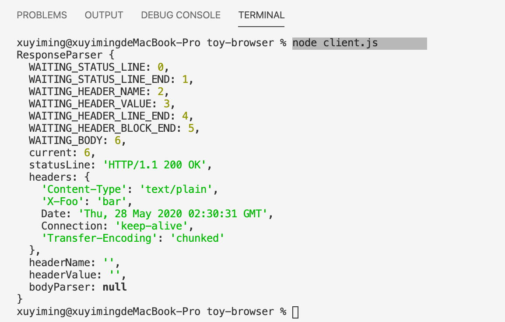
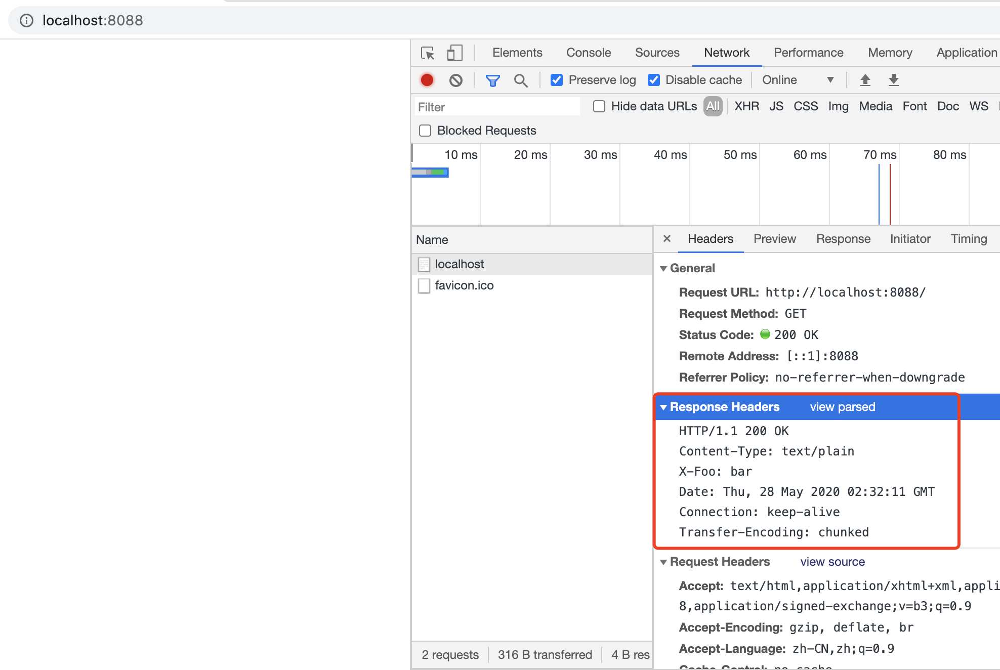
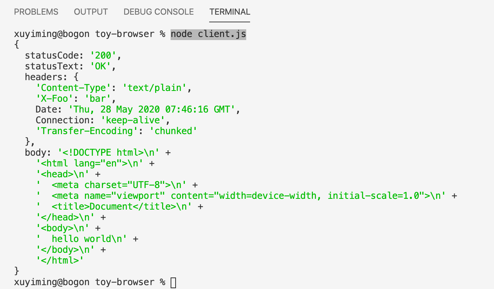

## 前言

上一节中 `Request` 已经可以依据参数构建并发送 HTTP 请求，本节处理响应。

## 解析 data 面临的两个问题

目前的 `data` 代码是这样的：

```js
// 接收返回数据
connection.on('data', (data) => {
  resolve(data.toString());
  connection.end();
});
```

这里的问题是不能保证 `data` 事件的发生时机。即：`data` 事件可以在数据传递的任何时候发生，且发生的次数并不固定。每次触发 `data` 事件，并不表示本次响应的数据已经完全接收，且可能在完整响应的任何地方产生 `data`。

比如假设完整响应是 `{hello:'world'}`，第一次请求时，可能第一次 `data` 接收到的是 `{hello:'w`，第二次 `data` 接收到的是 `orld'}`；而第二次请求时，可能第一次 `data` 接收到的是 `{he`，第二次 `data` 接收到的是 `llo:'world'}`；而第三次请求时，可能第一次 `data` 就接收到了完整的响应 `{hello:'world'}`

这里就产生了两个问题

- 完整响应可能由一个或多个 `data` 构成，因此需要在 `data` 回调**外部**、每个**请求内**设计一个位置用于保存每次 `data` 数据，最后组成完整响应
- 需要处理 `data` 有可能在完整响应的任意位置开始与结束

## 解决一个响应可能有多个 `data` 的问题

首先定义一个 `ResponseParser` 类用于处理这两个问题。显然，一个 `ResponseParser` 实例对应一次请求、一次响应、一次或多次 `data` 事件。

`ResponseParser` 暴露一个 `receive` 方法用于接收每次 `data` 的数据；暴露一个 `isFinished` 字段用于判断响应是否已经完整；暴露一个 `response` 字段用于提供完整响应。

由此可以得到 `ResponseParser` 的架子

```js
class ResponseParser {
  constructor() {}
  get isFinished() {}
  get response () {}
  receive(string) {}
}
```

由于一个 `ResponseParser` 实例对应一次请求、一次响应，所以我们要在 `send` 方法开头 `new` 一个 `ResponseParser` 的实例 `parser`。然后在每次 `data` 中将数据交给 `parser`，每次 `parser` 处理完后，通过 `parser.isFinished` 判断处理完本次 `data` 事件后响应是否完整，如果完整，则调用 `resolve` 将响应 `parser.response` 传出。

```js
send(connection) {
  return new Promise((resolve, reject) => {
    // 实例化用于解析返回数据的 parser
    const parser = new ResponseParser()

    // 发送请求
    if (connection) {
      connection.write(request.toString());
    } else {
      connection = net.createConnection({
        host: this.host,
        port: this.port
      }, () => {
        connection.write(this.toString())
      })
    }

    // 接收返回数据
    connection.on('data', (data) => {
      // 让 parser 处理每次返回的数据
      parser.receive(data.toString())

      // 若本次响应已完整，返回最终响应结果
      if (parser.isFinished) {
        resolve(parser.response);
        connection.end();
      }
    });

    // 连接过程出现错误
    connection.on('error', err => {
      reject(err)
      connection.end()
    });
  })
}
```

## 解决 `data` 数据可能是完整响应的任意片段的问题

这时第一个问题已经处理好了，接下来是处理 `data` 可能在完整响应的任意位置截断。既然每次的 `data` 可能在任意位置截断，那么就有两个点
- `parser` 需要逐字符地处理 `data`
- 在处理每个字符时，`parser` 自身需要维护一个状态以便判断当前处于什么状态，应该对该字符采取什么操作

所谓逐字符处理，就是 for 循环遍历每个字符。

对状态而言，简单来说，一个完整的响应大概包括三个部分，状态行，响应首部，响应体。比如当 `parser` 处于 *等待状态行接收完整* 的状态时，这时每处理一个字符就要做两个判断

- 该字符是否表示状态行已经接收完整了，如果接收完整了，可能就要进入比如 *等待响应首部接收完整* 的状态了
- 如果该字符不表示状态行已经接收完整，则说明该字符是状态行的一部分，那就要把该字符追加保存到最终的状态行里

整个 `parser` 就在这些不同的状态中转换，一个个字符解析，直至最终整个响应体解析完成。状态行的结束标志是 `\r\n`，响应首部每个键值对的结束标志也是 `\r\n`，响应首部与响应体之间的间隔是 `\r\n`。响应体的结束则取决于响应体的编码。

> 实际上 HTTP 的响应是存在没有响应体的情况的，若没有响应体，原先响应首部与响应体间的 `\r\n` 就成了响应结束的标志，本次玩具浏览器不考虑响应体不存在的情况。同时，响应体是存在编码这一概念的，响应体的编码方式在响应首部的 `Transfer-Encoding` 中指定，本次玩具浏览器仅处理 `Transfer-Encoding` 为 `chunked` 的情况。

> 这里实际上使用了 [有限状态机](https://zh.wikipedia.org/wiki/%E6%9C%89%E9%99%90%E7%8A%B6%E6%80%81%E6%9C%BA) 模型

实际需要的状态比上面说的复杂一点，首先状态行的状态有两个：
- WAITING_STATUS_LINE
  *等待状态行字符* 状态：需要在遇到 `\r` 时切换至 `WAITING_STATUS_LINE_END` 状态
- WAITING_STATUS_LINE_END 
  *等待状态行结束字符* 状态：因为 `\r` 在上个状态中用掉了，所以这个状态只检测一个值，就是 `\n`，遇到 `\n` 就将状态切换至 `WAITING_HEADER_NAME`

响应首部的状态有四个：
- WAITING_HEADER_NAME
  *等待响应首部字段名字符* 状态：这个状态比较复杂，首先首部字段名结束的标志是 `:` 字符，遇到需要切换到 `WAITING_HEADER_SPACE` 状态；第二，进入该状态并不代表接下来处理的字符属于响应首部字段名，因为需要循环处理响应首部字段，所以进入该状态时待处理的字符有可能是位于响应首部与响应体间的 `\r\n`，因此如果遇到 `\r`，需要将状态置为 `WAITING_HEADER_BLOCK_END`；最后，其它情况时将当前字符追加到字段名
- WAITING_HEADER_VALUE 
  *等待响应首部字段值字符* 状态：字段值的结束标志是 `\r`，遇到 `\r` 后进入 `WAITING_HEADER_LINE_END` 状态；
- WAITING_HEADER_LINE_END 
  *等待响应首部字段行结束字符* 状态：这个状态只检测一个值，就是 `\n`，遇到 `\n` 就将状态切换至 `WAITING_HEADER_NAME`，重新等待响应首部字段名字符，同时，本次首部字段结束，需要保存下本次的首部字段，保存首部字段时需要注意 HTTP 规定首部字段值前允许有空格，空格通常是一个，因此需要处理掉这部分的空格
- WAITING_HEADER_BLOCK_END 
  *等待响应首部结束字符* 状态：这个状态只检测一个值，就是 `\n`，遇到 `\n` 就将状态切换至 `WAITING_BODY`，等待响应体的解析

最后是响应体的状态：
- WAITING_BODY 
  *等待响应体字符* 状态：前面说过响应体的编码方式会因为 `Transfer-Encoding` 的不同而不同，解析自然是不同编码使用不同解析方式。因此，设计上应把解析响应体的工作划分给特定的 `BodyParser` 类，当处于 `WAITING_BODY` 状态时，只需把字符委托给专门的 `BodyParser` 类。本次玩具浏览器仅处理 `Transfer-Encoding` 为 `chunked` 的情况，因此规划 `ChunkedBodyParser` 类用于处理该编码

通过上面的分析，可以得到 `ResponseParser` 的构造函数

```js
class ResponseParser {
  constructor() {
    this.WAITING_STATUS_LINE = 0;
    this.WAITING_STATUS_LINE_END = 1;

    this.WAITING_HEADER_NAME = 2;
    this.WAITING_HEADER_VALUE = 3;
    this.WAITING_HEADER_LINE_END = 4;
    this.WAITING_HEADER_BLOCK_END = 5;
    
    this.WAITING_BODY = 6;

    this.current = this.WAITING_STATUS_LINE
    this.statusLine = ''
    this.headers = {}
    this.headerName = ''
    this.headerValue = ''
    this.bodyParser = null
  }
  // ...
}
```

解释下，最开始什么字符都还没接收，处于 *等待状态行字符* 的状态。这时候状态行 `statusLine` 为空，`headers` 也是一个空对象，`headerName` 和 `headerValue` 用于临时存放每行首部字段，`bodyParser` 则用于处理解析响应体相关事宜。

为 `ResponseParser` 设计一个内部使用的 `receiveChar` 方法用于处理每次的字符。`receive` 中调用 `receiveChar` 处理每个字符：

```js
class ResponseParser {
  // ...
  receive(string) {
    for (let i = 0; i < string.length; i++) {
      this.receiveChar(string[i])
    }
  }
}
```

`receiveChar` 就如上面分析的，依据当前状态的不同，对传入的字符做不同处理。

```js
class ResponseParser {
  // ...
  receiveChar(char) {
    if (this.current === this.WAITING_STATUS_LINE) {
      if (char === '\r') {
        this.current = this.WAITING_STATUS_LINE_END
      } else {
        this.statusLine += char
      }
    } else if (this.current === this.WAITING_STATUS_LINE_END) {
      if (char === '\n') {
        this.current = this.WAITING_HEADER_NAME
      }
    } else if (this.current === this.WAITING_HEADER_NAME) {
      if (char === ':') {
        this.current = this.WAITING_HEADER_VALUE
      } else if (char === '\r') {
        this.current = this.WAITING_HEADER_BLOCK_END
      } else {
        this.headerName += char
      }
    } else if (this.current === this.WAITING_HEADER_VALUE) {
      if (char === '\r') {
        this.current = this.WAITING_HEADER_LINE_END
        this.headers[this.headerName] = this.headerValue.trim()
        this.headerName = ''
        this.headerValue = ''
      } else {
        this.headerValue += char
      }
    } else if (this.current === this.WAITING_HEADER_LINE_END) {
      if (char === '\n') {
        this.current = this.WAITING_HEADER_NAME
      }
    } else if (this.current === this.WAITING_HEADER_BLOCK_END) {
      if (char === '\n') {
        this.current = this.WAITING_BODY
      }
    } else if (this.current === this.WAITING_BODY) {

    }
  }

  get isFinished() {
    return true
  }
  
  get response () {
    return this
  }
}
```

先不管处于 `WAITING_BODY` 状态时要怎么处理，把 `isFinished` 和 `response` 临时如上返回，测试一下 `parser` 能否正常工作，执行 `node client.js` 得到



对比浏览器中：



可以看到 `ResponseParser` 已成功解析响应状态行和响应首部

## 设计解析响应体的 ChunkedBodyParser

先不考虑 `ChunkedBodyParser` 具体如何解析响应体，先思考下 `ResponseParser` 需要 `ChunkedBodyParser` 提供哪些东西。

显然，`ResponseParser` 需要 `ChunkedBodyParser` 提供三个东西

- `ChunkedBodyParser` 需要提供 `receiveChar` 方法，这样处于 `WAITING_BODY` 状态的 `ResponseParser` 可以把每次收到的字符委托给 `ChunkedBodyParser` 解析
- 第二，需要提供 `isFinished` 字段，用于判断响应体是否已完整
- 第三，需要提供最后的解析产物。这里 `ChunkedBodyParser` 通过数组型的 `content` 字段提供解析后的响应体

因此，`ChunkedBodyParser` 设计如下

```js
class ChunkedBodyParser {
  constructor() {
    this.isFinished = false
    this.content = []
  }
  
  receiveChar(char) {}
}
```

现在我们先修改下 `ResponseParser`，将 `ChunkedBodyParser` 用上。这边有几个考虑：

- 什么时候实例化 `ChunkedBodyParser`？
  应该是在响应首部解析完成，确定存在响应体，且 `Transfer-Encoding` 值为 `chunked` 时实例化。
- 将 `ResponseParser` `WAITING_BODY` 状态下的字符处理代理到 `ChunkedBodyParser` 的 `receiveChar` 中。
- `ResponseParser` 的 `isFinished` 和 `response` 使用 `ChunkedBodyParser` 中的相应状态。

> 注意，暂时不考虑响应体不存在的情况

更改后的 `ResponseParser` 如下

```js
class ResponseParser {
  // ...
  get isFinished() {
    return this.bodyParser && this.bodyParser.isFinished
  }
  
  get response () {
    this.statusLine.match(/HTTP\/1.1 ([0-9]+) ([\s\S]+)/)
    return {
      statusCode: RegExp.$1,
      statusText: RegExp.$2,
      headers: this.headers,
      body: this.bodyParser.content.join('')
    }
  }

  receiveChar(char) {
    if (this.current === this.WAITING_STATUS_LINE) {
      // ...
    } else if (this.current === this.WAITING_HEADER_BLOCK_END) {
      if (char === '\n') {
        this.current = this.WAITING_BODY
        if (this.headers['Transfer-Encoding'] === 'chunked') {
          this.bodyParser = new ChunkedBodyParser()
        }
      }
    } else if (this.current === this.WAITING_BODY) {
      this.bodyParser.receiveChar(char)
    }
  }
}
```

## ChunkedBodyParser 解析响应体

### chunked 编码方式

看下 `chunked` 具体是如何编码数据的，标准是 [rfc7230 4.1.  Chunked Transfer Coding](https://tools.ietf.org/html/rfc7230#section-4.1)，先看下MDN 给的例子：[MDN Transfer-Encoding 分块编码](https://developer.mozilla.org/zh-CN/docs/Web/HTTP/Headers/Transfer-Encoding#%E5%88%86%E5%9D%97%E7%BC%96%E7%A0%81)

```http
HTTP/1.1 200 OK 
Content-Type: text/plain 
Transfer-Encoding: chunked

7\r\n
Mozilla\r\n 
9\r\n
Developer\r\n
7\r\n
Network\r\n
0\r\n 
\r\n
```

简单而言，一个 `chunked` 编码的响应体由若干个 `chunk` 块组成，每个 `chunk` 长这样：

```
7\r\n
Mozilla\r\n 
```

如上所示，一个 `chunk` 由一个 `chunk-size` 和一个 `chunk-data` 组成。上面的 `chunk-size` 值为 `7\r\n`，`chunk-data` 值为 `Mozilla\r\n`，它们都是以 `\r\n` 结尾。

`chunk-size` 里的 `7` 是个 **十六进制** 的数，表示本 `chunk` 的 `chunk-data` 数据有 `7` 个字符（字节）。所以上文中 `chunk-data` 的数据为 `Mozilla` 

这样设计的原因是 `chunk-data` 中可以存在 `\r\n` 字符。比如考虑这样的 `chunk`：

```
2\r\n
\r\n\r\n 
```

然后规定，最后一个 `chunk` 的 `chunk-size` 为 `0\r\n`。

### 实现 ChunkedBodyParser

有了这些信息，就可以开始实现 `ChunkedBodyParser`。实现原理和上面 `ResponseParser` 原理一样，都是用有限状态机去实现。

`ChunkedBodyParser` 的状态比较简单，只需要四个状态：

```js
class ChunkedBodyParser {
  constructor() {
    this.WAITING_SIZE = 0
    this.WAITING_SIZE_LINE_END = 1
    this.WAITING_DATA = 2
    this.WAITING_DATA_LINE_END = 3

    this.current = this.WAITING_SIZE
    this.size = 0

    this.isFinished = false
    this.content = []
  }

  receiveChar(char) {
    if (this.isFinished === true) return
    if (this.current === this.WAITING_SIZE) {
      if (char === '\r') {
        if (this.size === 0) {
          // 最后一个 chunk，直接结束
          this.isFinished = true
        } else {
          this.current = this.WAITING_SIZE_LINE_END
        }
      } else {
        this.size *= 16
        this.size += parseInt(char, 16)
      }
    } else if (this.current === this.WAITING_SIZE_LINE_END) {
      if (char === '\n') {
        this.current = this.WAITING_DATA
      }
    } else if (this.current === this.WAITING_DATA) {
      // 进入该分支时 size 一定大于 0，因此可以直接先 push
      this.content.push(char)
      this.size--
      if (this.size === 0) {
        this.current = this.WAITING_DATA_LINE_END
      }
    } else if (this.current === this.WAITING_DATA_LINE_END) {
      // 等待 line end 的状态会有 \r\n 两种结果
      if (char === '\n') {
        this.current = this.WAITING_SIZE
      }
    }
  }
}
```

> 这里有一个问题需要注意，`chunk-size` 是以字节（8 bit）为单位的，但是我们前面在接收 `data` 的时候直接对数据进行了 `data.toString`，这里就有了转码的问题。比如 `好` 这个字在 `chunk-size` 里大小为 `3`，但 `toString` 后，`好` 只是一个 char，长度仅为 `1`。
> 
> 本玩具浏览器不处理这个编码问题。因此，暂时只支持 ASCII 字符

### 服务端支持读取并返回 HTML

修改服务端代码如下，支持读取 `index.html` 文件并返回

```js
const http = require('http');
const fs = require('fs');

const server = http.createServer((req, res) => {
  console.log(`${req.method} ${req.url} HTTP/${req.httpVersion}`);
  console.log(req.headers, '\n');
  res.setHeader('Content-Type', 'text/html');
  res.setHeader('X-Foo', 'bar');
  res.writeHead(200, { 'Content-Type': 'text/plain' });
  const html = fs.readFileSync('./index.html', 'utf8')
  res.end(html);
});

server.listen(8088)
```

`index.html` 内容在 vscode 中用按 `!` 键快速生成一下，内容如下：

```html
<!DOCTYPE html>
<html lang="en">
<head>
  <meta charset="UTF-8">
  <meta name="viewport" content="width=device-width, initial-scale=1.0">
  <title>Document</title>
</head>
<body>
  hello world
</body>
</html>
```

### 测试，解析成功，撒花

`node server.js` 重启服务器，`node client.js` 访问，结果如下：




 

