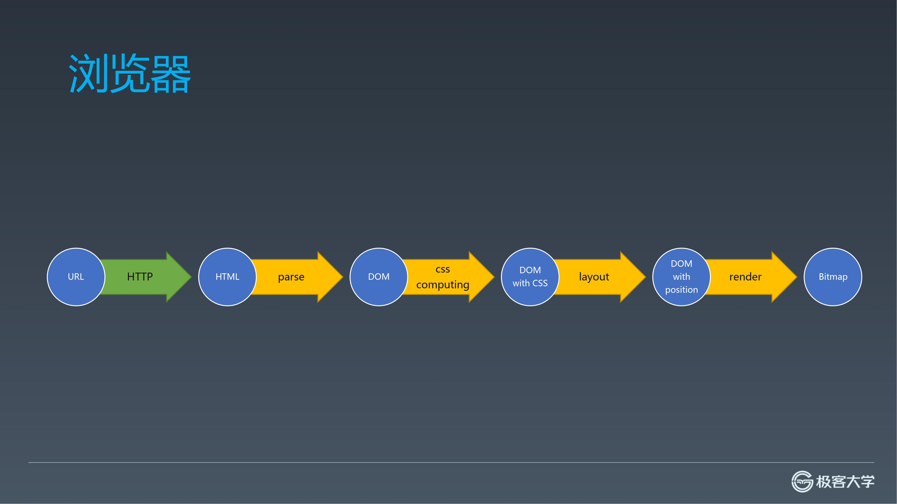
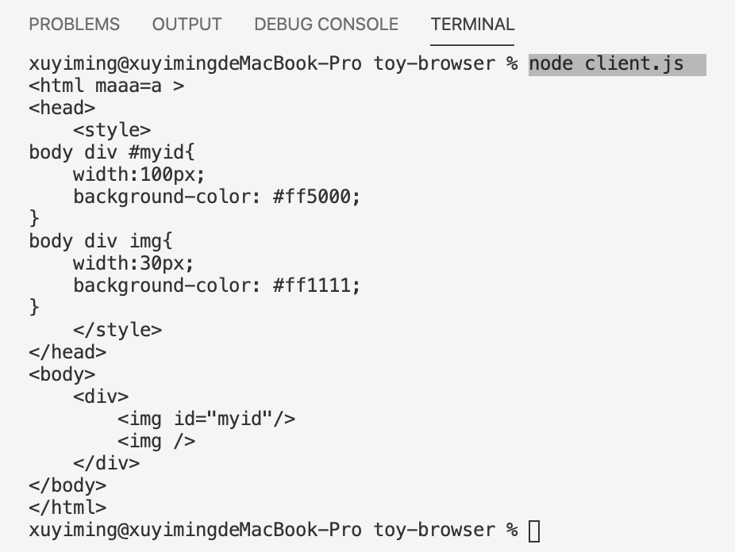
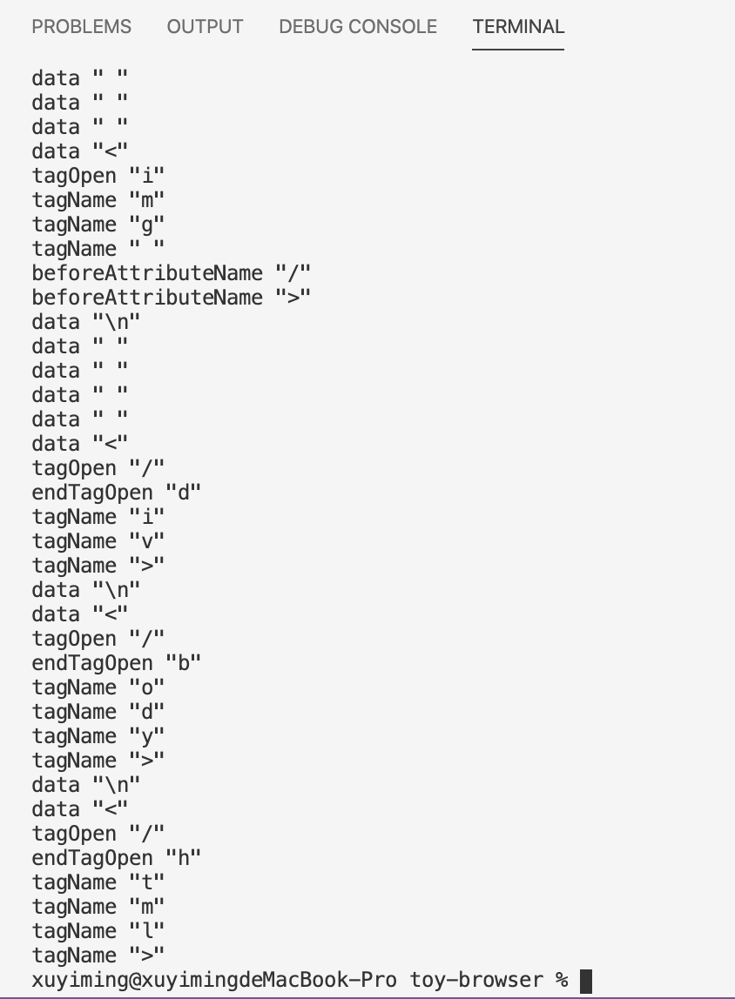
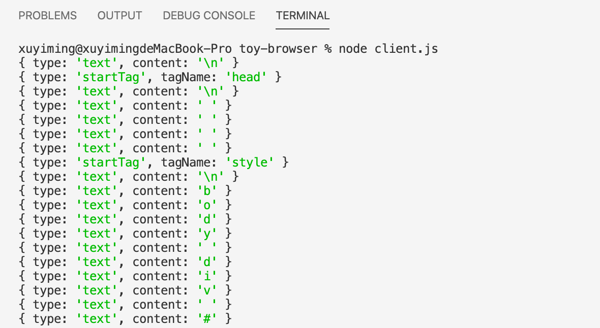
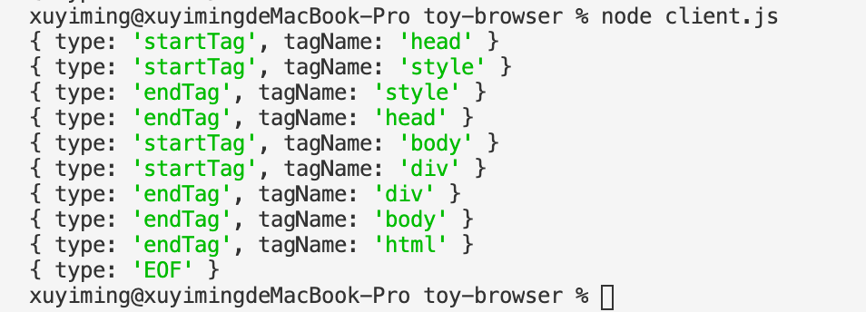
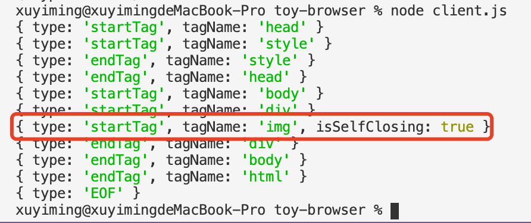

## 前言



上节中通过 `ResponseParser` 和 `ChunkedBodyParser` 完成了 HTTP 响应的解析，拿到了服务端返回的 HTML，本节将初步解析 HTML —— 搭建用于解析的有限状态机并接触词法分析中的 tokenization

> - [系列博文](/tag/实现一个玩具浏览器/)
> - [项目地址](https://github.com/xuyimingwork/toy-browser)

## 出来吧 parser

首先新建一个 `parser.js`，该文件导出 `parseHTML` 方法。该方法接收 `HTML` 文本，并最终返回构建好的 DOM 树。这里先简单打印传入的 `html` 字符串

```js
// parser.js
module.exports.parseHTML = function(html) {
  console.log(html)
}
```

调整一下 `client.js`，导入 `parser.js`，并将上节中得到的 `body` 传入 `parseHTML`

```js
// client.js
const parser = require('./parser')
// ...
const request = new Request({
  method: 'POST',
  host: '127.0.0.1',
  port: 8088,
  headers: {
    send: 'ok'
  },
  body: {
    send: 'body'
  }
})
request.send()
  .then(response => {
    const dom = parser.parseHTML(response.body)
  });
```

将服务端的 `index.html` 内容更换如下：

```html
<html maaa=a >
<head>
    <style>
body div #myid{
    width:100px;
    background-color: #ff5000;
}
body div img{
    width:30px;
    background-color: #ff1111;
}
    </style>
</head>
<body>
    <div>
        
        
    </div>
</body>
</html>
```

> 注意到这里没有常见 HTML 文件中的 `<!DOCTYPE html>`，是为了简化后面的解析

`node server.js` 启动服务端，`node client.js` 访问，一切正常工作



## 标准中的解析方式概览

如何解析 HTML？其实在 [HTML 标准](https://html.spec.whatwg.org/multipage/) 的 [12 The HTML syntax](https://html.spec.whatwg.org/multipage/#toc-syntax) 的 [12.2 Parsing HTML documents](https://html.spec.whatwg.org/multipage/parsing.html#parsing) 已经规定了解析方式

简单而言，标准中提供的解析模型是传入码点流，先经过 `tokenization` 阶段，然后是 `tree construction` 阶段，最后生成文档对象。


> 从标准里的这个模型也可以看到脚本的执行会阻碍 dom 树的构建

标准这一节的前面部分定义了诸如解析错误、处理输入流编码等问题，这我们不用关心，实际的浏览器确实是流式处理，就是边接收边解析，但我们前面设计为完整接收，并且传入前直接 `toString`，所以此处不需要考虑这些问题，直接进入标准的 [12.2.5 Tokenization](https://html.spec.whatwg.org/multipage/parsing.html#tokenization)

这里标准定义了的状态机来 tokenize HTML，状态机从 [data state](https://html.spec.whatwg.org/multipage/parsing.html#data-state) 开始。绝大多数状态消费（consume）一个字符，可能造成多种影响，并且：
- 或切换至新状态，让新状态重新 consume 当前字符
- 或切换至新状态，新状态 consume 下一个字符
- 或保持当前状态 consume 下一个字符

有些状态可以一次性 consume 多个字符。在某些情况下，状态机的状态还会随 dom 树的构建而改变。

标准的这一节规定了 80 个状态，我们只需要其中的一部分。

## 搭建状态机框架

```js
// parser.js
const EOF = Symbol('EOF') // End Of File

function data(c) {
  console.log(JSON.stringify(c))
  return data
}

module.exports.parseHTML = function(html) {
  let state = data
  for (let c of html) {
    state = state(c)
  }
  state = state(EOF)
}
```

在 `parseHTML` 里面首先定义了一个表示状态机当前状态的 `state` 变量，并把初始状态置为 `data`，这里状态机的每个状态用一个函数表示。

每个状态会依据输入的字符返回某个状态来处理下一个字符，这里先直接返回 `data` 状态本身，通过 for 循环依次对每个字符应用状态。for 循环完毕，说明响应结束，丢入 EOF Symbol。

现在执行会一直处于 `data` 状态，且打印进入 `data` 的字符直至结束，即表现为依次打印所有字符，下面我们要具体实现状态机的各个状态。

## 捕获开始、结束、自闭标签以及标签属性的状态

在第一阶段我们要实现六个状态，分别是：`data`、`tagOpen`、`endTagOpen`、`tagName`、`beforeAttributeName`、`selfClosingStartTag`，在这个阶段我们不做实际的构建 DOM 树的操作，完成后能看到随着字符的解析，状态机在不同的状态间跳转。

```js
function data(c) {
  if (c === '<') {
    return tagOpen 
  } else if (c === EOF) {
    return;
  } else {
    return data
  }
}
```

`data` 状态的操作很简单，主要动作为遇到 `<` 字符时切换至 `tagOpen` 状态；结束时无任何状态；其它情况继续保持 `data` 状态

```js
function tagOpen(c) {
  if (c === '/') {
    // 结束标签如 </style>
    return endTagOpen
  } else if (c.match(/^[a-zA-Z]$/)) {
    // 切换至 tagName 状态，让 tagName 状态重新 consume 当前字符
    return tagName(c)
  } else {
    throw new Error()
  }
}
```

`tagOpen` 状态的主要动作是遇到 `/` 时进入 `endTagOpen` 状态，遇到可能构成标签的字符时，将当前字符重新传给 `tagName` 状态，并用 `tagName` 的状态作为本次字符的状态。这里就是我们上面提过的“切换至新状态，让新状态重新 consume 当前字符”，也就是标准里的 **reconsume**

```js
function endTagOpen(c) {
  if (c.match(/^[a-zA-Z]$/)) {
    return tagName(c)
  } else {
    throw Error('')
  }
}
```

`endTagOpen` 状态遇到可能构成标签名的字符时，用 `tagName` **reconsume** 当前字符。

```js
function tagName(c) {
  if (c.match(/^[\t\n\f ]$/)) {
    return beforeAttributeName
  } else if (c === '/') {
    // 当 / 紧邻名字时，如 
    return selfClosingStartTag
  } else if (c === '>') {
    return data
  } else if (c.match(/^[a-zA-Z]$/)) {
    return tagName
  } else {
    throw Error('')
  }
}
```

`tagName` 状态遇到空格系列字符，表示接下来可能是属性，进入 `beforeAttributeName` 状态；遇到 `/` 字符，表明是自闭标签，进入 `selfClosingStartTag` 状态；遇到 `>`，表明标签结束，重新进入 `data` 标签；遇到可能构成标签名的字符，保持状态处理下一字符。

```js
function beforeAttributeName(c) {
  if (c.match(/^[\t\n\f ]$/)) {
    return beforeAttributeName
  } else if (c === '>') {
    return data
  } else {
    return beforeAttributeName
  }
}
```

`beforeAttributeName` 状态目前只是遇到 `>` 字符时退回到 `data` 状态，其它情况保持状态处理下一字符

```js
function selfClosingStartTag(c) {
  if (c === '>') {
    return data
  } else {
    throw Error('')
  }
}
```

最后 `selfClosingStartTag` 状态遇到 `>` 字符时返回 `data` 状态。

```js
module.exports.parseHTML = function(html) {
  let state = data
  for (let c of html) {
    console.log(state.name, JSON.stringify(c))
    state = state(c)
  }
  state = state(EOF)
}
```

改下 `parseHTML`，打印每个状态和字符，尝试运行一下，看起来状态机在各个状态间切换得不错



> 注：这里截图中并没有表现出 reconsume，是因为 log 语句位置的问题，实际代码是有完成 reconsume 动作的。
> 此处也可认真观察下在解析 HTML 各位置的字符前状态机分别处于什么状态

## 构建与提交 token

### token 是什么

目前的状态机只是在不同的状态间切换，并没有进行任何的操作。在标准文档中，会注意到某些状态会 `emit` `token`。`token` 是词法分析（Lexical analysis）中的概念，是构成源代码的最小单位。

比如 `var x = 1` 中，`var` 是一个 token，`x` 是一个 token，`=` 是一个 `token`，`1` 也是一个 token，但是 `var` 和 `x` 间的 ` ` 不是 token，`=` 前后的 ` ` 也不是 token，`var` 只有 `v` `a` `r` 三个字母合一起时才是一个 token，单独一个 `v` 或 `a` 或 `r` 或 `va` 或 `ar`，都不是一个 token

> 另见：[维基百科 Lexical analysis](https://en.wikipedia.org/wiki/Lexical_analysis#Token)

拿 HTML 标准的 tag name 状态举例，遇到 `>` 时，要 `emit` 当前的 token；遇到 `ASCII upper alpha` 时，就不是 `emit`，而是将输入字符追加到当前 token 上

这里的追加实际上是在构建一个 token；`emit` 可以理解为：“这个 token 我已经构建好了，我把这个 token 提交，你对这个 token 做后续的处理吧”

### token 的构建与提交

基于上述，新增一个全局变量 `currentToken` 以及函数 `emit`，`emit` 暂时只打印传入 token

```js
// parser.js
let currentToken = null;
function emit(token) {
  console.log(token)
}
```

首先在 `data` 状态，我们在文件结束的时候 emit 一次，然后在普通字符的时候也 emit token（文本节点的每个字符算作独立的 token）

```js
function data(c) {
  if (c === '<') {
    return tagOpen 
  } else if (c === EOF) {
    emit({
      type: 'EOF'
    })
    return;
  } else {
    emit({
      type: 'text',
      content: c
    })
    return data
  }
}
```

`tagOpen` 状态主要是在标签开始，我们要初始化开始标签的 token

```js
function tagOpen(c) {
  if (c === '/') {
    // 结束标签如 </style>
    return endTagOpen
  } else if (c.match(/^[a-zA-Z]$/)) {
    // 切换至 tagName 状态，让 tagName 状态重新 consume 当前字符
    currentToken = {
      type: 'startTag',
      tagName: ''
    }
    return tagName(c)
  } else {
    throw new Error()
  }
}
```

`endTagOpen` 状态同样，在结束标签开始的时候，初始化一个结束标签的 token

```js
function endTagOpen(c) {
  if (c.match(/^[a-zA-Z]$/)) {
    currentToken = {
      type: 'endTag',
      tagName: ''
    }
    return tagName(c)
  } else {
    throw Error('')
  }
}
```

`tagName` 状态做两个事情，一是遇到 `>` 标签结束，要 emit currentToken，二是若字符是当前 token 一部分时，把字符追加到当前 token 上

```js
function tagName(c) {
  if (c.match(/^[\t\n\f ]$/)) {
    return beforeAttributeName
  } else if (c === '/') {
    // 当 / 紧邻名字时，如 
    return selfClosingStartTag
  } else if (c === '>') {
    emit(currentToken)
    return data
  } else if (c.match(/^[a-zA-Z]$/)) {
    currentToken.tagName += c.toLowerCase()
    return tagName
  } else {
    throw Error('')
  }
}
```

`beforeAttributeName` 状态，暂时还不处理属性，此处代码不变。

`selfClosingStartTag` 状态，主要是在标签结束时标记一下该标签为自闭标签，同时 emit token

```js
function selfClosingStartTag(c) {
  if (c === '>') {
    currentToken.isSelfClosing = true
    emit(currentToken)
    return data
  } else {
    throw Error('')
  }
}
```

## 阶段成果

移除 `parseHTML` 中的 `console.log`，执行 `node client.js` 你会得到如下结果：



上图展示的即为每次 emit 的 token，在 `emit` 函数中过滤掉 type 为 text 的 token，会得到



注意到 `index.html` 一开始的 html 的开始标签没出现，且没有自闭标签，这是因为 `index.html` 中 html 的开始标签以及 img 的自闭标签分别长这样

```html
<html maaa=a >


```

在标签名后有个空格，因此进入了 `beforeAttributeName` 的状态，这个状态暂时还未处理。实际上，如果将 `` 改为 ``，就可以看到自闭标签了

