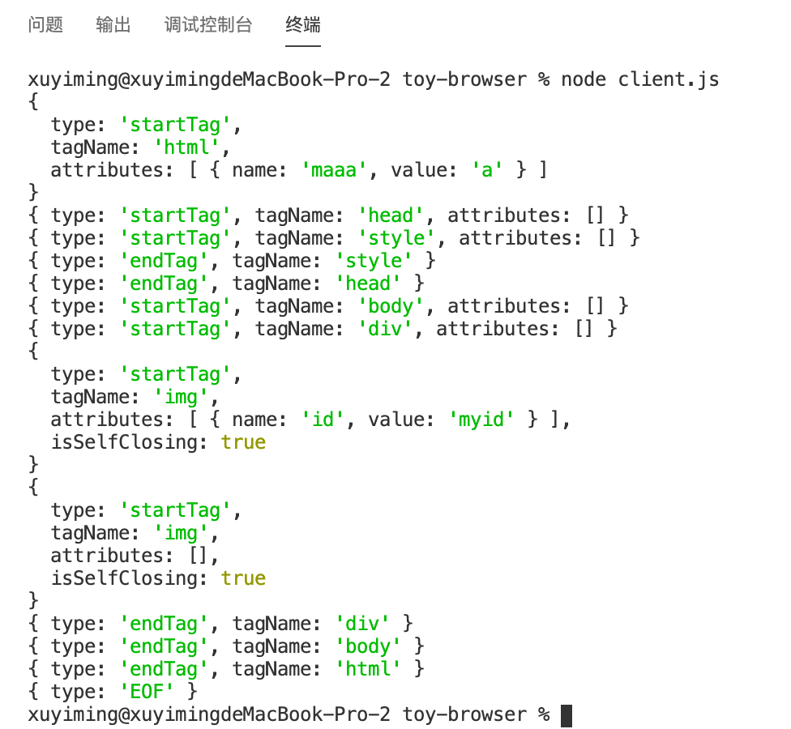
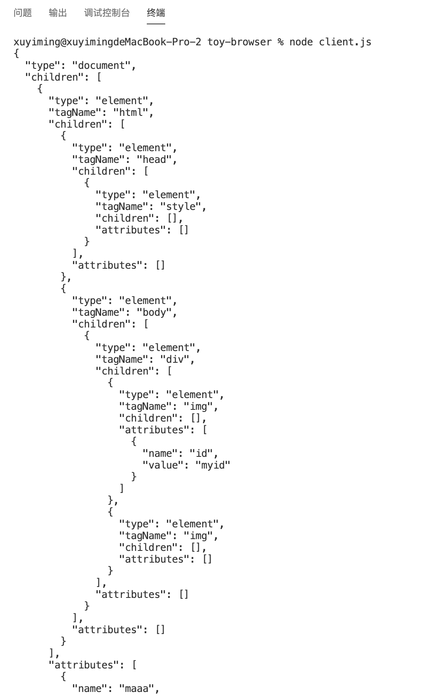
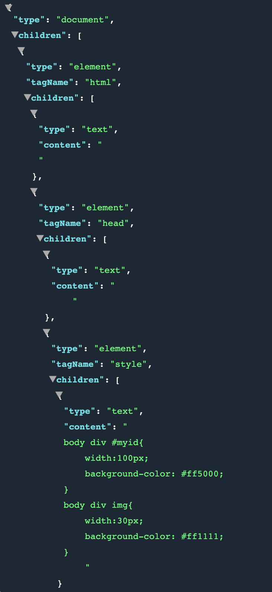

## 前言

本节将继续上节未完成的 HTML 解析

> - [系列博文](/tag/实现一个玩具浏览器/)
> - [项目地址](https://github.com/xuyimingwork/toy-browser)

## 解析标签属性

解析是逐字符的解析，所以属性同样是逐渐构建的过程，因此还需要一个全局变量保存当前正在构建的属性。

```js
// parser.js
let currentAttribute = null;
```

同时，在 `tagOpen` 状态创建 `startTag` 类型的 token 时，给 token 新增一个 `attributes` 数组属性

```js
function tagOpen(c) {
  if (c === '/') {
    // 结束标签如 </style>
    return endTagOpen
  } else if (c.match(/^[a-zA-Z]$/)) {
    // 切换至 tagName 状态，让 tagName 状态重新 consume 当前字符
    currentToken = {
      type: 'startTag',
      tagName: '',
      attributes: []
    }
    return tagName(c)
  } else {
    throw new Error()
  }
}
```

上节已经创建了临时的 `beforeAttributeName`，为了解析属性，依据[标准](https://html.spec.whatwg.org/multipage/parsing.html#before-attribute-name-state)，`beforeAttributeName` 需要进行一些更改，并新增一些用于处理属性的状态。

涉及属性处理的状态如下：

- beforeAttributeName
- attributeName
- afterAttributeName
- beforeAttributeValue
- doubleQuotedAttributeValue
- singleQuotedAttributeValue
- unquotedAttributeValue
- afterQuotedAttributeValue

> 注意点
> - 属性值分为双引号、单引号、无引号，需要对应状态处理
> - 当一个属性构建完成时，需要将 `currentAttribute` 添加到 `currentToken`

由于属性处理与标签类似，就不逐个分析状态。实现方式基本是依据标准，将标准“翻译”成代码即可。下面是相关状态的代码。

```js
// parser.js
function beforeAttributeName(c) {
  if (c.match(/^[\t\n\f ]$/)) {
    return beforeAttributeName
  } else if (c === '/' || c === '>' || c === EOF) {
    return afterAttributeName(c)
  } else if (c === '=') {
    throw Error()
  } else {
    currentAttribute = {
      name: '',
      value: ''
    }
    return attributeName(c)
  }
}

function attributeName(c) {
  if (c === EOF || c.match(/^[\t\n\f \/>]$/)) {
    return afterAttributeName(c)
  } else if (c === '=') {
    return beforeAttributeValue
  } else {
    currentAttribute.name += c.toLowerCase()
    return attributeName
  }
}

function afterAttributeName(c) {
  if (c.match(/^[\t\n\f ]$/)) {
    return afterAttributeName
  } else if (c === '/') {
    return selfClosingStartTag
  } else if (c === '=') {
    return beforeAttributeValue
  } else if (c === '>') {
    emit(currentToken)
    return data
  } else if (c === EOF) {
    throw Error()
  } else {
    currentAttribute = {
      name: '',
      value: ''
    }
    return attributeName(c)
  }
}

function beforeAttributeValue(c) {
  if (c.match(/^[\t\n\f \/>]$/)) {
    return beforeAttributeValue
  } else if (c === '"') {
    return doubleQuotedAttributeValue
  } else if (c === '\'') {
    return singleQuotedAttributeValue
  } else if (c === '>') {
    throw Error()
  } else {
    return unquotedAttributeValue(c)
  }
}

function doubleQuotedAttributeValue(c) {
  if (c === '"') {
    currentToken.attributes.push(currentAttribute)
    return afterQuotedAttributeValue 
  } else if (c === '\u0000') {
    throw Error()
  } else if (c === EOF) {
    
  } else {
    currentAttribute.value += c
    return doubleQuotedAttributeValue
  }
}

function singleQuotedAttributeValue(c) {
  if (c === '\'') {
    currentToken.attributes.push(currentAttribute)
    return afterQuotedAttributeValue
  } else if (c === '\u0000') {
    throw Error()
  } else if (c === EOF) {
    
  } else {
    currentAttribute.value += c
    return singleQuotedAttributeValue
  }
}

function unquotedAttributeValue(c) {
  if (c.match(/^[\t\n\f ]$/)) {
    currentToken.attributes.push(currentAttribute)
    return beforeAttributeName
  } else if (c === '/') {
    currentToken.attributes.push(currentAttribute)
    return selfClosingStartTag
  } else if (c === '>') {
    currentToken.attributes.push(currentAttribute)
    emit(currentToken)
    return data
  } else if (c === '\u0000') {
    throw Error()
  } else if (c === EOF) {

  } else {
    currentAttribute.value += c
    return unquotedAttributeValue
  }
}

function afterQuotedAttributeValue(c) {
  if (c.match(/^[\t\n\f ]$/)) {
    return beforeAttributeName
  } else if (c === '/') {
    return selfClosingStartTag
  } else if (c === '>') {
    emit(currentToken)
    return data
  } else if (c === EOF) {

  } else {
    throw Error()
  }
}
```

该步完成后，执行 `node client.js`，输出如图：



## 构建 DOM 树

从上面输出的结果可以看到，除了自闭标签，开始标签和结束标签是一一对应的关系，最终需要的元素对应的开始以及结束标签都有顺序。子元素的开始标签晚于父元素的开始标签，子元素的结束标签早于父元素的结束标签。这实际上是一个先进后出（First In Last Out）的栈结构。

因此，使用栈来构建 DOM 树，先添加一个栈的全局变量，初始的栈底元素为 `{ type: 'document', children: [] }`

```js
// parser.js
const stack = [{ type: 'document', children: [] }]
```

思路是这样的
- 在 `emit` 方法里去生成元素，操纵 `stack`。
- 每次 `emit` 的时候，先取 `stack` 的栈顶元素。
- 遇到 `startTag` 说明要创建元素、建立栈顶元素与新创建元素间的关系，最后，如果该标签不是自闭标签就要执行入栈操作。
- 遇到 `endTag` 说明一个元素结束了，此时要对栈顶元素执行出栈操作。

实现如下

```js
function emit(token) {
  if (token.type === 'text') return
  
  const top = stack[stack.length - 1]
  if (token.type === 'startTag') {
    const element = {
      type: 'element',
      tagName: token.tagName,
      parent: top,
      children: [],
      attributes: token.attributes
    }
    top.children.push(element)
    if (!token.isSelfClosing) stack.push(element)
  } else if (token.type === 'endTag') {
    if (top.tagName === token.tagName) stack.pop()
    else throw Error()
  }
}
```

最后的 `stack[0]` 就是初步构建完成的 dom 节点。注释掉 `parent: top,`，然后在 `parseHTML` 的循环后面添加 `console.log(JSON.stringify(stack[0], null, 2))`，打印结果如下



### 处理文本节点

文本节点的保存和之前一样，用一个全局的 `currentTextNode` 变量保存。关键在于什么时候生成文本节点，什么时候该文本结束。

答案是

- 出现文本型 token 时若不存在文本节点，创建文本节点并添加到栈顶（文本节点的父元素）元素的 `children`
- 出现文本型 token 时若存在文本节点，向文本节点中追加文本
- 出现开始标签和结束标签的 token 时，当前文本节点结束

代码如下

```js
let currentTextNode = null;
// ...
function emit(token) {  
  const top = stack[stack.length - 1]
  if (token.type === 'startTag') {
    const element = {
      type: 'element',
      tagName: token.tagName,
      // parent: top,
      children: [],
      attributes: token.attributes
    }
    top.children.push(element)
    if (!token.isSelfClosing) stack.push(element)
    currentTextNode = null
  } else if (token.type === 'endTag') {
    if (top.tagName === token.tagName) stack.pop()
    else throw Error()
    currentTextNode = null
  } else if (token.type === 'text') {
    if (!currentTextNode) {
      currentTextNode = {
        type: 'text',
        content: ''
      }
      top.children.push(currentTextNode)
    }
    currentTextNode.content += token.content
  }
}
```

## 出来吧 DOM 树



目前 DOM 树已经初步构建完成，还需要如解析 Style，应用样式之类的操作，下节继续。
