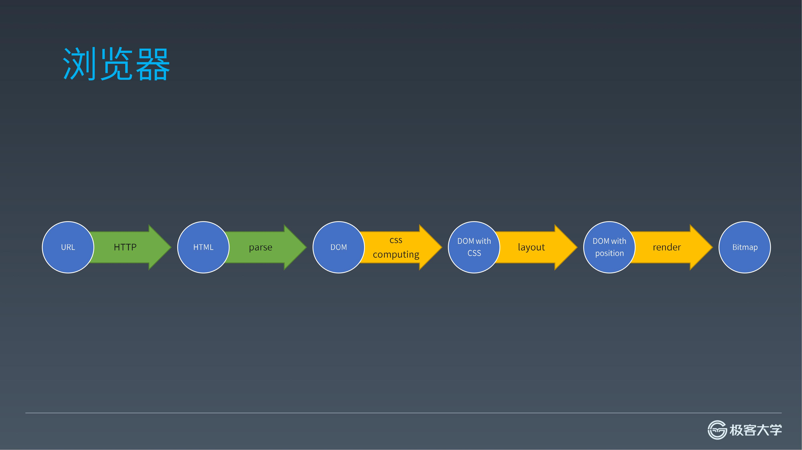

## 前言



目前已经完成了解析 HTML 的部分，接下来要进行 CSS Computing 部分。

浏览器的 `window` 对象上有一个 `getComputedStyle` 方法能获取到某个元素上的 ComputedStyle，这个 ComputedStyle 就是计算后最终在元素上生效的 style，这是后面布局计算的前提。

为了尽快渲染出页面，计算 CSS 的步骤是在构建 DOM 树的过程中同步进行的，但为了直观表示，上图中拆分成了流水线的步骤。在经历了计算 CSS 之后，出来的 DOM 树是带 Computed Style 的 DOM 树，也就是上图节点中的 DOM with CSS

> - [系列博文](/tag/实现一个玩具浏览器/)
> - [项目地址](https://github.com/xuyimingwork/toy-browser)

## 安装依赖

因为 CSS 的解析有些复杂，因此使用 [css](https://www.npmjs.com/package/css) 包来完成。该包接收 CSS 字符串并返回解析好的 [AST](https://en.wikipedia.org/wiki/Abstract_syntax_tree) 对象。

通过下面的命令在 toy-browser 项目中安装一下 `css` 包

```sh
yarn add css
```

## 收集 CSS 规则

这个步骤暂时不考虑 `link` 的情况，目前而言就是收集 `style` 标签的文本内容。

从上节可以看到，在 `emit` 中遇到结束标签时，说明标签内的文本内容已经完整。因此在结束标签时，若检测到当前元素为 `style` 元素，就把它的内容提取出来。

```js
function emit(token) {  
  // ... 
  } else if (token.type === 'endTag') {
    if (top.tagName === token.tagName) {
      if (top.tagName === 'style') {
        addCSSRules(top.children[0].content)
      }
      stack.pop()
    }
    else throw Error()
    currentTextNode = null
  } else if (token.type === 'text') {
  // ...
}
```

```js
const css = require('css')
let rules = []
function addCSSRules(text) {
  const ast = css.parse(text)
  rules.push(...ast.stylesheet.rules)
}
```

目前 `index.html` 中的 CSS 内容如下

```css
body div #myid{
    width:100px;
    background-color: #ff5000;
}
body div img{
    width:30px;
    background-color: #ff1111;
}
```

把 `parseHTML` 函数循环后的打印换成 `console.log(JSON.stringify(rules, null, 2))`，打印出来看下。


解析出了需要的 CSS 规则，结果中的 position 是用于 source map 的，这里不用去管它

## 计算元素的 CSS

### 计算元素 CSS 的时机

刚才的步骤只是收集 CSS 规则，接下来要计算每个元素的 CSS。一个关键点是计算 CSS 的时机。你会发现在遇到元素的**开始标签**时，我们已经收集好了这个元素**前**的 CSS 规则。这时就可以针对这个元素做 CSS Computing，算出这个元素需要的 CSS 规则。

之所以这么做还有一个原因是许多 CSS 属性的计算是依赖其父元素的 CSS 属性的，有些元素比较大，内部包裹了非常多的元素，如果在结束标签时去计算，就会导致页面渲染的时机非常晚，所以元素 CSS 的计算要尽量早，这里在元素开始标签的时候去做。

```js
function emit(token) {  
  const top = stack[stack.length - 1]
  if (token.type === 'startTag') {
    const element = {
      type: 'element',
      tagName: token.tagName,
      // parent: top,
      children: [],
      attributes: token.attributes
    }
    computeCSS(element)
    top.children.push(element)
    if (!token.isSelfClosing) stack.push(element)
    currentTextNode = null
  }
  // ...
}

function computeCSS(element) {
  console.log(rules, element)
}
```

> 实际上浏览器在遇到样式后，会对**该样式前面的元素**进行重新计算，之后就会产生重排重绘之类的事情。比如如果你在 body 的结束标签前放了一个 css，就会导致整个页面的 css 重新计算，导致后续的重排重绘。现在就能理解为什么样式位置的最佳实践会将所有样式放在最前面了。

### 获取当前元素的父序列

除了刚才传入 `computeCSS` 函数的当前元素自身以及 `rules` 外，CSS 计算还需要当前元素的父元素列表。

这里有两种方法获取：
- 我们构建 `element` 元素对象的时候，每个对象都有自己的 `parent` 属性，我们可以通过 `parent` 属性逐级获取拿到父序列
- 另一种是我们在构建 DOM 树中使用的是栈，所以从栈顶到栈底就是从当前元素的父元素到根元素。

```js
function computeCSS(element) {
  const elements = stack.slice().reverse()
  console.log(rules, element, elements)
}
```

这里给 `slice` 给 `stack` 做了层浅拷贝，`reverse` 则是因为后面的匹配需要从当前节点到根节点去和 CSS 的选择器匹配。

比如 CSS 选择器

`body div #myid`

如果这个选择器选中当前元素，那么当前元素一定有个值为 `myid` 的 id 属性。那在计算某个 CSS 选择器是否选中了当前元素的时候，也是先看当前元素是否匹配了最后的 `#myid` 这一简单选择器。然后再去看从父到根元素的序列中是否先有个 `div`，再有个 `body`。

### 获取匹配规则

```js
function computeCSS(element) {
  const elements = stack.slice().reverse()
  if (!element.computedStyle) element.computedStyle = {}

  // 遍历每条 CSS 规则，看是否与当前元素匹配
  for (let rule of rules) {
    /**
     * 对于单条规则
     * 1. 只考虑单个选择器，不考虑逗号分隔的选择器组
     * 2. 只考虑以空格分隔的后代组合选择符，不考虑子元素、兄弟等组合选择符
     * 3. selectorParts 中各项均为简单选择器（只考虑 id、类、类型三种简单选择器）
     */
    const selectorParts = rule.selectors[0].split(' ').reverse()
    if (!match(element, selectorParts[0])) continue

    let matched = false

    let j = 1;
    for (let i = 0; i < elements.length; i++) {
      if (match(elements[i], selectorParts[j])) {
        j++
      }
    }

    // 若选择器的各部分简单选择器均匹配，则该条规则匹配
    if (j >= selectorParts.length) matched = true
    
    if (matched) {
      console.log('el', element.tagName, element.attributes, 
        '\nmatched', rule.selectors[0])
    }
  }
}

/**
 * 判断元素与简单选择器是否匹配
 * @param {*} element 元素
 * @param {*} selector 简单选择器（id、类、类型）
 */
function match(element, selector) {
  if (!selector || !element.attributes) return false

  if (selector.charAt(0) === '#') {
    const attr = element.attributes.filter(attr => attr.name === 'id')[0]
    if (attr && attr.value === selector.replace('#', '')) return true
  } else if (selector.charAt(0) === '.') {
    const attr = element.attributes.filter(attr => attr.name === 'class')[0]
    if (attr && attr.value === selector.replace('.', '')) return true
  } else if (element.tagName === selector) {
    return true
  }

  return false
}
```
首先只考虑 ` ` 分隔的后代组合选择符，选择器的每个部分都是简单选择器。如：

`body div #myid` 以及 `body div img`

这里对于每个规则的做法是这样的，先用空格进行拆分，就能得到每个简单选择器。
- 先用最后一个简单选择器（就是 `#myid` 和 `img`）和当前元素进行匹配。
  - 若不匹配则这条规则不匹配，继续下条规则
  - 若匹配，遍历当前元素的父序列。若当前元素的父序列遍历完成时该规则的每个简单选择器都存在匹配元素，则当前元素与当前规则匹配。

对于简单选择器和元素的匹配，就是 `match` 函数，只是很粗暴地检查了一下三种类型的简单选择器。

对于匹配的规则和元素，这边只是简单地打印了一下，结果如下：


### 生成 Computed 属性

当元素拿到匹配的 CSS 规则之后，就需要用这个规则生成自身的 Computed 属性。同时在这一步里还需要做 CSS 优先级的计算，就是当一个属性被多个 CSS 规则设置的时候，那个规则设置的值会成为元素自身最后的 Computed 值。

首先是不带优先级的情况

```js
function computeCSS(element) {
  const elements = stack.slice().reverse()
  if (!element.computedStyle) element.computedStyle = {}

  for (let rule of rules) {
    // ...

    if (matched) {
      const computedStyle = element.computedStyle
      for (let declaration of rule.declarations) {
        if (!computedStyle[declaration.property]) computedStyle[declaration.property] = {}
        computedStyle[declaration.property].value = declaration.value
      }
      console.log(element.tagName, element.attributes,  element.computedStyle)
    }
  }
}
```

结果如下


这时候后面出现的规则会覆盖前面的规则，即使后面规则的优先级更低。

因此在保存某个属性的值的时候，还需要保存该属性值对应的 CSS 规则的优先级。这样后续遇到需要覆盖这个属性时，就可以比较优先级判断是否需要覆盖。

关于 CSS 规则优先级的计算，可以看这个图：

[](https://specifishity.com/)

可以看到 

- CSS 的优先级用了一个三元组来表示，inline 的是四元组，important 五元组。元组从高位到低位进行比较，一旦高位胜过，低位再大也无法“胜出”。

- CSS 的优先级计算需要考虑几个方面
  - selector
  - inline
  - important

> 实际上在标准的描述里，说的是用一个“足够大”的数，来防止低位的优先级影响到高位的优先级。也就是说，低位和高位之间不能出现“进位”。所以这里直接用元组的方式来表现。

这里不考虑 inline 和 important 的情况，所以计算优先级的过程其实就是得出三元组的过程，后面比较的时候也是比较这个三元组。

```js
function specificity(selector) {
  const p = [0, 0, 0]
  const selectorParts = selector.split(' ')
  for (let part of selectorParts) {
    if (part.charAt(0) === '#') {
      p[0] += 1
    } else if (part.charAt(0) === '.') {
      p[1] += 1
    } else {
      p[2] += 1
    }
  }
  return p
}
```

比较函数

```js
function compare(sp1, sp2) {
  if (sp1[0] - sp2[0]) return sp1[0] - sp2[0]
  if (sp1[1] - sp2[1]) return sp1[1] - sp2[1]
  if (sp1[2] - sp2[2]) return sp1[2] - sp2[2]
  return 0
}
```

最后，只需要在当前属性未赋值，或当前属性值的优先级更小或相同时，覆盖属性值即可

```js
function computeCSS(element) {
  // ...
  for (let rule of rules) {
    // ...

    if (matched) {
      const sp = specificity(rule.selectors[0])
      const computedStyle = element.computedStyle
      for (let declaration of rule.declarations) {
        if (!computedStyle[declaration.property]) computedStyle[declaration.property] = {}
        if (!computedStyle[declaration.property].specificity 
          || compare(computedStyle[declaration.property].specificity, sp) <= 0){
              computedStyle[declaration.property].specificity = specificity(rule.selectors[0])
              computedStyle[declaration.property].value = declaration.value
          }
      }
    }
  }
}
```

## 你好，DOM with CSS

照惯例打印一下 DOM


