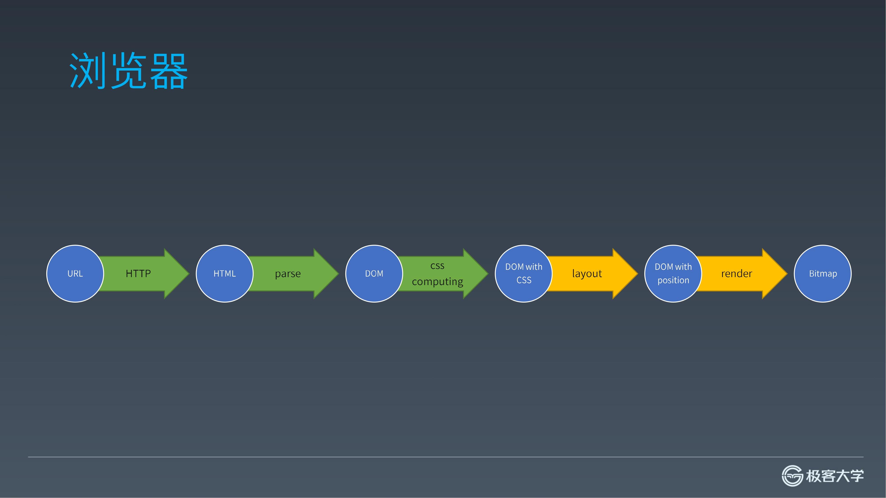
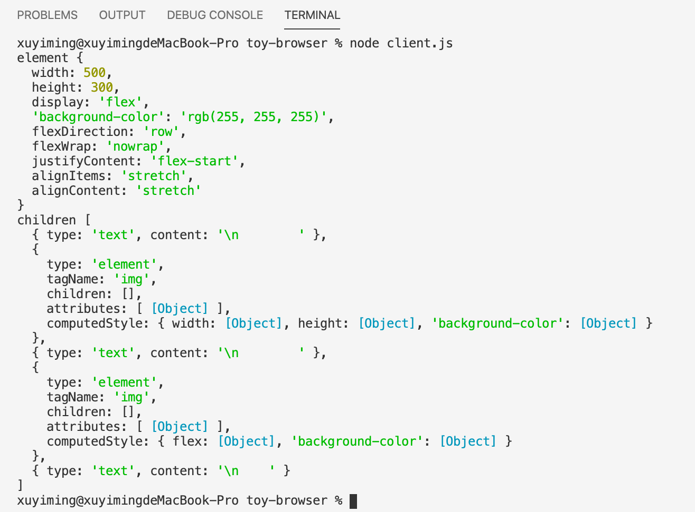

## 前言



截止目前，已经得到了各元素的 Computed Style，接下来要进行 Layout。浏览器目前有几种布局体系，如：正常流布局，flex 布局，以及 grid 布局等。本项目只实现 flex 布局。

> - [系列博文](/tag/实现一个玩具浏览器/)
> - [项目地址](https://github.com/xuyimingwork/toy-browser)

## Layout 的目标

在开始本阶段之前，需要明确一个问题，就是 Layout 到底要做什么事情，有什么产物，Layout 的目标是什么？

答案很简单，Layout 的作用就是确定每个元素在什么位置，占用了多大地方。实际上元素是矩形，且不考虑矩形的倾斜与旋转。因此在什么位置和占用了多大地方其实只需要知道元素的左上角坐标和以及元素的宽高。

因此 Layout 阶段就是计算元素的 `left` `top` `width` `height`，而这四个位置信息也等价于 `left` `top` `right` `bottom`。有了这些位置信息，绘制阶段就知晓在哪里绘制元素。

> 在浏览器中，可以通过元素的 `getBoundingClientRect` 方法，拿到类似的位置信息。

至于具体这个元素长什么样，元素里面要绘制出哪些东西，这是绘制阶段的事情。

## 了解 flex 布局

在实现 flex 布局之前，需要了解 flex 布局的规则，了解 flex 是如何“安放”各元素的。

参考资料：

- [阮一峰 Flex 布局教程：语法篇](https://www.ruanyifeng.com/blog/2015/07/flex-grammar.html)
- [MDN CSS 弹性盒子布局](https://developer.mozilla.org/zh-CN/docs/Web/CSS/CSS_Flexible_Box_Layout)
- [W3C CSS Flexible Box Layout Module Level 1](https://www.w3.org/TR/2018/CR-css-flexbox-1-20181119/)

## 更新 index.html 文件

将服务端的 `index.html` 内容替换如下：

```html
<html maaa=a >
<head>
    <style>
#container {
    width: 500px;
    height: 300px;
    display: flex;
    background-color: rgb(255, 255, 255);
}
#container #myid {
    width: 200px;
    height: 100px;
    background-color: rgb(255, 0, 0);
}
#container .c1 {
    flex: 1;
    background-color: rgb(0, 255, 0);
}
    </style>
</head>
<body>
    <div id="container">
        
        
    </div>
</body>
</html>
```

这里 `#container` 作为 flex 容器，其内有两个 flex 项。`#myid` 的固定框高，`.c1` 的使用 flex 自适应。三个元素均添加了背景色。

## 出来吧 layout

从前面的分析知道 layout 阶段实际上是计算元素的位置信息。那么需要一个 `layout` 函数，接收一个元素，计算并给该元素添加上位置属性。此处新增 `layout.js` 文件实现 `layout` 函数并将该函数导出 。

```js
// layout.js
function layout(element) {
  
}

module.exports = layout
```

## layout 的调用时机

然后，我们面对的问题是，要在哪里调用 layout 函数？

首先这个计算肯定是越早越好，越早得出位置信息，就能越早执行渲染，就能越早呈现页面。并且 `layout` 一定是在 `computeCSS` 之后调用。

那么，能不能直接在 `computeCSS` 之后调用 `layout`？

答案是对于 flex 布局，不行。

实际上浏览器中计算布局的时机是依据布局系统的不同而不同的。对与目前实现的 flex 布局而言，需要在结束标签的时候进行布局操作。原因是当某个元素是 flex 容器，该元素的位置信息依赖其子元素的属性。

因此，在 `parser.js` 中引入 `layout`。在结束标签时调用 `layout` 并传入元素。

```js
const layout = require('./layout')
// ...
function emit(token) {  
  const top = stack[stack.length - 1]
  if (token.type === 'startTag') {
    // ...
  } else if (token.type === 'endTag') {
    if (top.tagName === token.tagName) {
      if (top.tagName === 'style') {
        addCSSRules(top.children[0].content)
      }
      layout(top)
      stack.pop()
    }
    else throw Error()
    currentTextNode = null
  } else if (token.type === 'text') {
    // ...
  }
}
```

## layout.js 进行时

### 辅助函数 getStyle

在 layout 时，经过 `computeCSS` 的处理，元素上已经有了 `computedStyle`。但 `computedStyle` 中有些东西并不需要。用 `getStyle` 处理下

```js
// layout.js
function getStyle(element) {
  if (!element.style) element.style = {}

  for (let prop in element.computedStyle) {
    element.style[prop] = element.computedStyle[prop].value

    const value = element.style[prop]
    if (value.toString().match(/px$/)
      || value.toString().match(/^[0-9\.]+$/)) {
      element.style[prop] = parseInt(value)
    }
  }

  return element.style
}
```

`getStyle` 中只是简单地将 `computedStyle` 的属性复制到 `style` 的属性中。这里还把数值类型的属性值直接转为整数数字类型。

> 这里也是一个简单处理，后面会将 layout 得出的位置信息一同放在 `style` 字段内。在后续的绘制阶段则使用 `style` 内的信息进行绘制。

### layout 的开胃小菜

从这里开始会逐步实现 layout 函数。layout 函数内要计算 flex 布局下各元素的位置。先给个卫语句

```js
// layout.js
function layout(element) {
  if (!element.computedStyle) return

  const style = getStyle(element)
  if (style.display !== 'flex') return

  // ...
}
```

接下来处理一些属性。若这些属性没有，则添加上默认值。

```js
function layout(element) {
  if (!element.computedStyle) return

  const style = getStyle(element)
  if (style.display !== 'flex') return

  !['width', 'height'].forEach(size => {
    if (!style[size] || style[size] === 'auto') {
      style[size] = null
    }
  })

  if (!style.flexDirection || style.flexDirection === 'auto') 
    style.flexDirection = 'row'
  if (!style.flexWrap || style.flexWrap === 'auto') 
    style.flexWrap = 'nowrap'
  if (!style.justifyContent || style.justifyContent === 'auto') 
    style.justifyContent = 'flex-start'
  if (!style.alignItems || style.alignItems === 'auto') 
    style.alignItems = 'stretch'
  if (!style.alignContent || style.alignContent === 'auto') 
    style.alignContent = 'stretch'
}
```

这里先是统一了 `width` 和 `height` 属性不存在的情况，然后为将 flex 容器不存在的相关属性设为默认值。

> 在 `display: flex` 的情况下，flex 容器相关的 css 属性有：`flex-direction`、`flex-wrap`、`flex-flow`、`justify-content`、`align-items`、`align-content`。
> 
> 其中的 `flex-flow` 是 `flex-direction` 和 `flex-wrap` 的简写。因此，这里设置了五个默认属性。

## 小结

```js
function layout(element) {
  // ...
  console.log('element', style)
  console.log('children', element.children)
}
```

最后，打印一下当前元素的 `style`。



> 至此，已经完成了布局需要的前置准备工作，下节即可开始自身与子元素位置的计算