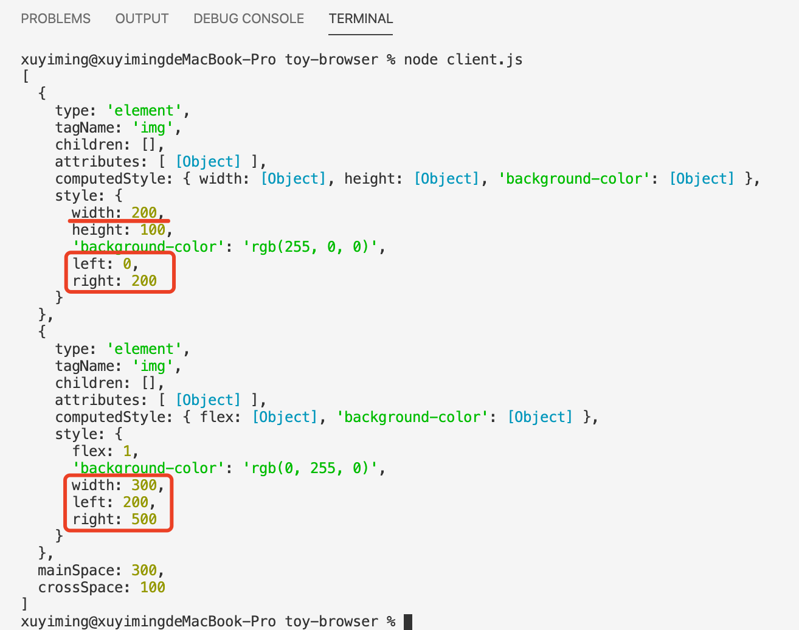
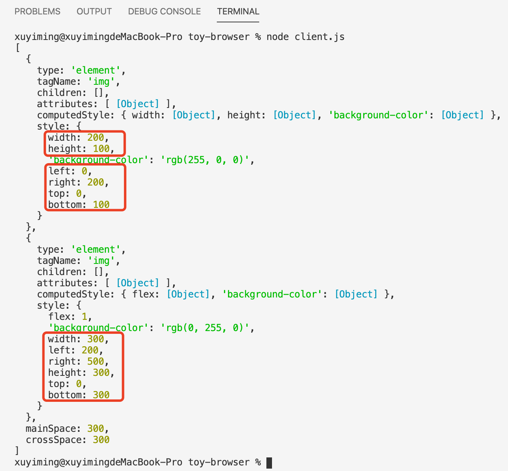

## 前言

上一节完成了 flex 布局计算前的准备。本节将完成 flex 布局下各元素位置的计算。

> - [系列博文](/tag/实现一个玩具浏览器/)
> - [项目地址](https://github.com/xuyimingwork/toy-browser)

## 抽象主轴与交叉轴属性

flex 有个主轴与交叉轴的概念。

- 当主轴为 `row` 时
  - 主轴排列子元素时计算的是 `width` 属性
  - 主轴排列从 `left` 到 `right`
  - 计算横向坐标从容器内左侧的 0 位置，排入元素时逐个相加
  - 此时交叉轴计算的是 `height` 属性
  - 交叉轴从 `top` 到 `bottom`
- 当主轴为 `row-reverse` 时
  - 主轴排列子元素计算的仍是 `width` 属性
  - 需要从 `right` 开始到 `left`
  - 位置坐标计算需要从容器右侧的容器宽度开始，排入元素时逐个相减
  - 交叉轴方向处理方式不变
- 当主轴为 `column`
  - 主轴排列子元素计算的是 `height` 属性
  - 主轴方向从 `top` 开始到 `bottom`
  - 计算纵向坐标时从容器内顶部的 0 位置，排入元素时逐个相加
  - 此时交叉轴计算的是 `width` 属性
  - 交叉轴从 `left` 到 `right`
- 当主轴为 `column-reverse`
  - 主轴排列子元素计算的是 `height` 属性
  - 主轴方向从 `bottom` 到 `top`
  - 计算纵向坐标时从容器内底部开始，排入元素时逐个相减
  - 此时交叉轴计算同 `column`

此外还有一个 wrap 的关系，
- nowrap 时
  - 交叉轴从 0 位置开始，排入一排主轴元素时累加
- wrap-reverse 时
  - 交叉轴的开始与结束互换
  - 交叉轴从“结束”位置开始，排入一列主轴元素时递减

因此需要用变量保存不同情况下需要处理的属性，抽象主轴与交叉轴在不同情况下的属性

```js
function layout(element) {
  // ...

  let {
    mainSize, mainStart, mainEnd, mainSign, mainBase,
    crossSize, crossStart, crossEnd, crossSign, crossBase
  } = initAbstractAxisVariable(style)

  console.log(mainSize, mainStart, mainEnd, mainSign, mainBase)
  console.log(crossSize, crossStart, crossEnd, crossSign, crossBase)
}

function initAbstractAxisVariable(style) {
  let mainSize, mainStart, mainEnd, mainSign, mainBase,
      crossSize, crossStart, crossEnd, crossSign, crossBase;
  
  if (style.flexDirection === 'row') {
    mainSize = 'width';
    mainStart = 'left';
    mainEnd = 'right';
    mainSign = +1;
    mainBase = 0;

    crossSize = 'height';
    crossStart = 'top'
    crossEnd = 'bottom'
  }

  if (style.flexDirection === 'row-reverse') {
    mainSize = 'width';
    mainStart = 'right';
    mainEnd = 'left';
    mainSign = -1;
    mainBase = style.width;

    crossSize = 'height';
    crossStart = 'top'
    crossEnd = 'bottom'
  }

  if (style.flexDirection === 'column') {
    mainSize = 'height';
    mainStart = 'top';
    mainEnd = 'bottom';
    mainSign = +1;
    mainBase = 0;

    crossSize = 'width';
    crossStart = 'left';
    crossEnd = 'right'
  }

  if (style.flexDirection === 'column-reverse') {
    mainSize = 'height';
    mainStart = 'bottom';
    mainEnd = 'top';
    mainSign = -1;
    mainBase = style.height;

    crossSize = 'width';
    crossStart = 'left';
    crossEnd = 'right'
  }

  if (style.flexWrap === 'nowrap') {
    crossBase = 0;
    crossSign = +1
  }

  if (style.flexWrap === 'wrap-reverse') {
    [crossStart, crossEnd] = [crossEnd, crossStart]
    crossBase = style[crossSize]
    crossSign = -1
  }

  return {
    mainSize, mainStart, mainEnd, mainSign, mainBase,
      crossSize, crossStart, crossEnd, crossSign, crossBase
  }
}
```

## 将 flex 项收入各排

简单而言就是看 flex 项能排成几排，当容器的 `flex-wrap` 属性不为 `nowrap` 时，flex 各项会按顺序排入各排。这排排不下后排入下一排。

> 这里的项指的是 flex 容器内的各项，“排”在标准里写作 flex lines，因为 flex 有主轴和交叉轴，行和列有方向意味，“排”就有横排竖排，因此此处把 line 译为排。

```js
function layout(element) {
  // ...

  const flexLines = collectItemsIntoLines({
    style, children: element.children, mainSize, crossSize
  })

  console.log(flexLines)
}

function collectItemsIntoLines({
  style, children, mainSize, crossSize
}) {
  const items = children
    .filter(node => node.type === 'element')
    .map(element => {
      getStyle(element)
      return element
    })
    .sort((a, b) => (a.style.order || 0) - (b.style.order || 0))

  let flexLine = []
  const flexLines = [flexLine]

  let mainSpace = style[mainSize]
  let crossSpace = 0
  
  for (item of items) {
    const itemStyle = getStyle(item)
    
    if (!itemStyle[mainSize]) {
      itemStyle[mainSize] = 0
    }

    if (style.flexWrap === 'nowrap') {
      // 一排情况
      flexLine.push(item)
    } else {
      // 可能单排或多排
      if (itemStyle[mainSize] > style[mainSize]) {
        itemStyle[mainSize] = style[mainSize]
      }

      if (itemStyle.flex) { 
        // 模型简化为扩张缩小均可的 flex
        flexLine.push(item)
      } else if (mainSpace >= itemStyle[mainSize]) {
        // 本行剩余空间可放下当前元素
        flexLine.push(item)
      } else {
        // 剩余空间不足放下当前元素，新开一排

        flexLine = [item]
        flexLines.push(flexLine)

        mainSpace = style[mainSize]
        crossSpace = 0
      }
    }

    mainSpace -= itemStyle[mainSize]
    if (itemStyle[crossSize]) {
      crossSpace = Math.max(crossSpace, itemStyle[crossSize])
    }

    flexLine.mainSpace = mainSpace
    flexLine.crossSpace = crossSpace
  }

  return flexLines
}
```

这段，我们把一个个 flex 项放入它应该归属的排。同时，每放入一项，就计算该排剩余的主轴空间与占据的交叉轴空间。
- 主轴剩余空间即减去当前排主轴方向各项所占空间
- 交叉轴占据空间即本排交叉轴占据空间最大的元素

## 计算主轴

计算主轴需要处理的一个东西是带 flex 属性的元素。

这里我们模型较为简单，即
- 获取每排的主轴方向剩余空间与 flex 值
- 若主轴方向空间为负，该排所有 flex 元素主轴尺寸为 0，等比压缩剩余尺寸
- 若主轴方向存在剩余空间
  - 若存在 flex 元素，则为 flex 元素分配剩余空间
  - 若不存在 flex 元素，则依据 justify-content 调整各元素位置

> 此处不考虑 flex 的 basic、grow、shrink 属性，只简单把 flex 元素看做可依据剩余空间扩大或缩小的元素

```js
function layout(element) {
  // ...

  calculateMainSize({ 
    flexLines, style, 
    mainSize, mainStart, mainEnd, mainSign, mainBase, })

  console.log(flexLines[0])
}

function calculateMainSize({ 
  flexLines, style, 
  mainSize, mainStart, mainEnd, mainSign, mainBase,
}) {
  flexLines.forEach(flexLine => {
    // 获取本排剩余空间
    const mainSpace = flexLine.mainSpace

    // 获取本排 flex 值
    const flexTotal = flexLine.reduce((flexTotal, item) => {
      const itemStyle = getStyle(item)
      if (itemStyle.flex) flexTotal += itemStyle.flex
      return flexTotal
    }, 0)

    if (mainSpace < 0) {
      // 本排元素需要宽度超过容器宽度，等比缩小本排各元素
      const scale = style[mainSize] / (style[mainSize] - mainSpace)
      let currentMainPosition = mainBase
      flexLine.forEach(item => {
        const itemStyle = getStyle(item)
        if (itemStyle.flex) itemStyle[mainSize] = 0

        // 主轴方向尺寸等比缩小
        itemStyle[mainSize] = itemStyle[mainSize] * scale

        // 计算主轴方向元素位置（排列个元素）
        itemStyle[mainStart] = currentMainPosition
        itemStyle[mainEnd] = itemStyle[mainStart] + mainSign * itemStyle[mainSize]
        currentMainPosition = itemStyle[mainEnd]
      })
    } else if (flexTotal > 0) {
      // 若本排存在剩余空间且存在 flex 元素
      let currentMainPosition = mainBase
      flexLine.forEach(item => {
        const itemStyle = getStyle(item)

        // flex 元素按比例分配本排剩余空间
        if (itemStyle.flex) itemStyle[mainSize] = (mainSpace / flexTotal) * itemStyle.flex

        // 计算主轴方向元素位置（排列个元素）
        itemStyle[mainStart] = currentMainPosition
        itemStyle[mainEnd] = itemStyle[mainStart] + mainSign * itemStyle[mainSize]
        currentMainPosition = itemStyle[mainEnd]
      })
    } else {
      // 若存在剩余空间且不存在 flex 元素，则 justifyContent 属性生效
      let currentMainPosition
      let gap
      const justifyContent = style.justifyContent

      if (justifyContent === 'flex-start') {
        currentMainPosition = mainBase
        gap = 0
      }

      if (justifyContent === 'flex-end') {
        currentMainPosition = mainSpace * mainSign + mainBase
        gap = 0
      }

      if (justifyContent === 'center') {
        currentMainPosition = mainSpace / 2 * mainSign + mainBase
        gap = 0
      }

      if (justifyContent === 'space-between') {
        currentMainPosition = mainBase
        gap = mainSpace / (flexLine.length - 1) * mainSign
      }

      if (justifyContent === 'space-around') {
        gap = mainSpace / flexLine.length * mainSign
        currentMainPosition = gap / 2 + mainBase
      }

      flexLine.forEach(item => {
        const itemStyle = getStyle(item)
        itemStyle[mainStart] = currentMainPosition
        itemStyle[mainEnd] = itemStyle[mainStart] + mainSign * itemStyle[mainSize]
        currentMainPosition = itemStyle[mainEnd] + gap
      })
    }
  })
}
```

在本步骤完成后，主轴方向的计算已经完成。从我们的 `index.html` 来看，就是横向的位置信息已经计算完毕。意味着 flex 容器中各子元素的 `left`、`right`、`width` 已经计算完毕。因为我们的 flex 只有一排，直接输出看下计算结果。



## 计算交叉轴

同样，交叉轴的计算也有几个点

- 首先，各排的交叉轴尺寸该排交叉轴方向尺寸最大的那个元素。
- 其次，多排且交叉轴方向存在剩余空间时，各排的交叉轴位置**及尺寸**取决于容器的 `align-content` 属性。
- 最后，在知晓了各排的位置，即可依据容器的 `align-items` 属性以及元素自身的 `align-self` 属性计算排中各个元素的尺寸

```js
function layout(element) {
  // ...

  calculateCrossSize({
    flexLines, style,
    crossSize, crossStart, crossEnd, crossSign, crossBase
  })

  console.log(flexLines[0])
}

function calculateCrossSize({ 
  flexLines, style,
  crossSize, crossStart, crossEnd, crossSign, crossBase
}) {
  if (!style[crossSize]) {
    // 容器元素未设置交叉轴尺寸，容器元素交叉轴尺寸为各排之和
    element[crossSize] = flexLines.reduce((crossSize, flexLine) => {
      return crossSize += flexLine.crossSize
    }, 0)
  }

  // 若只有一排，撑开
  if (flexLines.length === 1) flexLines[0].crossSpace = style[crossSize] 

  // 计算剩余空间，存在剩余空间时依据 alignContent 计算各排位置
  let crossSpace = style[crossSize]
  flexLines.forEach(flexLine => crossSpace -= flexLine.crossSpace)
  let gap = 0
  if (crossSpace > 0 && style.flexWrap !== 'nowrap') {
    if (style.alignContent === 'flex-start') {
      crossBase += 0
      gap = 0
    }

    if (style.alignContent === 'flex-end') {
      crossBase += crossSign * crossSpace
      gap = 0
    }

    if (style.alignContent === 'center') {
      crossBase += (crossSign * crossSpace) / 2
      gap = 0
    }

    if (style.alignContent === 'space-between') {
      crossBase += 0
      gap = crossSpace / (flexLines.length - 1)
    }

    if (style.alignContent === 'space-around') {
      gap = crossSpace / flexLines.length
      crossBase += crossSign * gap / 2
    }

    // alignContent 为 stretch 时，将多余的空间分配到各排
    if (style.alignContent === 'stretch') {
      crossBase += 0
      gap = 0
      flexLines.forEach(flexLine => flexLine.crossSpace += crossSpace / flexLines.length)
    }
  }

  // 计算各排各元素交叉轴位置
  flexLines.forEach(flexLine => {
    const lineCrossSize = flexLine.crossSpace

    flexLine.forEach(item => {
      const itemStyle = getStyle(item)
      align = itemStyle.alignSelf || style.alignItems
  
      // 获取元素交叉轴尺寸
      if (!itemStyle[crossSize]) 
        itemStyle[crossSize] = align === 'stretch' ? lineCrossSize : 0
      
      // 对排内元素执行 align 计算
      if (align === 'flex-start') {
        itemStyle[crossStart] = crossBase
        itemStyle[crossEnd] = crossBase + crossSign * itemStyle[crossSize]
      } else if (align === 'flex-end') {
        itemStyle[crossEnd] = crossBase + crossSign * lineCrossSize
        itemStyle[crossStart] = itemStyle[crossEnd] - crossSign * itemStyle[crossSize]
      } else if (align === 'center') {
        itemStyle[crossStart] = crossBase + crossSign * (lineCrossSize - itemStyle[crossSize])
        itemStyle[crossEnd] = itemStyle[crossStart] + crossSign * itemStyle[crossSize]
      } else if (align === 'stretch') {
        itemStyle[crossStart] = crossBase
        itemStyle[crossEnd] = crossBase + crossSign * itemStyle[crossSize]
      }
    })
  
    crossBase += crossSign * (lineCrossSize + gap)
  })
}
```

## 小结

自此，已完成了 flex 布局下各元素位置的计算，结果如下



看起来没什么错误，OK，下一节开始渲染！