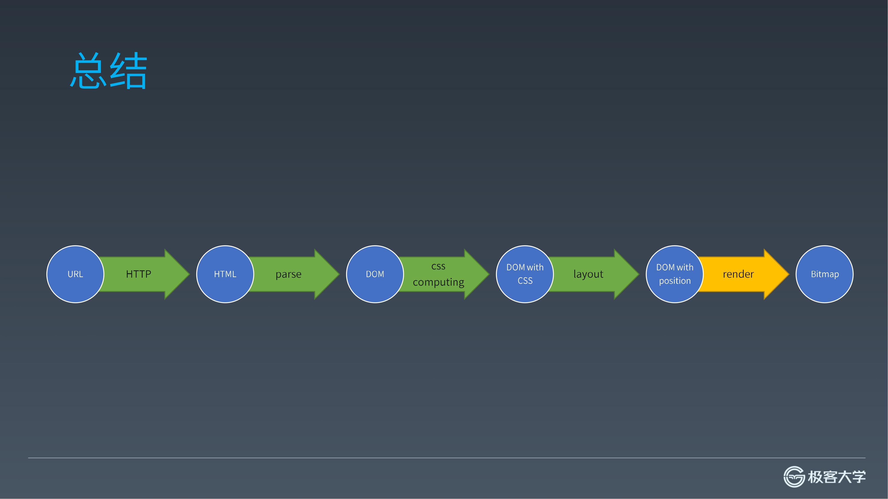
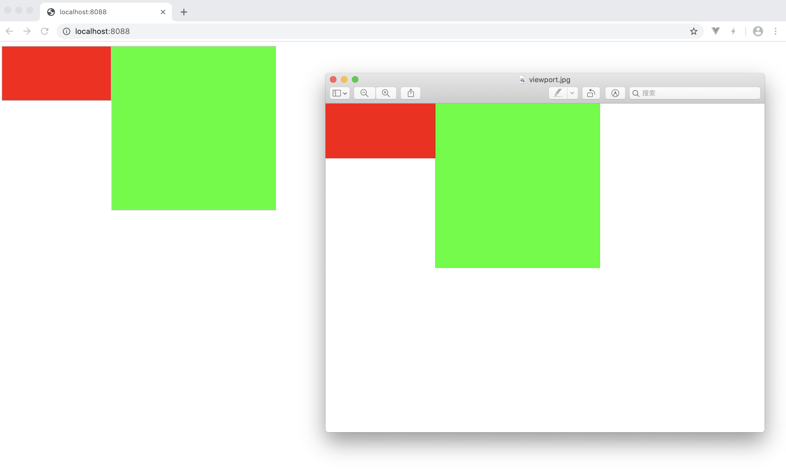

## 前言



经过布局，已经拿到了元素的位置信息，本节要做的就是将元素画出来。其实这节并没有什么东西，主要是用一个库来绘制页面，但终于走到这一步，还是比较激动的。

## 准备

主要是用 [images](https://www.npmjs.com/package/images) 完成最后的渲染工作。可以先看下如何使用这个库。

> 注意，这个库暂时最高支持 node v10 版本，你可以用 nvm 管理你的 node 版本。

将 node 切换到 v10，通过 `yarn add images` 添加一下这个依赖

首先调整 `parser.js` 中 `parseHTML` 函数，返回最总的解析结果

```js
// parser.js
// ...
module.exports.parseHTML = function(html) {
  let state = data
  for (let c of html) {
    state = state(c)
  }
  state = state(EOF)
  return stack[0]
}
```

新增一个 `render.js` 文件，该文件导出 `render` 函数

```js
// render.js
const images = require('images')

function render(viewport, element) {
  
}

module.exports = render
```

`client.js` 文件，执行 `render` 并保存结果

```js
// client.js
const images = require('images')
const render = require('./render')
// ...
request.send()
  .then(response => {
    const dom = parser.parseHTML(response.body)
    const viewport = images(800, 600)
    viewport.fill(255, 255, 255, 1)
    render(viewport, dom)
    viewport.save('viewport.jpg')
  });
```

这里用 `images` 函数创建了一个 800 * 600 背景是白色的画布 viewport，然后将画布与 dom 节点传入渲染函数 render

最后将画布保存到 `viewport.jpg`

## 渲染方法

```js
function render(viewport, element) {
  if (element.style) {
    const img = images(element.style.width, element.style.height)

    if (element.style['background-color']) {
      const color = element.style['background-color'] || "rgb(255, 255, 255)"
      color.match(/rgb\((\d+), *(\d+), *(\d+)\)/)
      img.fill(Number(RegExp.$1), Number(RegExp.$2), Number(RegExp.$3), 1)
    }
    
    viewport.draw(img, element.style.left || 0, element.style.top || 0)
  }

  if (element.children) {
    for (let child of element.children) {
      render(viewport, child)
    }
  }
}
```

这个渲染方法总体还是比较简单，首先看元素是否有 `style` 属性，有就依据上节计算的宽高创建图片 `img`，如果有背景色就给图片添加背景色。然后将图片画到画布 `viewport` 上。

之后检测是否有子元素，若有子元素，则递归调用 `render` 函数，将子元素画到 `viewport` 上。

## 结果与核对

终端执行 `node client.js`，项目文件夹下生成 `viewport.jpg` 如下


怎么知道渲染的对不对？浏览器访问服务端 `http://localhost:8088/`，对照浏览器，如下

