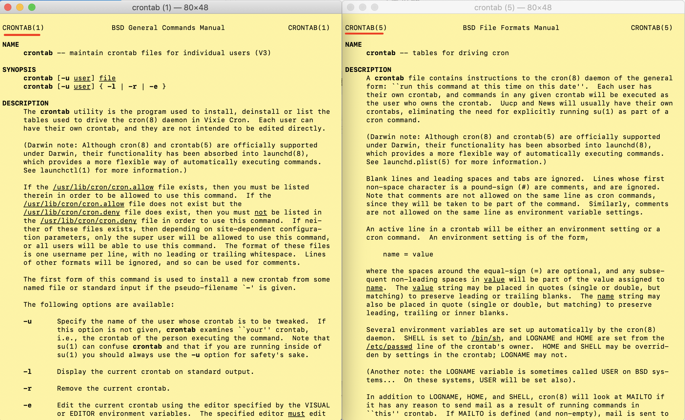

## 前言

在通过 [`acme.sh`](https://github.com/acmesh-official/acme.sh) 获取 [Let's Encrypt](https://letsencrypt.org/) 的 SSL 证书时接触到了 `cron` 与 `crontab`，现在总结整理一波。

> Let's Encrypt 签发的 SSL 证书存在有效期，目前是三个月。虽然时间比较短，但 Let's Encrypt 支持自动签发 SSL 证书，因此只要有个后台定期执行的程序，每天定时检测，在三个月快到期时重新获取 SSL 证书即可。而 `acme.sh` 在获取 SSL 证书时会自动在 `crontab` 中注册一个定期命令来完成上述事情。

## 介绍

### cron

通过 `man cron` 查看 `cron` 的介绍：

```sh
cron -- daemon to execute scheduled commands (Vixie Cron)
```

简而言之
- `cron` 是一个用于执行**计划表中**命令的后台进程
- `cron` 由 `launchd` 程序启动，无需手动启动
- `cron` 会每分钟检测**计划表中**的所有命令，查看是否需要执行

### crontab

上文提到了计划表中的命令。而这个**计划表**，就是 `crontab`，但 `crontab` 又不止是计划表。

`crontab` 代表两个东西：
- 一个是上面提到的计划表，就是计划表的名字是 `crontab`。这个计划表只是一个简单的文本文件，列出了需要在某个周期或时间点执行的命令。`cron` 每分钟都会去读取检测一下的这个计划表。
- 同时，`crontab` 也是操作计划表的命令的名字。

通过 `man crontab` 与 `man 5 crontab` 可以分别看到对这两个 `crontab` 的介绍



所以情况就变成了

**通过 `crontab` 命令操作 `crontab` 文件，设置由 `cron` 执行的计划任务**

## 使用

`crontab` 命令的具体使用方式可以通过 `man crontab` 查看。通常我们用 `crontab -l` 列出计划任务；通过 `crontab -e` 编辑 `crontab` 文件。

`crontab` 文件的具体内容格式可以通过 `man 5 crontab` 查看。大致是一行一个计划，每行的前半部分设置待执行的周期，后半部分是要执行的命令，周期设置分为五个部分，从左至右分别是分时日月周，以空格分隔。

另见：[维基百科 Cron](https://en.wikipedia.org/wiki/Cron)
