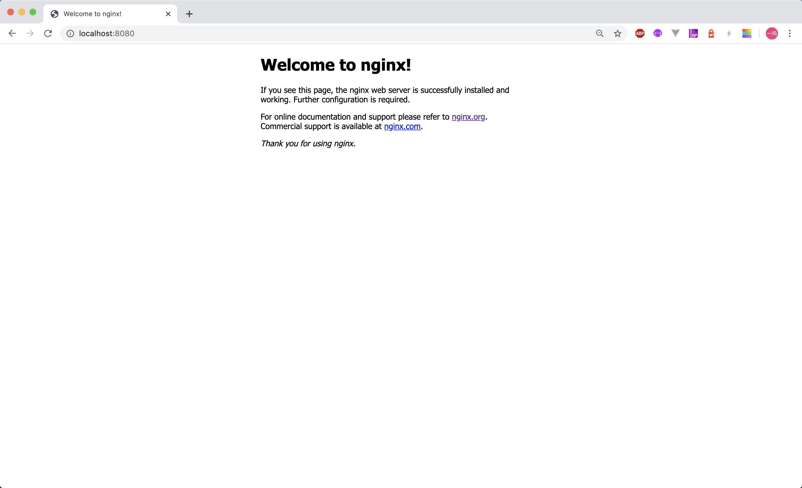
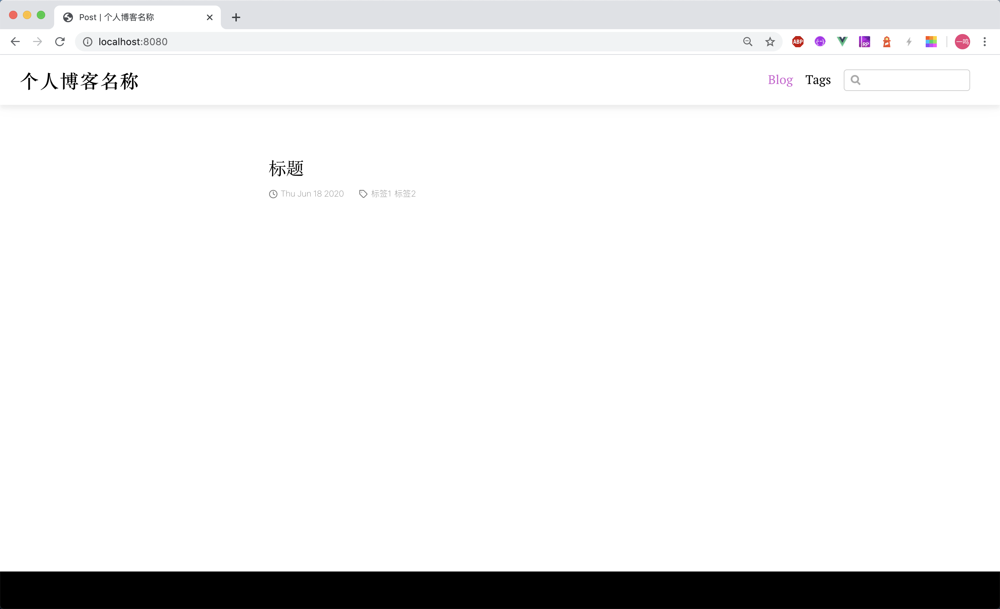
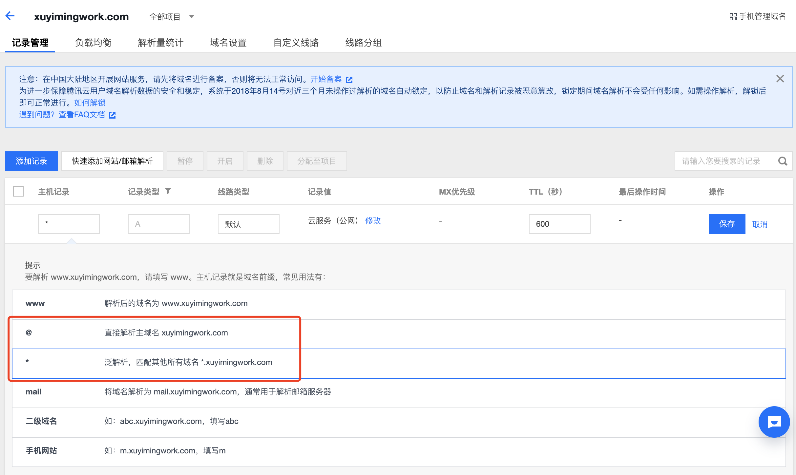
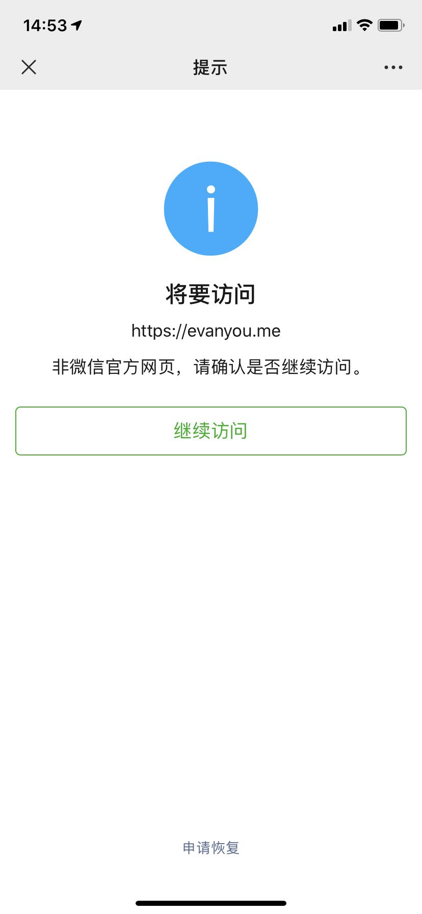

## 前言

整体步骤见右侧目录

## 使用 vuepress 搭建博客前端

vuepress 是个静态网站生成器，类似于 Hexo，简单来说就是它能把你写的 markdown 文档“编译”成能部署的网站（HTML+JS+CSS），详见[官网](https://vuepress.vuejs.org/zh/guide/)

vuepress 适合用来搭建项目文档、技术站点、博客，对于不同的用途，有对应不同的插件和主题，这里我们选择[博客主题](https://vuepress-theme-blog.ulivz.com/#installation)

### 初始化项目，安装依赖

```sh
mkdir demo-blog
cd demo-blog
git init
yarn init -y
yarn add vuepress @vuepress/theme-blog -D
```

### 设置 `.gitignore`

```.gitignore
node_modules
```

### 添加脚本

在 `package.json` 中添加脚本

```json
{
  "scripts": {
    "new": "node scripts/new-post.js",
    "dev": "vuepress dev .",
    "build": "vuepress build ."
  },
}
```

- new 脚本用于生成空白博文
- dev 启动开发服务器，在写博客时可以实时看到构建完成的博客
- build 命令构建最终部署的网站

new 命令通过 node 执行了 `scripts` 文件夹下的 `new-post.js`，内容如下：

```js
#!/usr/bin/env node
const fs = require('fs');
const moment = require('moment');
const argv = require('yargs').argv;

const DATE_FORMAT = 'YYYY-MM-DD';
const DATE_TIME_FORMAT = 'YYYY-MM-DDTHH:mm:ss';
const POST_DIR = 'posts/';
const DEFAULT_FILE_NAME = 'post';
const BANNER = `---
title: 标题
date: ${moment().format(DATE_TIME_FORMAT)}
tags:
  - 标签1
  - 标签2
---\n`;

function getPostFileName() {
  const prefix = `${moment().startOf('day').format(DATE_FORMAT)}-`;
  const postName = argv._.length ? argv._.join('-') : DEFAULT_FILE_NAME;
  const suffix = '.md';
  return `${prefix}${postName}${suffix}`;
}

function getPostFileContent() {
  return BANNER;
}

function isExist(file) {
  return new Promise(resolve => {
    fs.access(file, fs.constants.F_OK, err => {
      resolve(!err ? true : false);
    });
  });
}

function createPostFile(name, content) {
  return isExist(name)
    .then(isExist => {
      if (isExist) throw new Error(`${name} is exist!`);      
      return create(name, content);
    })

  function create(file, content) {
    return new Promise((resolve, reject) => {
      fs.writeFile(file, content ? content : '', err => {
        if (err) return reject(err);
        console.log(`create file ${file}`);
        resolve();
      })
    })
  }
}

function main() {
  isExist(POST_DIR)
    .then(isExist => {
      if (!isExist) fs.mkdirSync(POST_DIR);
      return createPostFile(`${POST_DIR}${getPostFileName()}`, getPostFileContent());
    })
    .catch(err => console.error(err))
}

main();
```

这里引入了 `moment`、`yargs` 依赖，通过 `yarn add -D moment yargs` 安装一下

执行 `yarn new hello world`，在 `posts` 文件夹下生成一个空白博文

### 配置博客

vuepress 通过 `.vuepress` 文件夹下的 `config.js` 文件进行配置，配置如下：

```js
module.exports = {
  title: '个人博客名称',
  theme: '@vuepress/theme-blog',
  themeConfig: {
    directories:[
      {
        id: 'post',
        dirname: 'posts',
        path: '/',
        itemPermalink: '/post/:year-:month-:day/:slug',
      }
    ],
  }
}
```

这里主要就做了三个配置，配置了站点名称，配置了使用博客主题，以及配置了我们的博文路径为 `posts` 文件夹

此时，执行 `yarn dev`，即可看到刚才生成的空白博文。

执行 `yarn build`，会在 `.vuepress` 下生成 `dist` 文件夹，里面就是后面要部署的内容。

到这里博客的搭建已经完成，其它的一些网站配置可以参考 [vuepress 配置](https://vuepress.vuejs.org/zh/config/) 以及 [vuepress 博客主题配置](https://vuepress-theme-blog.ulivz.com/config/)

## 使用 nginx 搭建后端服务器

### 安装

这里选择 nginx 作为后端服务器。nginx 目前应用得十分广泛，前端也有必要了解一些 nginx 知识。入门知识可见：[初识 nginx](./2020-04-12-nginx-guide.md)，本节主要是本地安装部署一下网站

我电脑是 mac，mac 上安装 nginx 只要 `brew install nginx`，windows 下可能需要查一下。安装命令执行完成之后输出了如下提示：

```sh
==> nginx
Docroot is: /usr/local/var/www

The default port has been set in /usr/local/etc/nginx/nginx.conf to 8080 so that
nginx can run without sudo.

nginx will load all files in /usr/local/etc/nginx/servers/.

To have launchd start nginx now and restart at login:
  brew services start nginx
Or, if you don't want/need a background service you can just run:
  nginx
```

大概是说：
- nginx 的文档根目录是 `/usr/local/var/www`
- 配置文件是 `/usr/local/etc/nginx/nginx.conf`，默认端口是 `8080`
- nginx 会加载所有 `/usr/local/etc/nginx/servers/` 文件夹下的文件，这个是指该文件夹下的文件会作为 nginx 的配置加载

### 启动

此时在终端执行 `nginx`，没有任何输出，说明 nginx 启动成功，会看到这个页面



这个实际上是 `/usr/local/var/www` 文件夹下的内容。

对于静态资源服务器，nginx 做的就是将你对 `http://localhost:8080/` 的请求对应到 `/usr/local/var/www` 文件夹。

这里请求根路径 `/`，默认会访问 `/index.html`，所以 nginx 会返回 `/usr/local/var/www` 文件夹下的 `index.html` 文件给你

### 部署

从上面大概可以猜到，对于静态资源的部署，实际上就是将 index.html 的文件复制到服务器对应的文件夹下。

因此将上节构建出的 `.vuepress/dist` 文件夹中的内容复制到 `/usr/local/var/www`，刷新下 `http://localhost:8080/`，就能看到



至此，博客的前后端都已完成，接下来是要将你本地的这些东西放到云端的服务器上

## 购买服务器与手动部署

购买服务器腾讯云和阿里云都可以，对于新用户来说，1 核 2G，1M 宽带的服务器，大概是不到 100 块 1 年，目前两家新用户这个价格最多买 3 年。我个人建议如果你是新用户，可以直接买 3 年，因为老用户续费，同等配置大概 400、500 一年。

这里要注意：
- 阿里的有些服务器是有基线限制的，就是 CPU 负载不能长时间超过基线。我最近看阿里基线的限制是 20%，如果单纯只是部署博客的话，CPU 利用率基本常年 5% 以下吧。
- 如果你买的服务器位于大陆，那么你最后需要备案。

关于具体如何购买服务器，这里就不介绍了。购买完成之后你会得到一个服务器的公网 IP 地址，之后就是通过 `ssh` 登录到服务器，然后和上一步一样下载并启动 nginx，然后通过 `scp` 将本地构建产物拷贝到服务器 nginx 对应的目录下。这样就完成了部署。

以上完成之后，就可以通过 IP 地址访问到你的博客页面。

> 这一步建议全部通过命令行操作，这样可以更了解自动化部署时到底发生了什么。其实生产中是不会在服务器上下载应用，比如这里的下载 nginx，但我们这边就不做要求了

## 使用 circleci 自动化构建部署

如果每写一篇博文都要这么繁琐的流程，那肯定没人写了。因此就需要自动化的构建和部署工具。这里我使用了 circleci。

简单介绍下 circleci，它应该说是一个提供持续集成服务的服务提供商。它提供了一堆云服务器，可以和 github 结合，你可以配置这些服务器在每次你代码变动时执行一些工作。

circleci 一个优势是，它提供了足够的免费额度，个人使用的话，基本用不完这些免费额度。也就是你可以认为它是免费的。目前 github 上有很多项目用到了 circleci，比如 vue、angular、react 等

最后的效果就是：每次你将代码（博文）提交到 github，circleci 会检出我们的代码，启动它的服务器构建我们的代码，然后将最终的结果部署到我们自己的服务器上。这样每次提交，我们的个人博客网站就能自动更新。

更多信息，你可以查阅 [circleci 官网](https://circleci.com/)

这里有几个步骤：
- 首先需要把项目放到 github 上
- 然后去 circleci 官网注册一下账号，可以用 github 账号直接注册
- 配置 circleci

circleci 的配置文件位于项目根目录的 `.circleci` 文件夹下的 `config.yml`，整个配置文件大体分为三个部分，版本（version），作业（jobs），以及工作流（workflows）

```yml
version: 2.1
jobs:
workflows:
```

- 版本就是指示这份配置文件要用什么版本来解析，不必多言
- 作业是定义 circleci 具体要执行的工作的地方，比如安装依赖作业，构建作业，部署作业。这里要注意不同作业的环境是隔离的，比如安装依赖作业需要 node 环境；构建作业需要 window 环境，都可以独立配置。circleci 中作业的环境可以自定义 docker 环境或虚拟机环境
- 最后是工作流，定义作业执行的顺序，以及什么时候执行哪些作业，比如 dev 分支的变动可能只需要执行到构建作业，而 master 分支的变动需要执行到部署作业之类

你可以参考我的配置文件 [xuyimingwork/blog/.circleci/config.yml](https://github.com/xuyimingwork/blog/blob/master/.circleci/config.yml)

我这里定义了三个作业，安装依赖，构建、部署；定义了一个工作流顺序执行上面的三个依赖。这里可以关注下部署作业：

- 一个是 ssh key，因为要部署，等于说 circleci 的服务器要访问你的云服务器，所以需要配 ssh key。这里需要先在 circleci 的项目设置的 SSH Permissions 中添加 ssh key，然后将得到的 Fingerprint 放到配置文件中
- 另一个是，你可能不想让人知道登录到云服务器的账号，或者具体的路径，那么就可以在 circleci 的控制台中设置环境变量，然后在配置文件中使用环境变量，不让人知道具体值。

> 注意：circleci 中定义的环境变量也是可以在代码中使用的，比如 node 中可以用 `process.env` 来访问

这里我的部署操作很简单，就是先打包压缩了一下 `dist` 文件夹，然后将它拷贝到服务端的对应路径下，然后解压。工作流里定义了只在 master 分支变动时执行部署操作。

## 请求流程、购买与配置域名

截止目前，博客还是通过 IP 地址访问，实际在使用上是需要域名的。同样，域名可以去腾讯云或阿里云购买，有了域名之后就可以在云服务商上配置 DNS 解析。便宜的域名大概几块十几块一年，一次性最多买 10 年，一般而言 .com 与 .cn 的域名比较值得购买。

> 购买域名要注意的是只有部分域名在国内允许备案，名单见：[工信部公示](http://xn--eqrt2g.xn--vuq861b/#)

我们知道域名是通过 DNS 转换为 IP 地址的，那么我们要怎么配置转换规则？比如发邮件的时候 xxx@qq.com 和直接访问 qq.com DNS 会解析出同样的 IP 地址吗，会冲突吗？

实际上是不会，因为 DNS 的记录是有类型的，解析邮箱的 DNS 记录类型与普通网站的 DNS 记录类型不同。

博客网站不考虑邮箱，在我们这个情况下，只需要配置 A 类型的两条解析规则。以我的域名 xuyimingwork.com 举例，要配置：

- 输入 xuyimingwork.com 时，能解析到我的 IP 地址
- 输入 xxx.xuyimingwork.com 时，xxx 为任意值，包括三级域名 xxx.xxx.xuyimingwork.com，能解析到我的 IP 地址



这里注意一点，DNS 配置解决的是域名到 IP 地址的问题，至于这个域名有没有网站，以及如果这个域名没有网站要不要自动跳转到其它域名，这个 DNS 是不管的，要在服务端配置

至此，博客已经可以通过域名访问

## 配置 nginx：跳转、gzip、https、http2

### 跳转

首先要理解虚拟主机的概念，就是一台服务器上可以部署多个网站，每个网站都有各自对应的服务去处理，这个多个服务在 nginx 里就是通过配置多个 server 块指令完成的。

> 也是因为虚拟主机的原因，HTTP/1.1 规范要求请求头必须包含 Host 字段，用于服务器区分

以 xuyimingwork.com 网站为例，博客域名是 blog.xuyimingwork.com，首先上一步的 DNS 中已经配置了不管怎么输域名都可以解析到我的 IP。但是到云服务器上后，需要配置 nginx 转发到合适的服务处理。nginx 就通过请求头中的 host 字段将请求分配到某个具体的 server

因为我的站点只有个人博客，所以对于任意域名，都希望转发到 blog.xuyimingwork.com 的服务上去处理。

```nginx
server {
    listen       80;
    listen       443 ssl;
    server_name  xuyimingwork.com  *.xuyimingwork.com;
    return       302 https://blog.xuyimingwork.com$request_uri;
}
```

然后对于 blog.xuyimingwork.com 域名，我们希望到 80 端口访问能重定向到 443 端口，因此配置如下

```nginx
server {
    server_name  blog.xuyimingwork.com;
    return       301 https://$host$request_uri;
}
```

这里注意，从 xuyimingwork.com 到 blog.xuyimingwork.com，我使用了 302 响应状态码，说明是一个临时指向，从 blog 的 http 80 请求到 https 的 443，用了 301，这是永久指向

### gzip、https、http2

然后到了监听 443 端口的 blog.xuyimingwork.com 的配置了。

```nginx
server {
    # 域名
    server_name blog.xuyimingwork.com;

    # SSL 访问端口号为 443
    listen 443 ssl http2;
    ssl_session_timeout 5m;
    # 请按照以下协议配置
    ssl_protocols TLSv1 TLSv1.1 TLSv1.2;
    # 请按照以下套件配置，配置加密套件，写法遵循 openssl 标准。
    ssl_ciphers ECDHE-RSA-AES128-GCM-SHA256:HIGH:!aNULL:!MD5:!RC4:!DHE;
    ssl_prefer_server_ciphers on;

    # 证书文件名称
    ssl_certificate conf.d/https/xuyimingwork.com.fullchain.cer;
    # 私钥文件名称
    ssl_certificate_key conf.d/https/xuyimingwork.com.key;

    # gzip
    gzip            on;
    gzip_min_length 1000;
    gzip_proxied    expired no-cache no-store private auth;
    gzip_types      text/plain text/css application/javascript;

    location / {
        root /data/blog;
    }
}
```

这里有几个点：

首先看端口的配置是 `listen 443 ssl http2;`，http2 是基于 https 的，在 nginx 中配完 https 之后，只要加上这个 http2，服务就可以走 http2 的协议了。

然后是一段 ssl 的配置，这个基本就是按 nginx 官网给的例子配了。接下来是 ssl 证书，就是 `ssl_certificate` 和 `ssl_certificate_key`，分别指向证书文件和证书私钥。证书的获取方式见下文

最后是 gzip。gzip 说来很简单，配置也很简单，但实际上它是提升最大的点。开启 gzip 后，普遍可以将文本文件的传输体积减少一半以上。所以如果网站做访问性能优化，还没开启 gzip 的情况下肯定是首选开启 gzip 而不是去动代码里面的一些东西。

### 获取 SSL 证书

如何获取 SSL 证书，首先是可以从云服务商那边获取免费的单域名证书的，但是如果想获取免费的泛域名证书，那么可以通过 [Let's Encrypt](https://letsencrypt.org/) 获取。

证书有有效期，比如腾讯云的免费 SSL 证书是 1 年有效期，通过 Let's Encrypt 获取的证书是 3 个月有效期。

其实证书有有效期这个事很正常，因为证书颁发者并不知道过了一段时间后，这个域名还属不属于你，所以一段时间后需要验证后重颁发。

对于 Let's Encrypt，目前网上有非常多工具，可以到期自动获取证书，比如 [acme.sh](https://github.com/acmesh-official/acme.sh/wiki/%E8%AF%B4%E6%98%8E)

完成这步后，个人博客网站就很 OK 了，每次提交能自动构建、部署，使用 https 与 http2，且资源经过 gzip，即时服务器只有 1M 宽带，也没有部署 CDN，也基本可以做到秒开。

最后，谈一下备案。

## 后续：ICP 备案与公安备案

国内的网站是需要备案的，没有备案的网站某些时候访问会有点问题，比如这个网站：https://evanyou.me/

`.me` 的域名目前国内无法备案，那么在微信中首次访问会出现如下提示



从我个人体验来说，备案流程还是比较顺利的，ICP 备案与公安备案总共大概需要十来天的时间，全部线上完成，依据引导一步步完成即可。

## 参见

- [GitHub xuyimingwork/blog](https://github.com/xuyimingwork/blog)