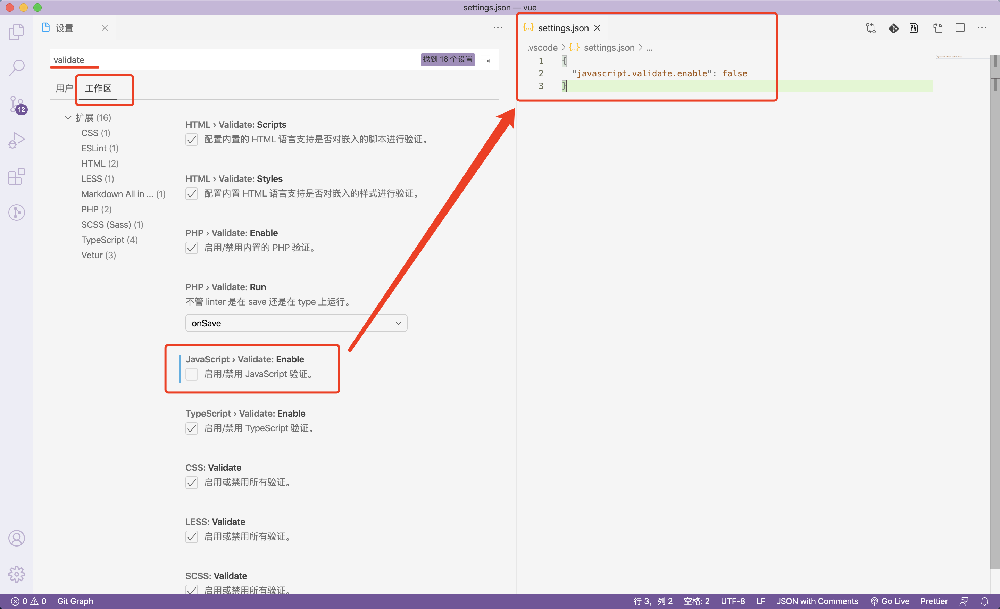

## vscode 设置

### flow

从上篇博文中定位到 `dist/vue.js` 的入口文件 `web/entry-runtime-with-compiler.js`

打开入口文件后在 vscode 中一堆报错，原因是因为 vue 2.0 中使用了 flow 作为静态类型检测，而 vscode 中默认使用 ts 进行类型检测，二者冲突。

同时，由于 vscode 的 Flow Language Support 插件不支持 vue 源码中使用的 flow 版本，单纯升级依赖中的 flow 版本会造成 flow 检查时大面积报错，且 vue 3.0 中已不再使用 flow。

因此，最简单的做法是禁用 vscode 对该项目中 js 文件的检测



### 跳转

源码中在引入文件的时候用了一些路径别名，如：

```js
import { warn, cached } from 'core/util/index'
```

flow 以及 rollup 分别读取 `.flowconfig` 和 `scripts/alias.js` 获取别名的真实路径。

因此在 vscode 中浏览源码，需要配置一下。在根目录新增 `jsconfig.json`，内容如下：

```json
{
  "compilerOptions": {
    "baseUrl": ".",
    "paths": {
      "compiler/*": ["./src/compiler/*"],
      "core/*": ["./src/core/*"],
      "shared/*": ["./src/shared/*"],
      "web/*": ["./src/platforms/web/*"],
      "weex/*": ["./src/platforms/weex/*"],
      "server/*": ["./src/server/*"],
      "sfc/*": ["./src/sfc/*"]
    }
  }
}
```

之后退出重新打开 vue 项目，即可点击别名路径跳转

## 入口 with or without compiler

我们的入口文件是 `web/entry-runtime-with-compiler.js`，但其实去看 `scripts/config.js` 里面的 `builds` 配置，扣除掉构建产物是 `packages` 文件夹下的以及 `weex` 相关的。其它的构建，入口文件就两种：

- web/entry-runtime.js
- web/entry-runtime-with-compiler.js

可以看到 `web/entry-runtime.js` 只是简单地导入 `web/runtime/index.js` 的 `Vue` 后导出。

而在 `web/entry-runtime-with-compiler.js`，也是从 `web/runtime/index.js` 导入了 `Vue`，做了些操作后导出 `Vue`，这里的操作就是 **with compiler**，即让 Vue 具备将模板编译为 `render` 方法的能力。具体操作为：
  - 改写 `Vue.prototype.$mount` 方法
  - 将 `compileToFunctions` 函数通过 `Vue.compile` 属性暴露。

暂时先不细看 `compiler` 的实现，先进这俩入口文件 `Vue` 共同的来源 `web/runtime/index.js`

> compiler 是 Vue 中非常重要的一部分内容，最终产物的 compiler 代码占比约为 30%，此处暂时略过，只需知晓 `with-compiler` 入口为 `Vue` 添加上了编译（compile）能力，能将模板（template）编译成 render 方法即可。

## Vue 中功能的添加方式

进入 `web/runtime/index.js`，先不急看代码，先看文件的总体结构。文件的最开始从 `core/index` 引入了 `Vue` 以及其它一堆东西，中间对 `Vue` 进行一系列操作，最后将这个 `Vue` 导出。

这个模式和入口文件 `entry-runtime-with-compiler.js` 的模式一模一样。继续查看导入 `Vue` 的 `core/index`。它的整体结构也是如此，从 `./instance/index` 导入 `Vue`，中间对导入的 Vue 对象进行一系列操作，最后导出 `Vue`。

最终追溯到了 `./instance/index`，在这个文件中声明了 `Vue` 函数，然后将其导出。

从构建入口到最终定义 `Vue` 文件的地方，追踪 `Vue` 函数的导入导出，顺序如下：

- `src/platforms/web/entry-runtime-with-compiler.js`
- `src/platforms/web/runtime/index.js`
- `src/core/index.js`
- `src/core/instance/index.js`

代码执行的顺序则相反，即：

- `src/core/instance/index.js`
- `src/core/index.js`
- `src/platforms/web/runtime/index.js`
- `src/platforms/web/entry-runtime-with-compiler.js`

从最开始在 `src/core/instance/index.js` 中声明 `Vue` 函数，到最终 `src/platforms/web/entry-runtime-with-compiler.js` 中作为构建入口的导出。在这个过程中 `Vue` 函数不变，每经历一次导入导出，就为该函数添加上了一些功能。这实际是一种代码组织方式。将不同模块的功能分配到不同的地方。

源码阅读时可以遵循代码执行的顺序，从 `src/core/instance/index.js` 开始。

## 参见

- [Vue 项目结构](https://github.com/vuejs/vue/blob/dev/.github/CONTRIBUTING.md#project-structure)