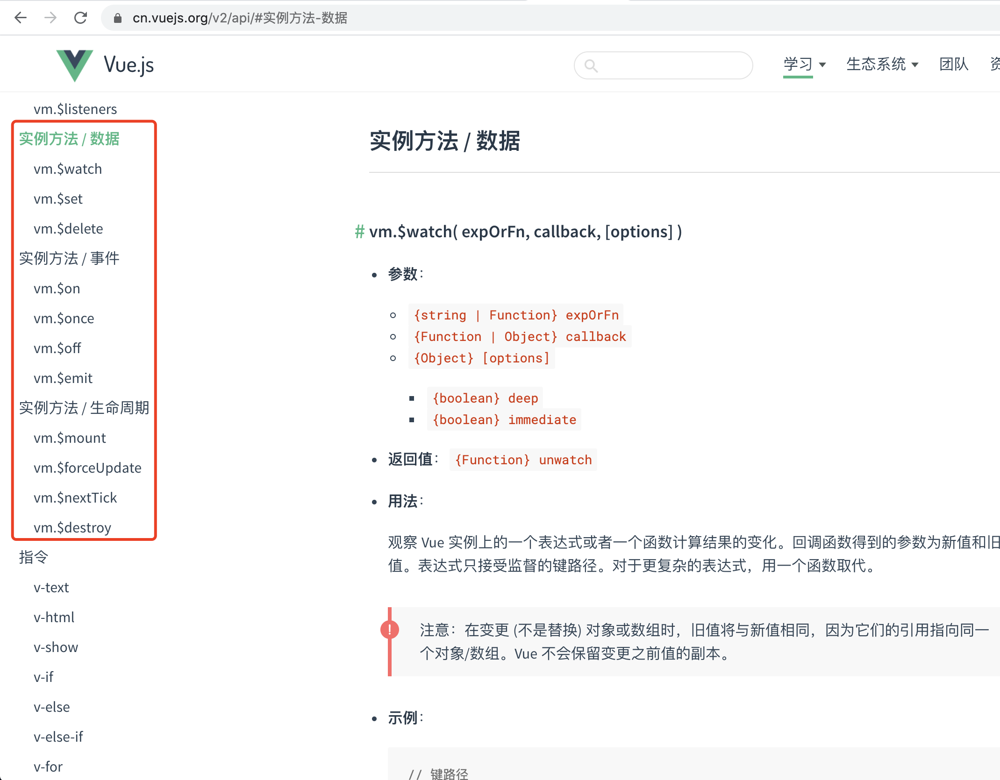

## 文件夹结构

依据 [Vue 贡献指南的项目结构](https://github.com/vuejs/vue/blob/dev/.github/CONTRIBUTING.md#project-structure)，`src/core/instance/` 文件夹下包含 Vue 实例的构造函数以及原型方法

## 代码执行视角

直接看代码

- src/core/instance/index.js

```js
import { initMixin } from './init'
import { stateMixin } from './state'
import { renderMixin } from './render'
import { eventsMixin } from './events'
import { lifecycleMixin } from './lifecycle'
import { warn } from '../util/index'

function Vue (options) {
  if (process.env.NODE_ENV !== 'production' &&
    !(this instanceof Vue)
  ) {
    warn('Vue is a constructor and should be called with the `new` keyword')
  }
  this._init(options)
}

initMixin(Vue)
stateMixin(Vue)
eventsMixin(Vue)
lifecycleMixin(Vue)
renderMixin(Vue)

export default Vue
```

上面 `index` 文件的内容很简单，但是包含两个代码执行视角：

- 构造 `Vue` 函数，即给 `Vue` 函数（类）不断添加功能（方法）的过程
- 实例化，即 `new Vue()` 的执行过程

比如下面的 Hello Vue 例子

```html
<!DOCTYPE html>
<html lang="en">

<head>
  <meta charset="UTF-8">
  <meta name="viewport" content="width=device-width, initial-scale=1.0">
  <title>Document</title>
</head>

<body>
  <div id="app">
    {{ message }}
  </div>
  <script src="https://cdn.jsdelivr.net/npm/vue"></script>
  <script>
    var app = new Vue({
      el: '#app',
      data: {
        message: 'Hello Vue!'
      }
    })
  </script>
</body>

</html>
```

上面代码中的 `<script src="https://cdn.jsdelivr.net/npm/vue"></script>` 引入，对应源码中以下代码的执行 

```js
function Vue (options) {
  // ...
}

initMixin(Vue)
stateMixin(Vue)
eventsMixin(Vue)
lifecycleMixin(Vue)
renderMixin(Vue)
```

而 

```html
<script>
  var app = new Vue({
    el: '#app',
    data: {
      message: 'Hello Vue!'
    }
  })
</script>
```

对应源码 `Vue` 函数中

```js
if (process.env.NODE_ENV !== 'production' &&
  !(this instanceof Vue)
) {
  warn('Vue is a constructor and should be called with the `new` keyword')
}
this._init(options)
```

的执行。

阅读代码过程中注意两个执行视角的切换。

## 实例入口概览（core/instance）

首先是 `Vue` 函数，这个函数的执行过程非常简单，只是调用了 `this._init(options)`，而后是 5 个 mixin

- `initMixin(Vue)`
- `stateMixin(Vue)`
- `eventsMixin(Vue)`
- `lifecycleMixin(Vue)`
- `renderMixin(Vue)`

这里的每个 mixin 都给 `Vue` 函数添加了一些功能。

> 这里展示了给 `Vue` 添加功能的另一种方法，就是将 `Vue` 作为参数传入各函数，在函数内给 `Vue` 添加原型方法。

由于 `instance` 文件夹下包含的是 Vue 实例构造函数和原型方法。可以在官方文档的 API 中找到 Vue 实例的原型方法，如下：



逐个查看 mixin，看其添加了哪些实例方法，注意，mixin 代码的执行时机是构造 `Vue` 函数

### initMixin

```js
export function initMixin (Vue: Class<Component>) {
  Vue.prototype._init = function (options?: Object) {
    // ...
  }
}
```

添加了原型方法 `_init`，这个就是在 `Vue` 函数中调用的方法，即 `new Vue()` 过程中要执行的操作。

> 这里注意 Vue 的一个命名规则，Vue 的原型方法或实例变量，如果是“公共的”，那么会以 `$` 开头，如果是“私有的”，则使用 `_` 开头。显然 `_init` 是个私有方法。

### stateMixin

```js
export function stateMixin (Vue: Class<Component>) {
  const dataDef = {}
  dataDef.get = function () { return this._data }
  const propsDef = {}
  propsDef.get = function () { return this._props }
  // ...
  Object.defineProperty(Vue.prototype, '$data', dataDef)
  Object.defineProperty(Vue.prototype, '$props', propsDef)

  Vue.prototype.$set = set
  Vue.prototype.$delete = del

  Vue.prototype.$watch = function (
    expOrFn: string | Function,
    cb: any,
    options?: Object
  ): Function {
    // ...
  }
}
```

`stateMixin` 中添加了原型属性 `$data` 和 `$props`，添加了 `$set`、`$delete`、`$watch`，实例方法。

注意这里原型属性 `$data` 和 `$props` 的处理，在其 `get` 中返回了 `this._data` 和 `this._props`。当使用时访问 Vue 实例的 `$data` 属性，由于实例上并没有 `$data`，会顺着原型链找到 `Vue.prototype.$data`，而此时 `$data` 的 `get` 被调用，返回实例自身的 `_data` 属性。

### eventsMixin

接下来是事件系统相关方法的 mixin

```js
export function eventsMixin (Vue: Class<Component>) {
  const hookRE = /^hook:/
  Vue.prototype.$on = function (event: string | Array<string>, fn: Function): Component {
    // ...
  }

  Vue.prototype.$once = function (event: string, fn: Function): Component {
    // ...
  }

  Vue.prototype.$off = function (event?: string | Array<string>, fn?: Function): Component {
    // ...
  }

  Vue.prototype.$emit = function (event: string): Component {
    // ...
  }
}
```

添加了事件相关的 `$on`、`$once`、`$off`、`$emit` 四个原型方法。

### lifecycleMixin

```js
export function lifecycleMixin (Vue: Class<Component>) {
  Vue.prototype._update = function (vnode: VNode, hydrating?: boolean) {
    // ...
  }

  Vue.prototype.$forceUpdate = function () {
    // ...
  }

  Vue.prototype.$destroy = function () {
    // ...
  }
}
```

lifecycleMixin 中添加了一个私有方法 `_update`，以及两个公共方法 `$forceUpdate`、`$destroy`

### renderMixin

```js
export function renderMixin (Vue: Class<Component>) {
  // install runtime convenience helpers
  installRenderHelpers(Vue.prototype)

  Vue.prototype.$nextTick = function (fn: Function) {
    // ...
  }

  Vue.prototype._render = function (): VNode {
    // ...
  }
}
```

renderMixin 首先调用 `installRenderHelpers` 传入 `Vue.prototype`，实际上是在 `Vue.prototype` 上添加了一堆私有的辅助方法，扫一眼先略过

```js
export function installRenderHelpers (target: any) {
  target._o = markOnce
  target._n = toNumber
  target._s = toString
  target._l = renderList
  target._t = renderSlot
  target._q = looseEqual
  target._i = looseIndexOf
  target._m = renderStatic
  target._f = resolveFilter
  target._k = checkKeyCodes
  target._b = bindObjectProps
  target._v = createTextVNode
  target._e = createEmptyVNode
  target._u = resolveScopedSlots
  target._g = bindObjectListeners
  target._d = bindDynamicKeys
  target._p = prependModifier
}
```

而后添加了公共方法 `$nextTick` 以及私有方法 `_render`

## 小结

到目前（`src/core/instance/index.js` 执行完毕），大部分 Vue **实例**的公共方法，已经添加完毕，除了 `$mount`。

> 这里顺便提一下，`$mount` 是一个平台相关的方法。所以 `$mount` 的首次添加是在 `src/platforms/web/runtime/index.js` 文件中，而后依据构建入口文件的不同，在 `src/platforms/web/entry-runtime-with-compiler.js` 对 `$mount` 进行了一次重写。重写的主要目的是给 `$mount` 添加编译模板的功能。这些东西都是平台相关的，因此都放在 `src/platforms/` 目录下

|                       | 私有方法     | 公共属性          | 公共方法                        |
| --------------------- | ------------ | ----------------- | ------------------------------- |
| `initMixin(Vue)`      | `_init`      |                   |                                 |
| `stateMixin(Vue)`     |              | `$data`、`$props` | `$watch`、`$set`、`$delete`     |
| `eventsMixin(Vue)`    |              |                   | `$on`、`$once`、`$off`、`$emit` |
| `lifecycleMixin(Vue)` | `_update`    |                   | `$forceUpdate`、`$destroy`      |
| `renderMixin(Vue)`    | `_render` 等 |                   | `$nextTick`                     |

> 注意：本节主要看的代码执行视角是构造 `Vue` 函数的视角