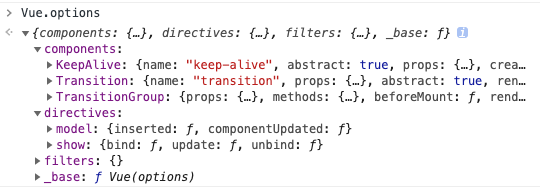

本节进入实例化过程的各项具体方法，先从 `new Vue()` 的实例化过程开始。

最开始的 `_uid`、`_isVue` 无需多言，进入 `$options`。

官网文档中对 `$options` 的解释是

> 用于当前 Vue 实例的初始化选项。

看代码

```js
vm.$options = mergeOptions(
  resolveConstructorOptions(vm.constructor),
  options || {},
  vm
)
```

通过 `resolveConstructorOptions(vm.constructor)` 得到 `mergeOptions` 的第一个参数。

`vm.constructor` 指向实例的构造函数，也就是 `Vue` 函数本身。从 `resolveConstructorOptions` 命名来看，是获取构造函数的 `options`

## resolveConstructorOptions

```js
export function resolveConstructorOptions (Ctor: Class<Component>) {
  let options = Ctor.options
  if (Ctor.super) {
    // ...
  }
  return options
}
```

`resolveConstructorOptions` 中先获取构造函数的 `options` 属性，然后如果构造函数上存在 `super` 属性，则进行一些操作，最后返回 `options`

`Vue` 构造函数上是不存在 `super` 这一属性的，因此此次不会执行到该 if 块。此处 `resolveConstructorOptions` 仅返回了 `Vue` 的 `options` 属性。

> `super` 是 JavaScript 中的关键字，用于调用父类的构造函数。此处的 `super` 属性来自 `Vue.extend` 方法，指向父类构造函数。

## Vue.options

构造 `Vue.options` 相关代码

- src/core/global-api/index.js

```js
Vue.options = Object.create(null)
ASSET_TYPES.forEach(type => {
  Vue.options[type + 's'] = Object.create(null)
})

// this is used to identify the "base" constructor to extend all plain-object
// components with in Weex's multi-instance scenarios.
Vue.options._base = Vue

extend(Vue.options.components, builtInComponents)
```

> ASSET_TYPES 内含 `component`、`directive`、`filter` 三种类型。`builtInComponents` 含内置组件 `KeepAlive`

- src/platforms/web/runtime/index.js
```js
// install platform runtime directives & components
extend(Vue.options.directives, platformDirectives)
extend(Vue.options.components, platformComponents)
```

> `platformDirectives` 平台指令含 `model` 与 `show`；`platformComponents` 平台组件含 `Transition` 和 `TransitionGroup`

结果如下



## mergeOptions

回到 `new Vue()`，`mergeOptions` 结果如下

```js
vm.$options = mergeOptions(Vue.options, {}, vm);
```

进入 `mergeOptions`

```js
export function mergeOptions (
  parent: Object,
  child: Object,
  vm?: Component
): Object {
  // ...

  if (typeof child === 'function') {
    child = child.options
  }

  normalizeProps(child, vm)
  normalizeInject(child, vm)
  normalizeDirectives(child)

  // Apply extends and mixins on the child options,
  // but only if it is a raw options object that isn't
  // the result of another mergeOptions call.
  // Only merged options has the _base property.
  if (!child._base) {
    if (child.extends) {
      parent = mergeOptions(parent, child.extends, vm)
    }
    if (child.mixins) {
      for (let i = 0, l = child.mixins.length; i < l; i++) {
        parent = mergeOptions(parent, child.mixins[i], vm)
      }
    }
  }

  const options = {}
  let key
  for (key in parent) {
    mergeField(key)
  }
  for (key in child) {
    if (!hasOwn(parent, key)) {
      mergeField(key)
    }
  }
  function mergeField (key) {
    const strat = strats[key] || defaultStrat
    options[key] = strat(parent[key], child[key], vm, key)
  }
  return options
}
```

在 `mergeOptions` 主要执行了 `normalizeProps`、`normalizeInject`、`normalizeDirectives`，最后通过 `mergeField` 将 `parent` 和 `child` 上的属性 merge 到新的 `options` 对象上返回。

由于 `new Vue()` merge 的 child 是个空对象，所以主要就是将 `Vue.options` 的内容 merge 到 `$options` 上。这里注意针对不同的配置属性有不同的 merge 策略。

目前的 `Vue.options` 上有四个属性 `components`、`directives`、`filters`、`_base` 需要 merge。期中:

- `components`、`directives`、`filters` 使用 `strats[key]` 指向的 `mergeAssets` 策略
- `_base` 使用 `defaultStrat` 策略

```js
function mergeAssets (
  parentVal: ?Object,
  childVal: ?Object,
  vm?: Component,
  key: string
): Object {
  const res = Object.create(parentVal || null)
  if (childVal) {
    process.env.NODE_ENV !== 'production' && assertObjectType(key, childVal, vm)
    return extend(res, childVal)
  } else {
    return res
  }
}

const defaultStrat = function (parentVal: any, childVal: any): any {
  return childVal === undefined
    ? parentVal
    : childVal
}
```

> 这里其实可以看到：Vue 每个全局组件、指令、过滤器都会注册为局部组件内的组件、指令、过滤器。组件、指令、过滤器通过原型继承的方式 merge 到局部组件的相应位置，避免了局部组件对全局组件的改动。