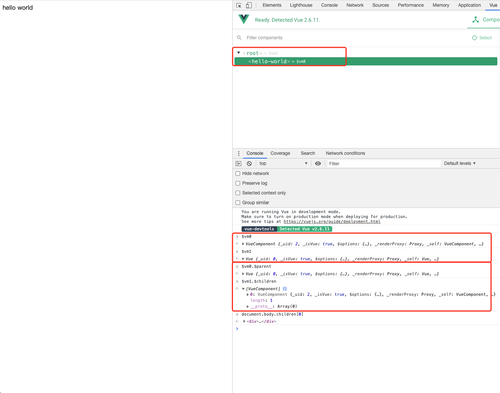

`$options` 属性后是 `_renderProxy` 与 `_self`，之后就是 `initLifecycle(vm)`，上代码：

```js
export function initLifecycle (vm: Component) {
  const options = vm.$options

  // locate first non-abstract parent
  let parent = options.parent
  if (parent && !options.abstract) {
    while (parent.$options.abstract && parent.$parent) {
      parent = parent.$parent
    }
    parent.$children.push(vm)
  }

  vm.$parent = parent
  vm.$root = parent ? parent.$root : vm

  vm.$children = []
  vm.$refs = {}

  vm._watcher = null
  vm._inactive = null
  vm._directInactive = false
  vm._isMounted = false
  vm._isDestroyed = false
  vm._isBeingDestroyed = false
}
```

`initLifecycle` 整体来看比较简单，主要是初始化了一些生命周期相关的属性。

这里先获取 `parent`，通过 `parent` 拿到 `$root`；没有 `parent` 的组件（根组件） `$root` 为自身。之后就是一些属性的初始化。

## 选项：abstract 

这里有个点就是 `options.abstract`，首先在 Vue 官网的文档里，并没有 `abstract` 这一选项，也就是，这是一个内部选项。

在源码中搜索，使用到 `abstract` 选项的组件有 `<transition>` 和 `<keep-alive>`，看起来 `abstract` 的主要是让高阶组件不进入通用组件的父子链中。比如

```html
<!DOCTYPE html>
<html lang="en">
<head>
  <meta charset="UTF-8">
  <meta name="viewport" content="width=device-width, initial-scale=1.0">
  <title>Demo Vue</title>
</head>
<body>
  <div id=app></div>
  <script src="./vue.js"></script>
  <script>
    Vue.component('hello-world', {
      template: '<div>hello world</div>'
    })
    var app = new Vue({
      el: '#app',
      template: `
      <div>
        <keep-alive>
          <hello-world></hello-world>
        </keep-alive>
      </div>`
    })
  </script>
</body>
</html>
```

上面的例子在 Vue 的开发者工具中是看不到 `<keep-alive>` 这一组件的，且 `<hello-world>` 组件的父组件是 `<Root>` 组件，`<Root>` 组件的 `$children` 列表中也仅包含了 `<hello-world>` 组件。

同时，`<Root>` 组件的 `_uid` 属性是 `0`，`<hello-world>` 组件的 `_uid` 属性为 `2`，这里面缺失的 `_uid` `1` 就是 `<keep-alive>` 组件。



> 这里也可以看到 Vue 的实例化顺序是由根组件开始一直到子组件的

## 小结

| 方法            | 实例属性            | 备注                   |
| --------------- | ------------------- | ---------------------- |
| `initLifecycle` | `$parent`           | 非 `abstract` 的父组件 |
|                 | `$root`             | 根组件                 |
|                 | `$children`         | `[]`                   |
|                 | `$refs`             | `{}`                   |
|                 | `_watcher`          | `null`                 |
|                 | `_inactive`         | `null`                 |
|                 | `_directInactive`   | `false`                |
|                 | `_isMounted`        | `false`                |
|                 | `_isDestroyed`      | `false`                |
|                 | `_isBeingDestroyed` | `false`                |

- 当组件选项 `abstract` 为 `true` 时，不进入 `$parent`、`$root`、`$children`