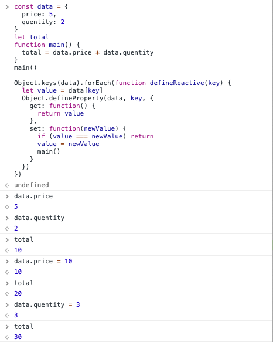

## 前言

当你更新 vue 实例 data 的某个属性，依赖该属性的所有内容随之重新执行，你或许知道这是 vue 通过 `defineProperty` 实现的响应式系统，但具体是如何实现的，`define` 了哪些 `property`？

## 响应式系统要解决的问题

先不考虑 Vue，看一个小片段

```js
let price = 5
let quentity = 2
let total = price * quentity
```

在上面的片段执行完后，重新给 `price` 或 `quentity` 赋值，`total` **并不会** 自动更新。除非重新执行一次 `total = price * quentity`，那么问题就来了

**如何在每次 `price` 或 `quentity` 重新赋值后，自动执行 `total = price * quentity` ？**

接下来就是设计一个系统，也就是响应式系统，来解决上述问题。

## 解决问题的关键点

回到问题

> 如何在每次 `price` 或 `quentity` 重新赋值后，自动执行 `total = price * quentity` 

这里有几个关键点

1. 首先的关键点是**自动执行**，既然是自动执行，说明系统要能**检测**到 `price` 或 `quentity` 的重新赋值
   
2. 第二个关键点是**每次**，就是每更改一次 `price` 或 `quentity`，就需要重新执行一次 `total = price * quentity`。这说明系统需要有个地方保存 `total = price * quentity`，才可以每次变化后执行
   
3. 第三个关键点是 **`price` 或 `quentity`**，只有在 `price` 或 `quentity` 这两个变量变化时，才重新执行 `total = price * quentity`。说明这二者存在关联，且系统应该自动建立并保存这种关联。
  
> 举一个没有关联的反例：比如对 `total` 重新赋值，系统不会执行 `total = price * quentity`

## 攻克关键点，响应式系统原型

### 如何检测 `price`、`quentity` 的重新赋值

答案：`defineProperty` 中的 `set`。

`defineProperty` 是用来定义对象的属性，而不是直接的某个变量。因此，调整下小片段

```js
const data = {
  price: 5,
  quentity: 2
}
let total = data.price * data.quentity

Object.keys(data).forEach(function defineReactive(key) {
  let value = data[key]
  Object.defineProperty(data, key, {
    get: function() {
      return value
    },
    set: function(newValue) {
      if (value === newValue) return
      value = newValue
      console.log(`${key} is changed.`)
    }
  })
})
```

### 如何保存 `total = price * quentity`

答案：通过函数保存

调整小片段

```js
// ...
let total
function main() {
  total = data.price * data.quentity
}
main()
// ...
```

此时更改 `console.log` 为调用 `mian`，那么就实现了一个写死的微型响应式系统

```js
const data = {
  price: 5,
  quentity: 2
}
let total
function main() {
  total = data.price * data.quentity
}
main()

Object.keys(data).forEach(function defineReactive(key) {
  let value = data[key]
  Object.defineProperty(data, key, {
    get: function() {
      return value
    },
    set: function(newValue) {
      if (value === newValue) return
      value = newValue
      main()
    }
  })
})
```



### 如何自动建立变量与计算过程的关联

首先，我们要建立的是 `data.price`、`data.quentity` 与 `total = data.price * data.quentity` 的关联。

观察 `total = data.price * data.quentity`，步骤如下

- **读取** `data.price`，**读取** `data.quentity`
- 将 `data.price` 与 `data.quentity` 相乘
- 将上一步的计算结果赋值给 `total`

注意到**读取**操作，我们知道**读取**操作会通过 `defineProperty` 的 `get` 方法，因此，如果能在 `get` 时收集正在执行的计算过程（这里是：`total = data.price * data.quentity`），就可以建立变量与计算过程的关联。

同时，需要在首次执行 `total = data.price * data.quentity` 时就能触发 `get` 进行关联；且后续执行时不触发。

这里通过 `target` 变量临时持有计算过程，首次触发后置空。

```js
const data = {
  price: 5,
  quentity: 2
}
let total

function main() {
  total = data.price * data.quentity
}

Object.keys(data).forEach(function defineReactive(key) {
  let value = data[key]
  let cb = null
  Object.defineProperty(data, key, {
    get: function() {
      if (target) cb = target
      return value
    },
    set: function(newValue) {
      if (value === newValue) return
      value = newValue
      if (cb) cb()
    }
  })
})

let target = null
target = main
main()
target = null
```

至此，一个微型响应式系统已经实现完毕。

## Vue 中的代码组织方式

代码的组织方式相当于把代码的各部分内容拆到不同函数或类中，使结构更加清晰，更易维护。上面的原型代码显然不是 Vue 中代码的组织方式，实际上，Vue 源码中响应式系统相关的功能位于 `src/core/observer/` 文件夹下。这里主要涉及该文件夹下的 `index.js`、`dep.js`、`watcher.js`

### 划分输入与系统内部

针对原型代码，输入是什么？显然，输入是

```js
const data = {
  price: 5,
  quentity: 2
}
let total

function main() {
  total = data.price * data.quentity
}
```

系统内部则是后半部分的代码，又可以分为两个部分

- 数据前期准备，需要先把数据定义成响应式，才能在首次执行时通过数据收集计算过程

```js
Object.keys(data).forEach(function defineReactive(key) {
  let value = data[key]
  let cb = null
  Object.defineProperty(data, key, {
    get: function() {
      if (target) cb = target
      return value
    },
    set: function(newValue) {
      if (value === newValue) return
      value = newValue
      if (cb) cb()
    }
  })
})
```

说明系统需要提供一个函数用于建立数据前期准备

- 计算过程的首次执行

```js
let target = null
target = main
main()
target = null
```

说明系统需要提供一个函数用于控制 main 的执行时机

接下来划分变量与计算过程，同时用两个类来承担变量与计算过程各自的功能。

### 变量与计算过程的关系

它们有两个关系

- 变量变化时需要通知计算过程
- 计算过程依赖变量

这里就非常适合应用观察者模式，变量是观察对象，计算过程是观察者。又由于变量是计算过程的依赖物，因此对它们相应的类命名为

- `Dep` 类对应变量，主要职责是维护对应的计算过程（添加、删除），当变量发生变化时通知相应计算过程
- `Watcher` 类对应计算过程，主要职责一是让用户控制首次执行的时机，二是当 `Dep` 通知时再次执行

```js
class Dep {
  static target

  constructor() {
    this.subs = []
  }

  addSub(watcher) {
    this.subs.push(watcher)
  }

  notify() {
    this.subs.forEach(watcher => watcher.update())
  }
}

Dep.target = null
```

```js
class Watcher {
  constructor(cb) {
    this.cb = cb
    this.get()
  }

  get() {
    Dep.target = this
    this.cb()
    Dep.target = null
  }

  update() {
    this.cb()
  }
}
```

### 处理变量的响应式

首先，每个对象类型的数据对应一个 `Observer` 类，职责是将对象类型的各个属性转为响应式。

```js
class Observer {
  constructor (data) {
    this.data = data
    this.walk(data)
  }

  walk (obj) {
    const keys = Object.keys(obj)
    for (let i = 0; i < keys.length; i++) {
      defineReactive(obj, keys[i])
    }
  }
}
```

接着更改 `defineReactive`，对传入的对象进行处理

```js
function defineReactive(obj, key) {
  let value = obj[key]
  const dep = new Dep()
  Object.defineProperty(obj, key, {
    get: function() {
      if (Dep.target) dep.addSub(Dep.target)
      return value
    },
    set: function(newValue) {
      if (value === newValue) return
      value = newValue
      dep.notify()
    }
  })
}
```

### 改造完成

```js
class Dep {
  static target

  constructor() {
    this.subs = []
  }

  addSub(watcher) {
    this.subs.push(watcher)
  }

  notify() {
    this.subs.forEach(watcher => watcher.update())
  }
}

Dep.target = null

class Watcher {
  constructor(cb) {
    this.cb = cb
    this.get()
  }

  get() {
    Dep.target = this
    this.cb()
    Dep.target = null
  }

  update() {
    this.cb()
  }
}

class Observer {
  constructor (data) {
    this.data = data
    this.walk(data)
  }

  walk (obj) {
    const keys = Object.keys(obj)
    for (let i = 0; i < keys.length; i++) {
      defineReactive(obj, keys[i])
    }
  }
}

function defineReactive(obj, key) {
  let value = obj[key]
  const dep = new Dep()
  Object.defineProperty(obj, key, {
    get: function() {
      if (Dep.target) dep.addSub(Dep.target)
      return value
    },
    set: function(newValue) {
      if (value === newValue) return
      value = newValue
      dep.notify()
    }
  })
}

const data = {
  price: 5,
  quentity: 2
}

let total

function main() {
  total = data.price * data.quentity
}

new Observer(data)
new Watcher(main)
```

## 小结

本节实现了一个微型的响应式系统并将它以 Vue 源码中的组织方式进行了重构，把各部分拆分到各个类后，即可添加对应的功能。比如 `data` 为数组类型时，就可以在 `Observer` 中进行处理；若 `data` 的某个属性为对象类型，就可以在 `defineReactive` 中对该子对象调用 `new Observer()`