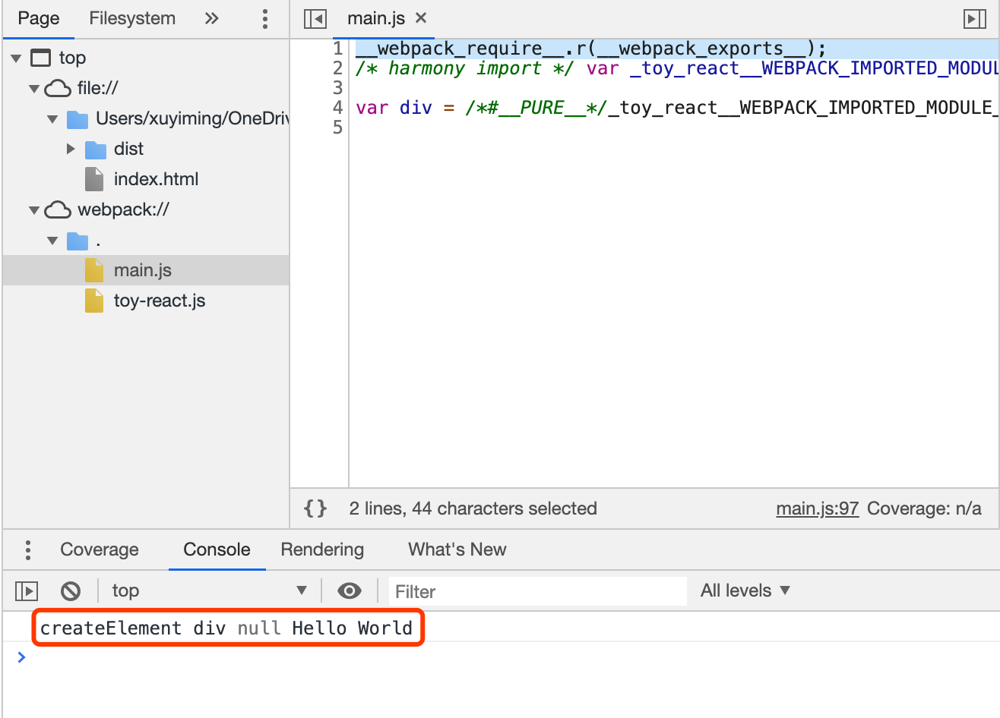

## 前言

本系列记录一个玩具 React 的实现，预计最终的效果是将 React 官网的[入门教程 tic-tac-toe 游戏](https://reactjs.org/tutorial/tutorial.html#setup-option-2-local-development-environment) 用 ToyReact 跑起来。

> 另附：[官网教程 tic-tac-toe 游戏最终代码](https://codepen.io/gaearon/pen/gWWZgR?editors=0010)

本节主要记录先期开发环境的搭建。

> 本系列预计 4 ~ 5 篇，计划下周完成（flag 高高立起）

> 注：[项目源码](https://github.com/xuyimingwork/toy-react)

## 开始

新建一个文件夹 `toy-react`，在该文件夹下通过 `npm init -y` 初始化 node 包。

新建文件 `main.js`，内容如下

```js
const div = <div>Hello World</div>
```

这时候 `main.js` 是无法执行的。比如通过 `node main.js` 执行一下，提示 `SyntaxError: Unexpected token '<'`，这是因为 node 执行的是正常的 js 文件，而正常的 js 语法里面是没有 `<div>Hello World</div>` 这种东西的。因此需要通过 babel 进行转换。

babel 是可以独立使用的，但是这里将 babel 以 webpack loader 的形式使用。所以安装一下这些东西。

## 安装 webpack

先安装 webpack，命令如下：

- `npm install webpack webpack-cli --save-dev`

这时候 webpack 命令已经被安装到 `node_modules/.bin/` 目录下，在命令行输入 `./node_modules/.bin/webpack` 即可执行 webpack。

执行一下，提示 `ERROR in Entry module not found: Error: Can't resolve './src' in ...`

这是因为 webpack 默认入口文件位于项目根目录的 `src` 文件夹下的 `index.js` 文件，但是我们项目里的入口文件是 `main.js`，因此需要配置一下 webpack。

webpack 默认会读取项目根目录的 `webpack.config.js` 文件作为配置。因此新建该文件，内容如下：

```js
module.exports = {
  entry: './main.js'
};
```

此时执行 `./node_modules/.bin/webpack`，输出

```
ERROR in ./main.js 1:12
Module parse failed: Unexpected token (1:12)
You may need an appropriate loader to handle this file type, currently no loaders are configured to process this file. See https://webpack.js.org/concepts#loaders
> const div = <div>Hello World</div>
```

这个错误和刚才用 node 执行时的错误是一致的，webpack 在错误里提醒：你可能需要适合的 loader 来处理这种类型的文件。

这个适合的 webpack loader，就是前面说的 webpack loader 形式的 babel

## 安装 babel-loader

webpack loader 形式的 babel 就是 babel-loader

执行一下安装命令

```sh
npm install -D babel-loader @babel/core @babel/preset-env @babel/plugin-transform-react-jsx
```

上面的命令实际上安装了 4 个依赖：

- babel-loader 
- @babel/core 
- @babel/preset-env 
- @babel/plugin-transform-react-jsx

这是因为 babel 被设计为通过插件增加功能。babel-loader 只是管理这些插件的一个壳子。

比如如果你需要转换 ES6 的语法，可能需要一个 babel-es6 的插件，需要转换 ES7 的语法，可能就需要一个 babel-es7 的插件。我们需要转换 jsx，因此需要 `@babel/plugin-transform-react-jsx` 这个插件。

而 `@babel/core` 则提供了核心的编译功能（是的，babel 的编译功能也是已独立插件的形式提供的）。`@babel/preset-env` 则可以认为是一系列常用插件的集合，有了这个插件后 babel 就可以转换最新的 js 语法。

接下来是配置 webpack，让 webpack 能使用 babel-loader，更改 `webpack.config.js` 如下

```js
module.exports = {
  entry: './main.js',
  mode: 'development',
  module: {
    rules: [
      {
        test: /\.m?js$/,
        exclude: /(node_modules|bower_components)/,
        use: {
          loader: 'babel-loader',
          options: {
            presets: ['@babel/preset-env'],
            plugins: [
              "@babel/plugin-transform-react-jsx"
            ]
          }
        }
      }
    ]
  }
};
```

这个配置和之前配置不同的地方在于新增了 `mode` 字段和 `module` 字段。

- mode 是 webpack 中比较重要的一个概念，值有 `development`、`production` 和 `none`。默认为 `production`，`production` 会开启如移除空格注释、混淆之类的操作，因此我们这里设为 `development`
  
- 然后就是 module。webpack 中的 loader 是通过 module 中的 rules 来配的。上面配置的大意思就是若文件以 js 结尾，就使用 `babel-loader` 处理文件。
  
  至于 `babel-loader` 下面的 options 中的内容则是对 `babel-loader` 的配置，配置了 presets 和 plugins。

  > 这里就用到了刚才安装的 babel，`@babel/core` 会被默认使用

此时执行 `./node_modules/.bin/webpack`，会发现项目根目录下多出了个 `dist` 文件夹，里面有个 `main.js` 文件。这个文件就是我们的 `main.js` 经过 webpack 和 babel 转化后的最终产物。

## 跑起来吧

在项目的根目录下新增 `index.html`，引入 `dist/main.js`，内容如下

```html
<script src="./dist/main.js"></script>
```

在浏览器中打开 `index.html`，浏览器的控制台报了一个错误

```
Uncaught ReferenceError: React is not defined
```

点进报错指示的文件，发现原先 main.js 文件中的内容

```js
const div = <div>Hello World</div>
```

被转换成了

```js
var div = /*#__PURE__*/React.createElement("div", null, "Hello World");
```

浏览器执行到这一语句时，由于没找到 `React`，就报了 `ReferenceError`。这里发现 jsx 实际上最后转化为了 `React` 的 `createElement` 方法

在根目录下新增一个名为 `toy-react.js` 的文件，内容如下

```js
export default {
  createElement() {
    console.log('createElement', ...arguments)
  }
}
```

然后修改 `main.js`，内容如下

```js
import React from './toy-react'

const div = <div>Hello World</div>
```

运行 `./node_modules/.bin/webpack` 重新构建，刷新浏览器，可以看到浏览器控制台输出



至此，需要的环境已经搭建完毕。但你发现每次改完代码，需要重新执行 webpack，然后还要刷新浏览器，这个过程很繁琐，以及并没有 sourcemap。因此在进入正式的编程前，还需要优化一下开发流程。

## 优化开发流程

### webpack-dev-server

该工具主要解决开发过程的自动构建和浏览器自动刷新的问题。

安装命令如下

```sh
npm i webpack-dev-server -D
```

更改 `index.html` 内容如下

```html
<script src="./main.js"></script>
```

这里解释一下

- 首先 webpack-dev-server 默认会以项目根目录的 index.html 文件作为入口文件
- 第二是 webpack-dev-server 会将 index.html 中引入的脚本走一遍 webpack 构建流程，并替换进去。就是当 webpack-dev-server 启动后，这里的 main.js 指向的就是已经构建完成的 main.js 了

通过 `node_modules/.bin/webpack-dev-server` 运行一下 webpack-dev-server。

项目正常跑了起来，这时候你改动 `main.js`，webpack-dev-server 自动编译然后自动刷新了浏览器。在浏览器开发者工具的 Sources 面板上也可以看到，浏览器载入的 `main.js` 是项目中 `main.js` 构建完成后的产物。

### sourcemap

这时候在浏览器中点击跳转，会跳到 webpack 的构建产物中，并不是我们写的代码，这不方便 debug，修改 webpack.config.js，添加 devtool 属性

```js
module.exports = {
  entry: './main.js',
  mode: 'development',
  devtool: 'inline-source-map',
  module: {
    // ...
  }
};
```

同时，每次运行 webpack-dev-server 时输入前面那串 `node_modules/.bin/` 也比较烦，因此，在 package.json 中新增一条命令如下

```json
{
  "name": "toy-react",
  "version": "1.0.0",
  "description": "",
  "main": "index.js",
  "scripts": {
    "dev": "webpack-dev-server"
  },
  "keywords": [],
  "author": "",
  "license": "ISC",
  "devDependencies": {
    "@babel/core": "^7.10.5",
    "@babel/plugin-transform-react-jsx": "^7.10.4",
    "@babel/preset-env": "^7.10.4",
    "babel-loader": "^8.1.0",
    "webpack": "^4.44.0",
    "webpack-cli": "^3.3.12",
    "webpack-dev-server": "^3.11.0"
  }
}
```

因为更改了 webpack 的配置，先停止下 webpack-dev-server，然后通过 `npm run dev` 重新启动。

此时，更改代码将自动构建并刷新浏览器，sourcemap 也已启用，在控制台中点击即可跳转至原文件。

至此，环境搭建完毕。


