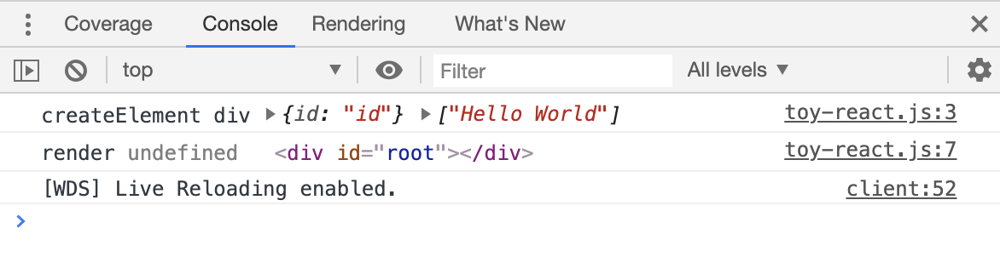
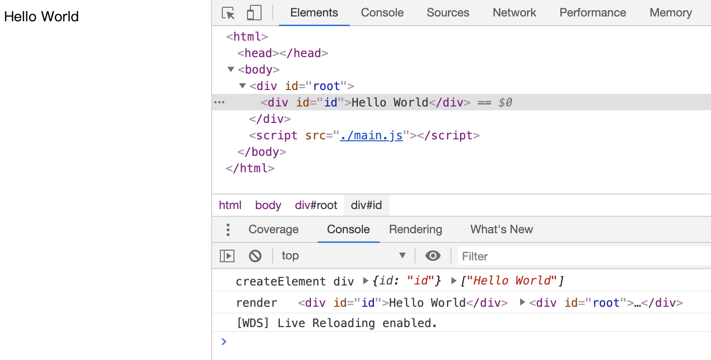
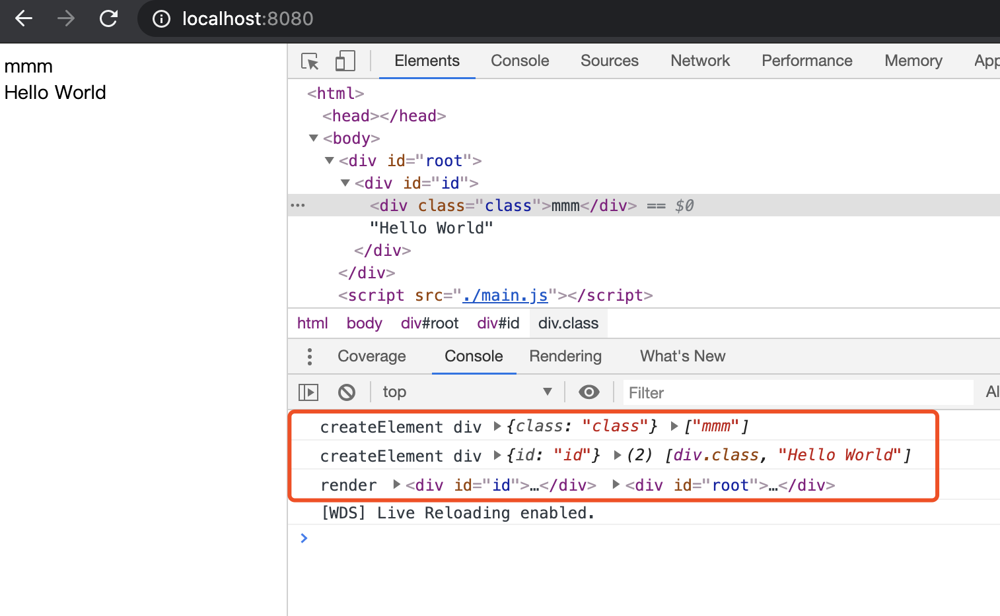
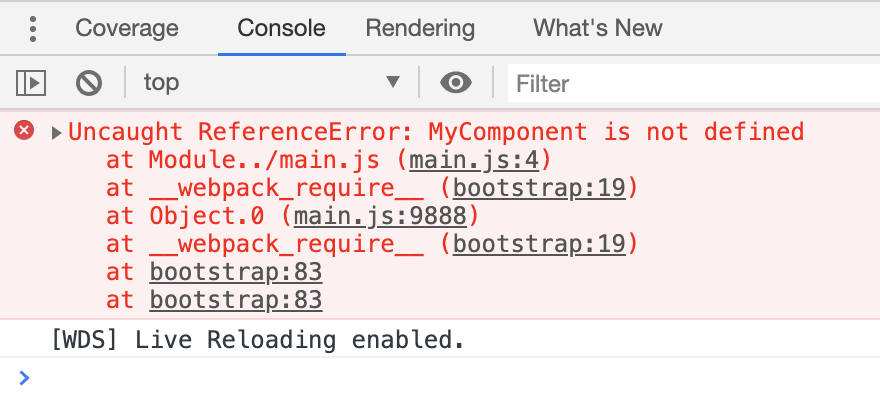
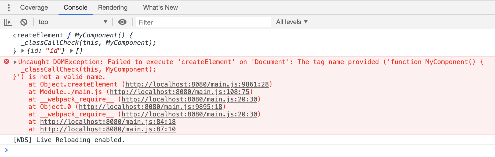
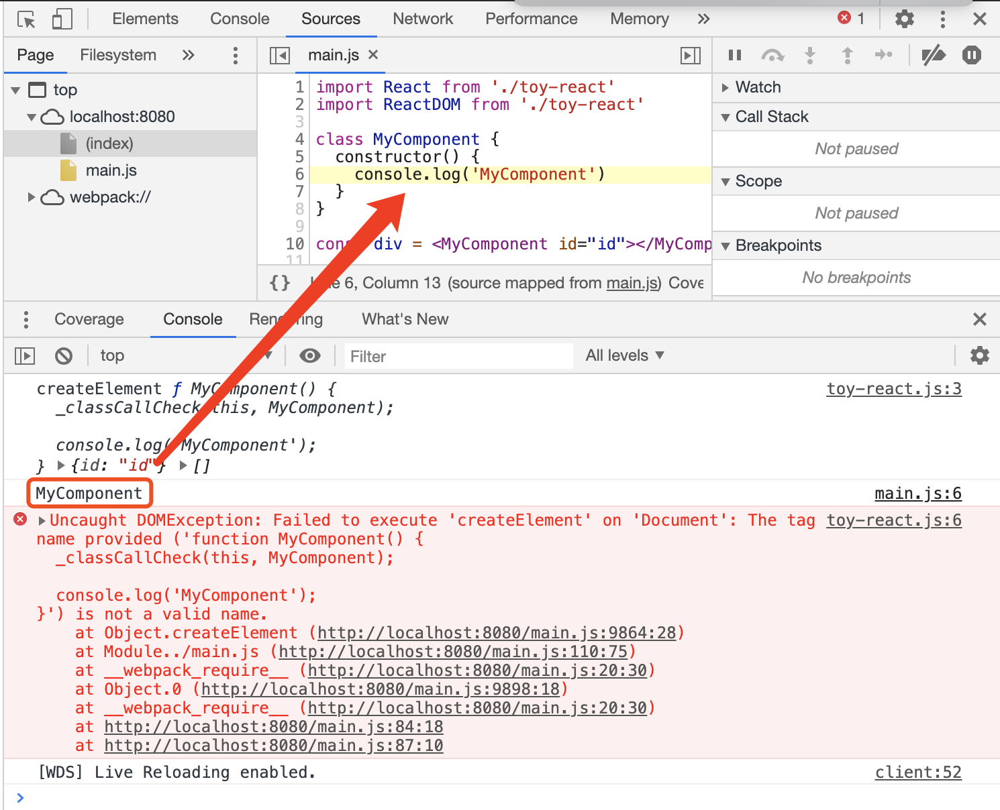
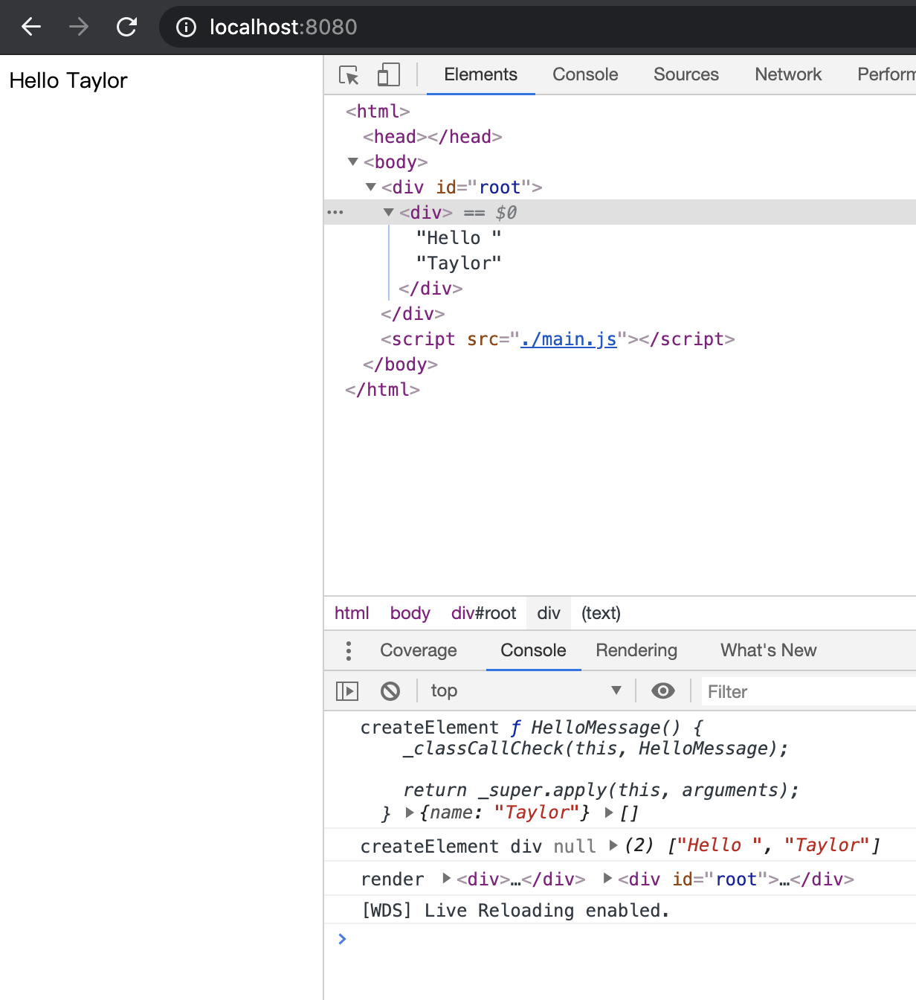
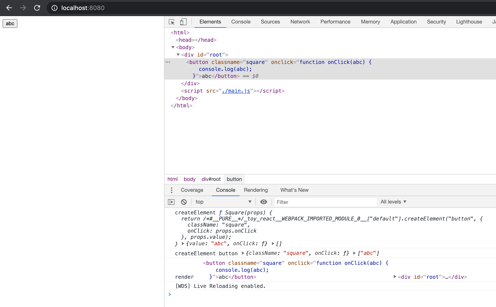
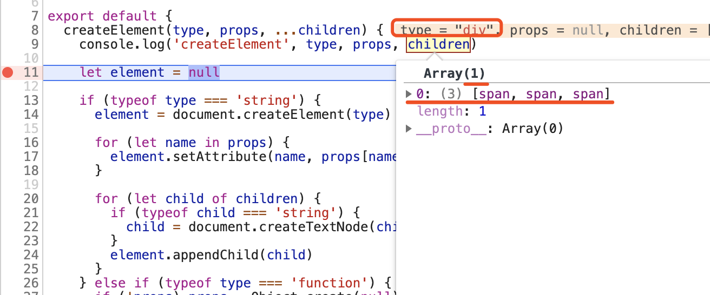
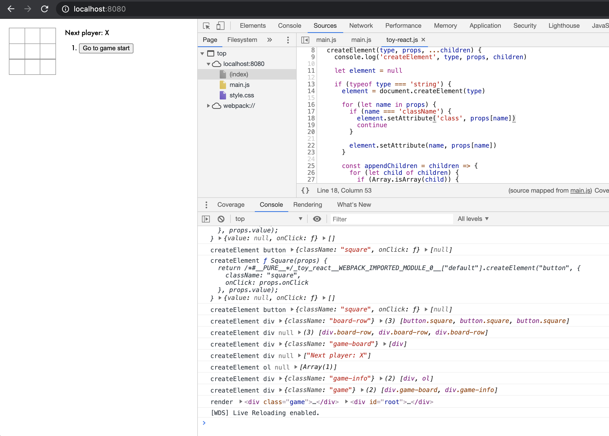

## 前言

> 附：
> - [官网教程 tic-tac-toe 游戏最终代码](https://codepen.io/gaearon/pen/gWWZgR?editors=0010)
> - [项目源码](https://github.com/xuyimingwork/toy-react)

## plugin transform react jsx 的配置

上节有提到 `@babel/plugin-transform-react-jsx` 会将 jsx 语法转换为合法的 js 语法，实际上这个步骤是可以配置的。

为了方便查看构建出来的结果，先将上篇文章配的 sourcemap 关闭，即注释掉 `webpack.config.js` 中的 `devtool: 'inline-source-map',`，并将 `main.js` 中的 `import` 一同注释。

利用浏览器 source 面板查看 `main.js` 转换后的代码是

```js
// import React from './toy-react'
var div = /*#__PURE__*/React.createElement("div", null, "Hello World");
```

注意到原先的 jsx 代码被转换成了调用 `React.createElement` 函数并传入一系列参数，变成了合法的 js 代码。

这里可以配置 `@babel/plugin-transform-react-jsx` 插件，转换成调用别的方法。比如目前我们的插件配置如下：

```js
plugins: [
  "@babel/plugin-transform-react-jsx",
]
```

更改为

```js
plugins: [
  ["@babel/plugin-transform-react-jsx", {
    pragma: 'ToyReact.createElement'
  }]
]
```

重新运行，构建结果就变成了

```js
// import React from './toy-react'
var div = ToyReact.createElement("div", null, "Hello World");
```

> 补充：
> - 更多 `@babel/plugin-transform-react-jsx` 的 [配置](https://babeljs.io/docs/en/babel-plugin-transform-react-jsx/#options)
> - 如何 [为 babel 的插件指定配置](https://babeljs.io/docs/en/plugins#plugin-options)

OK，了解一下该插件还可以配置之后，将代码还原一下，进入下一步。

## React.createElement 与 ReactDOM.render 需要实现什么

在正式开始前，需要了解一下 createElement 做了哪些事。

可以看 React 的官网的这个 [介绍](https://reactjs.org/docs/react-api.html#createelement)

```js
React.createElement(
  type,
  [props],
  [...children]
)
```

看该函数的定义，接收一个 type，一个 props，以及若干个 children。

对于该函数官网是这么描述的：

> 用指定的 type 创建并返回一个新的 React 元素。type 参数既可以是标签名字符串（如 “div” 或 “span”），也可以是 React 组件类型（一个 class 或一个 function），还可以是一个 React fragment 类型。

看下官网一个完整的小例子

```js
class HelloMessage extends React.Component {
  render() {
    return (
      <div>
        Hello {this.props.name}
      </div>
    );
  }
}

ReactDOM.render(
  <HelloMessage name="Taylor" />,
  document.getElementById('hello-example')
);
```

从上面的代码里我们知道 `HelloMessage` 类中 `render` 方法里 return 后面的 jsx 语法最后会转换为 `React.createElement` 的一堆东西，而 `React.createElement` 会返回一个新的 React 元素，相当于类里的 render 方法最后会 return 一个 React 元素。

在 ReactDOM.render 中，第一个参数使用了 jsx 语法，也会转换成 `React.createElement`，也就是传入一个 React 元素；而第二个参数 `document.getElementById('hello-example')` 则会拿到一个真实的浏览器元素。

> 注意这里的几种角色，浏览器元素、React 元素、React 组件。

从整体流程看下来，`React.createElement` 会依据给定参数创建一个 React 元素，最终这个 React 元素会通过 `ReactDOM.render` 方法挂载到真实的浏览器元素上。

> 另见：[render 方法](https://reactjs.org/docs/react-dom.html#render)

由此大致明白，实现玩具 React 大概需要实现一个 React.createElement 函数，一个用于最终挂载的 ReactDOM.render 函数，一个用于继承的 Component 类。

## 处理原生元素

调整一下 index.html

```html
<div id="root"></div>
<script src="./main.js"></script>
```

调整一下 createElement

```js
export default {
  createElement(type, props, ...children) {
    console.log('createElement', type, props, children)
  },

  render(element, container) {
    console.log('render', element, container)
  }
}
```

同时，在 main.js 中

```js
import React from './toy-react'
import ReactDOM from './toy-react'

const div = <div id="id">Hello World</div>

ReactDOM.render(div, document.getElementById('root'));
```

浏览器输出如下



得知：

- type 输出的是字符串 div
- props 是一个对象，以键值对的形式保存了开始标签里的 props
- children 则是数组，其中只有一项，是文字节点 Hello World

这里 `render` 的第一个参数 div 是 `undefined`，因为我们的 `createElement` 没有返回任何东西。

依据上面的分析，`React.createElement` 会返回一个对象（React 元素），这个对象能够描述最终需要渲染的真实元素，最后在 ReactDOM.render 中渲染并挂载到真实 dom 树上。

先不考虑真实元素与虚拟元素的问题，如果只考虑真实元素，那么 `createElement` 与 `render` 实现如下

```js
export default {
  createElement(type, props, ...children) {
    console.log('createElement', type, props, children)

    const element = document.createElement(type)
    for (let name in props) {
      element.setAttribute(name, props[name])
    }
    for (let child of children) {
      if (typeof child === 'string') {
        child = document.createTextNode(child)
      }
      element.appendChild(child)
    }

    return element
  },

  render(element, container) {
    console.log('render', element, container)
    container.appendChild(element)
  }
}
```

这里做的事情非常简单
- 在 `createElement` 中，实际创建一个 `type` 类型的元素，并且把 `props` 作为元素的 `attribute` 进行设置，把子节点挂载到元素上；
- 在 `render` 函数中将元素挂载到 `container` 上。

浏览器执行结果如下：



修改 main.js 尝试做一下嵌套

```js
import React from './toy-react'
import ReactDOM from './toy-react'

const div = <div id="id">
  <div class="class">mmm</div>
  Hello World
</div>

ReactDOM.render(div, document.getElementById('root'));
```

渲染成功，输出如下



注意控制台输出的 `createElement` 调用的顺序，是先创建了子元素，然后再创建父元素。

## 处理自定义组件

如果我们将 jsx 里的 div 换成 MyComponent，即使用自定义的组件，如下

```js
const div = <MyComponent id="id"></MyComponent>
```

浏览器则报了一个错误



回过头去看上面的 HelloMessage 例子，在 `render` 使用 `<HelloMessage name="Taylor" />` 前，需要先定义 `HelloMessage` 类。

这里报错就是因为没有定义 MyComponent 引起的。写一个 MyComponent 类

```js
import React from './toy-react'

class MyComponent {}

const div = <MyComponent id="id"></MyComponent>
```

报错就变了，此时浏览器的输出是：



发现此时 `createElement` 接收到的 `type` 变成了一个 function。

实际上，jsx 在解析的时候，会将大写开头的标签名认为是自定义组件，会将自定义组件的引用作为 type 传入 createElement。

这里打印出的 type 就是 `MyComponent`。比如给 `MyComponent` 添加一个构造函数，然后在 createElement 中 new 一下 type

```js
class MyComponent {
  constructor() {
    console.log('MyComponent')
  }
}
```

```js
export default {
  createElement(type, props, ...children) {
    console.log('createElement', type, props, children)
    new type()

    // ...
  }
}
```




这里还需要理解一个概念是，当

```js
<MyComponent id="id"></MyComponent>
```

这样写的时候，意味着这里有个 MyComponent，而不是 MyComponent 本身长这样。MyComponent 的具体样子是由 MyComponent 的 render 方法决定的。

修改 main.js 如下

```js
import React from './toy-react'
import ReactDOM from './toy-react'

class MyComponent {
  render() {
    return <div>MyComponent</div>
  }
}

const div = <MyComponent id="id"></MyComponent>

ReactDOM.render(div, document.getElementById('root'));
```

这里 `render` 函数中的 `<div>MyComponent</div>` 才是 MyComponent 的具体长相，`<MyComponent id="id"></MyComponent>` 只是对 MyComponent 的一个调用。

既然 `render` 返回的才是具体的 MyComponent，那么很容易想到这样更改 `createElement` 函数

```js
createElement(type, props, ...children) {
  console.log('createElement', type, props, children)

  const element = typeof type === 'string' 
    ? document.createElement(type)
    : new type().render()
  
  for (let name in props) {
    element.setAttribute(name, props[name])
  }
  for (let child of children) {
    if (typeof child === 'string') {
      child = document.createTextNode(child)
    }
    element.appendChild(child)
  }

  return element
},
```

这样写可以渲染出自定义组件，但在 props 和 children 的处理上有问题。

我在 `<MyComponent id="id"></MyComponent>` 里写了 id，但在 render 中并未使 用 id。在 react 中，这时候的 id 是不会渲染到 render 的 div 上去的，类的 render 返回的结果就是最终的结果。

`<MyComponent id="id"></MyComponent>` 里的 id，以及调用 MyComponent 时的 children，都会被作为 props 传入 MyComponent 的构造函数。由 MyComponent 自行决定如何使用。

先说 props，看个具体的例子

```js
class HelloMessage extends React.Component {
  render() {
    return (
      <div>
        Hello {this.props.name}
      </div>
    );
  }
}

ReactDOM.render(
  <HelloMessage name="Taylor" />,
  document.getElementById('hello-example')
);
```

这个例子有两个关键点

- `<HelloMessage name="Taylor" />` 使用组件时传入的 name 属性并没有直接作用在 `render` 返回元素最外层的 div 上，而是通过 this.props.name 放在了内容位置。
- 这里的 `HelloMessage` 类并没有定义 props 属性，因此 props 是在 `React.Component` 中定义并初始化的。

因此代码里要加上 Component 类，然后调整 createElement 实现如下

```js
export default {
  createElement(type, props, ...children) {
    console.log('createElement', type, props, children)

    let element = null

    if (typeof type === 'string') {
      element = document.createElement(type)

      for (let name in props) {
        element.setAttribute(name, props[name])
      }

      for (let child of children) {
        if (typeof child === 'string') {
          child = document.createTextNode(child)
        }
        element.appendChild(child)
      }
    } else {
      if (!props) props = Object.create(null)
      props.children = children
      element = new type(props).render()
    }

    return element
  },

  Component: class Component {
    constructor(props) {
      this.props = props
    }
  },

  render(element, container) {
    console.log('render', element, container)
    container.appendChild(element)
  }
}
```

把刚才的例子替换到 main.js 中

```js
import React from './toy-react'
import ReactDOM from './toy-react'

class HelloMessage extends React.Component {
  render() {
    return (
      <div>
        Hello {this.props.name}
      </div>
    );
  }
}

ReactDOM.render(
  <HelloMessage name="Taylor" />,
  document.getElementById('root')
);
```

得到



> 这里注意到实际的挂载之类的操作都是在 jsx 的原生元素中发生的

## 处理 Function 组件

React 中还有一种组件是 Function 组件，比如下面的例子

```js
function Square(props) {
  return (
    <button className="square" onClick={props.onClick}>
      {props.value}
    </button>
  );
}
```

这里涉及到的一个问题是判断一个函数是否为类，这个网上有比较严格的方法。由于组件类会继承 React.Component 因此这里可以通过 prototype 简单判断一下。

```js
class Component {
  constructor(props) {
    this.props = props
  }
}

export default {
  createElement(type, props, ...children) {
    console.log('createElement', type, props, children)

    let element = null

    if (typeof type === 'string') {
      element = document.createElement(type)

      for (let name in props) {
        element.setAttribute(name, props[name])
      }

      for (let child of children) {
        if (typeof child === 'string') {
          child = document.createTextNode(child)
        }
        element.appendChild(child)
      }
    } else if (typeof type === 'function') {
      if (!props) props = Object.create(null)
      props.children = children

      element = type.prototype instanceof Component
        ? new type(props).render()
        : type(props)
    } else throw Error()

    return element
  },

  Component,

  // ...
}
```

用下面这个验证

```js
import React from './toy-react'
import ReactDOM from './toy-react'

function Square(props) {
  return (
    <button className="square" onClick={props.onClick}>
      {props.value}
    </button>
  );
}

ReactDOM.render(
  <Square value="abc" onClick={(abc) => { console.log(abc) }} />,
  document.getElementById('root')
);
```



## 处理数组元素、非字符串子元素与 className

jsx 中有一种情况是数组子节点，此时会形成嵌套 children，考虑如下情况

```js
import React from './toy-react'
import ReactDOM from './toy-react'

function Parent() {
  const children = [1, 2, 3]
  return <div>
    {children.map(i => <span>{`${i}`}</span>)}
  </div>
}

ReactDOM.render(
  <Parent />,
  document.getElementById('root')
);
```

传入 createElement 的子节点如下



在处理 div 时，只有一个子节点，且该子节点为数组，内含三个子节点。

调整插入子节点逻辑如下

```js
createElement(type, props, ...children) {
  // ...

  if (typeof type === 'string') {
    element = document.createElement(type)

    for (let name in props) {
      element.setAttribute(name, props[name])
    }

    const appendChildren = children => {
      for (let child of children) {
        if (Array.isArray(child)) {
          appendChildren(child)
        } else {
          if (typeof child === 'string') {
            child = document.createTextNode(child)
          }
          element.appendChild(child)
        }
      }
    }

    appendChildren(children)
  } else if (typeof type === 'function') {
    // ...
  } else throw Error()

  return element
}
```

注意到在 Parent 类的 render 方法里 children 在 map 的时候 i 包在了字符串里。这是因为目前只处理的子节点为字符串的情况。如果去掉，就会报错，比如

```js
function Parent() {
  const children = [1, 2, 3]
  return <div>
    {children.map(i => <span>{i}</span>)}
  </div>
}
```

因此在 appendChild 前添加一些处理，修改 `appendChildren` 如下

```js
const appendChildren = children => {
  for (let child of children) {
    if (Array.isArray(child)) {
      appendChildren(child)
    } else {
      if (!(child instanceof Node)) child = child ? String(child) : ''
      if (typeof child === 'string') child = document.createTextNode(child)
      element.appendChild(child)
    }
  }
}
```

即如果 child 不是可以 append 的 Node 节点，那么将其转换为 String 类型，然后将 String 类型转为文本节点。

最后处理下 className

```js
createElement(type, props, ...children) {
  console.log('createElement', type, props, children)

  let element = null

  if (typeof type === 'string') {
    element = document.createElement(type)

    for (let name in props) {
      if (name === 'className') {
        element.setAttribute('class', props[name])
        continue
      }

      element.setAttribute(name, props[name])
    }

    // ...
  } else if (typeof type === 'function') {
    // ...
  } else throw Error()

  return element
}
```

## 小结

这个时候将 React [官网教程 tic-tac-toe](https://codepen.io/gaearon/pen/gWWZgR?editors=0010) 搬过来了，界面已经可以渲染出来了



下一节将处理事件和 state，用户操作触发事件，事件修改状态，状态变更则更新页面。