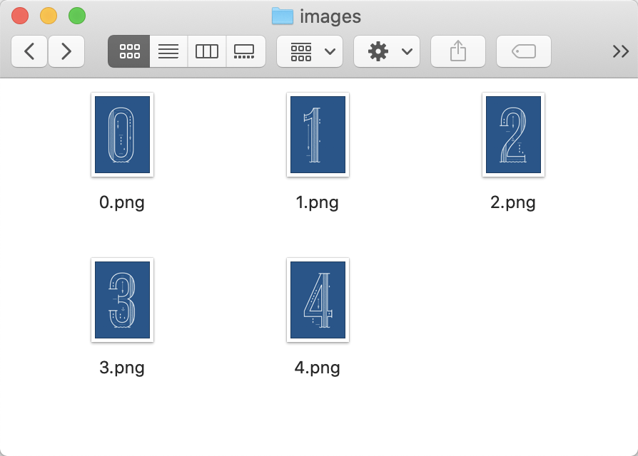
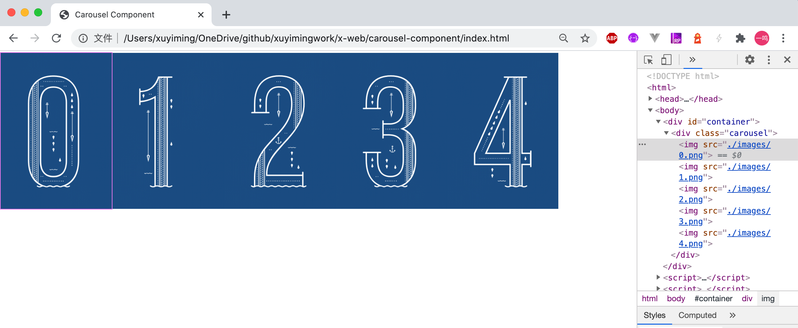
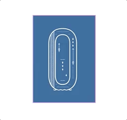

## 前言

本系列记录一个轮播组件的实现。

## 开始

新建文件夹 `carousel-component`，从 `index.html` 开始。

```html
<!DOCTYPE html>
<html>
<head>
  <meta charset="UTF-8">
  <title>Carousel Component</title>
</head>
<body>
  <div id="container"></div>
</body>
</html>
```

作为一个组件，应该有个 Carousel 类，对应的实例提供一个 render 方法用于渲染轮播的结构，内部处理自动切换图片，用户手势等，最后外部用户能够将渲染完成的节点挂载到对应位置。

因此，对应组件框架有：

```html
<script>
class Carousel {
  constructor() {
    this.root = null;
    this.data = null;
  }
  render() {}
}
</script>
```

root 保存渲染完成的节点，data 保存外部传入用于轮播的图片地址。对于组件的使用者而言，使用时实例化 Carousel 类，设置 data，然后调用 render 方法，最后将渲染完成的 root 挂载到页面中

```html
<script>
  const carousel = new Carousel()
  carousel.data = [
    './images/0.png',
    './images/1.png',
    './images/2.png',
    './images/3.png',
    './images/4.png',
  ]
  carousel.render()
  document.getElementById('container')
    .appendChild(carousel.root)
</script>
```

这里的 `images` 文件夹下的 `0.png`、`1.png`、`2.png`、`3.png`、`4.png` 是事先准备的图片。大概长这样：



这时候页面会报错，因为 `carousel.root` 没有东西。开始实现 `render` 方法。

## 轮播结构

首先要做轮播的 dom 结构，这里轮播组件的结构很简单，就是一个 div 里面包裹着需要轮播的一组图片。

```js
class Carousel {
  // ...
  render() {
    this.root = document.createElement('div')
    this.root.classList.add('carousel')

    for (let src of this.data) {
      const img = document.createElement('img')
      img.src = src
      this.root.appendChild(img)
    }
  }
}
```

这里 `root` 的 `div` 加 `class` 是为了方便做样式。添加一下样式

```html
<style>
  .carousel {
    width: 500px;
    height: 700px;
    white-space: nowrap;
    outline: 5px solid violet;
    /* overflow: hidden; */
  }

  .carousel > img {
    width: 500px;
    height: 700px;
    display: inline-block;
  }
</style>
```

- `.carousel` 的 `white-space: nowrap;` 主要是为了让 `img` 保持在一行不换行。
- `outline` 主要是为了看清 `.carousel` 的大小，`outline` 内部就是正在展示的图片。用 `outline` 的原因是该属性不涉及排版
- `overflow` 用于隐藏其它图片，这里为了方便开发，暂时注释

> 这里顺道提一句关于 `img` 元素，`img` 是行内元素，也就是它遵守行内元素的基线对齐那些规则。因此把 `img` 放到 `div` 内的时候会遇到 `img` 下面多了大概 3、4px 的空白（比如我们这边的 `.carousel` 如果没有设置 `height` 就会出现这个情况）。
> 解决方法就是将 `img` 变为块级元素或者把 `img` 的行内对齐方式（`vertical-align` 属性）改为对齐到 `bottom`，又或者像我上面做的，直接写明高度

完成后结果如下：



## 无限轮播

### 无限循环

当要进行轮播，比如隔 3s 换一下图片，然后无限进行下去。就需要有个无限的循环，并且这个循环不能阻塞页面主线程。比较简单的方式是用 `setTimeout` 来实现。

```js
render() {
  // ...

  const next = () => {
    console.log('next')
    setTimeout(next, 3000);
  }

  next()
}
```

### 单图移动

然后要做轮播切换的操作。这里有个需要注意的点是，轮播切换操作只能通过 CSS 来完成，不能更改实际的 DOM 结构。

> 这里 winter 给出的解释是更改 DOM 结构会导致 HTML 文档原本的语义发生变化，这个是不可控的，因此不能通过改变 DOM 进行轮播。

既然无法改变 DOM 结构，那么移动的方案就是通过 `transform` 属性把当前需要展示的图片移动到 `carousel` 的框里。这里方案也有两种，一种是所有图片整体移动，另一种是只移动需要展示的部分图片。

这里选择移动部分图片的方式。轮播在切换的时候，实际上是将当前图片移出，下一张图片移入，每次切换只会涉及到这两张图片。

先考虑移动一张图片的情况，看一下目前组件渲染的成果


从图中可以看到轮播组件，就是那个紫色的框，一直是处于位置 0，这个是没有变化的。同时，因为不改变 DOM，图片本身的起始位置也是没有变化的。变化的只是不同时刻把不同位置的图片 transform 到 0 的位置上。

假设：
- 展示 0 图片，那么就是从 0 位置移动到 0 位置 => -100% * 0
- 要展示 1 图片，就是从 1 位置移动到 0 位置 => -100% * 1

所以代码就是

```js
render() {
  // ...

  let position = 0
  const next = () => {
    const currentElement = this.root.childNodes[position]
    currentElement.style.transform = `translateX(${- 100 * position}%)`
    position = (position + 1) % this.data.length
    console.log('next')
    setTimeout(next, 3000);
  }

  next()
}
```

这里要注意代码中的 `position = (position + 1) % this.data.length`，这是通过取余的方式将 position 设为下一个 position，比如当前的 position 是 4，那么下一个 position 就是 0，完成后效果如下


这时候把 overflow 开起来就有那么点感觉了，实现到这里有几个问题，第一个就是第一轮循环完成之后，4 图片到了 0 位置，接下来的 0 图片就无法出现被 4 图片盖住了。

这是因为 4 图片 transform 到了 0 位置，而 4 图片的真实位置在 0 图片的后面，因此当 0 图片和 4 图片都处于 0 位置的时候，4 图片就会把 0 图片盖住。

因此，在移入的同时，需要把上一张图片移到 -1 位置。

### 双图移动

先以图片 1 举个例子：

假设接下来要展示 1 图片，就是把 1 图片**从 1 位置**移动到 0 位置。再进一步，现在 1 图片已经在 0 位置了，要把 1 图片从 0 位置移动到 -1 的位置，你会发现在计算 transform 值时，仍旧是计算把 1 图片**从 1 位置**移动到 -1 位置。注意到我们计算的一直是图片的真实位置到目标位置的 transform

把上面执行 transform 的逻辑抽象一下

```js
const transform = (element, realPosition, targetPosition) => {
  element.style.transform = `translateX(${100 * targetPosition - 100 * realPosition}%)`
}
```

使用时就变成了

```js
const next = () => {
  const currentElement = this.root.childNodes[position]
  transform(currentElement, position, 0)
  position = (position + 1) % this.data.length
  console.log('next')
  setTimeout(next, 3000);
}
```

在我们的逻辑里，当执行 next 的时候，position 所在的元素是正要进入，正要展示的元素。那么上一个 position 就是要移出的元素（移动到 -1 位置）

首先是计算上一个元素的位置，然后拿到上一个元素，然后通过 transform 把上一个元素放到 -1 的位置

代码实现如下

```js
const next = () => {
  const prevPosition = (position - 1 + this.data.length) % this.data.length

  const prevElement = this.root.childNodes[prevPosition]
  const currentElement = this.root.childNodes[position]
  
  transform(prevElement, prevPosition, -1)
  transform(currentElement, position, 0)
  
  position = (position + 1) % this.data.length
  console.log('next')
  setTimeout(next, 3000);
}
```

这里同样注意获取上一个 position 的方式，通过取余的方式，同时为了避免得到负值，加了一个 length

为了方便看效果，给最外部的容器加一个样式

```css
#container {
  transform: scale(.25);
}
```

效果如下


一开始 4 图片在 -1 的位置，然后一步步继续下去。这里 4 图片一直显示在 -1 的位置和单图移动里一轮后 4 一直位于 0 位置的原因一样。

此时让 `.carousel` 样式中的 `overflow: hidden;` 生效，效果如下



到这里其实已经完成了，但是切换过程太突兀了，因此要做一下动画

### 动画

动画主要涉及 `transition`，需要起始值与终止值，对应到轮播里，就是起始位置和终止位置，在一次动画结束后，看到的是终止位置。

比如，如果接下来要展示 3 图片，在把 3 图片移动到终止的 0 位置前，3 图片应该处于起始的 1 位置。

也就是说，在执行 next 的时候，要先把 position 对应的元素 transform 到起始的 1 位置，再把它 transform 到终止的 0 位置。

同样的道理对于 prevPosition，要先把它放到起始的 0 位置，再把它放到终止的 -1 位置。

此外，还一个问题是，把图片移动到起始位置的时候，我们希望它没有动画，图片从起始位置移动到终止位置时，希望有动画。

这里的关键是，`transition` 属性的生效失效，不能在一个事件循环里。

先写两个辅助方法，用于开始和结束动画

```js
const startAnimate = (...elements) => elements.forEach(element => element.style.transition = 'transform ease 1s')
const stopAnimate = (...elements) => elements.forEach(element => element.style.transition = 'none')
```

然后 next 里面

```js
const next = () => {
  const prevPosition = (position - 1 + this.data.length) % this.data.length

  const prevElement = this.root.childNodes[prevPosition]
  const currentElement = this.root.childNodes[position]
  
  stopAnimate(prevElement, currentElement)
  transform(prevElement, prevPosition, 0)
  transform(currentElement, position, 1)

  setTimeout(() => {
    startAnimate(prevElement, currentElement)
    transform(prevElement, prevPosition, -1)
    transform(currentElement, position, 0)
    position = (position + 1) % this.data.length
  });
  
  console.log('next')
  setTimeout(next, 3000);
}
```

进入循环后先停止动画，把上一个元素移到 0，当前元素移到 1，然后挂一个 `setTimeout`，在 `setTimeout` 里开始动画，把元素移动到最终的位置，此时更新 position，完成一次轮播。

## 最终效果


到这里一个无限自动循环的轮播组件已经完成。后面会介绍如何让该轮播组件支持手势等