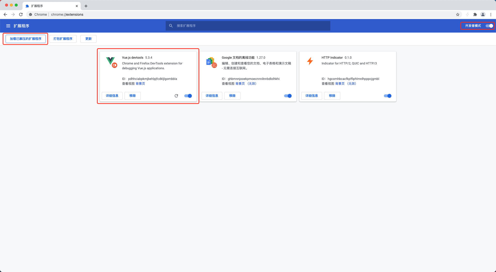

Vue 开发者工具 vue-devtools Chrome 商店地址为：[Vue.js devtools](https://chrome.google.com/webstore/detail/vuejs-devtools/nhdogjmejiglipccpnnnanhbledajbpd)

从商店当然是非常顺畅的安装方式，但是在商店访问不畅的情况下，我们还需要寻找下本地安装的方法。具体步骤如下：

1. 下载并解压 zip 包：[vue-devtools-5.3.4](../assets/vue-devtools-5.3.4.zip)
2. 打开 Chrome，访问 `chrome://extensions/` 页面
3. 打开 Chrome 拓展程序页面右上角的*开发者模式*，点击左上角的*加载已解压的拓展程序*，在弹出的选择框中选择步骤1中解压出的文件夹

至此，vue-devtools 安装完毕。

> 注：文中 zip 包依据 GitHub vue-devtools 仓库 README.md 中的手动安装步骤制作而成：切换到 tag v5.3.4 节点；构建；zip 压缩 `vue-devtools/packages/shell-chrome/` 文件夹。

## 参见：

- [GitHub vue-devtools](https://github.com/vuejs/vue-devtools)，

